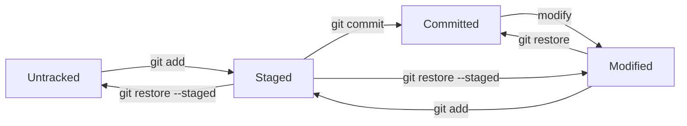

# Esercizio 2: Gestione Stati File

## 🎯 Obiettivo
Comprendere e padroneggiare i diversi stati dei file in Git: untracked, tracked, staged, committed, modified. Imparare a gestire transizioni tra stati in modo efficace.

## ⏱️ Durata Stimata
60-75 minuti

## 📋 Prerequisiti
- Completamento Esercizio 1 (Primo Repository)
- Comprensione teorica degli stati file Git
- Familiarità con comandi `git status`, `git add`, `git commit`

## 🎮 Scenario di Gioco
Sei un developer che lavora su un progetto di e-commerce. Il tuo team leader ti ha chiesto di gestire diverse modifiche ai file del progetto, controllando attentamente ogni transizione di stato per mantenere una cronologia pulita e professionale.

## 🔍 Gli Stati dei File in Git



## 📚 Livelli di Apprendimento

### 🥉 Livello Bronze: Stati Base

#### Setup del Progetto E-commerce

```bash
# Crea il progetto e-commerce
mkdir ecommerce-states-demo
cd ecommerce-states-demo
git init

# Configura il progetto base
echo "# E-commerce Project" > README.md
git add README.md
git commit -m "🎬 Initial commit: Setup e-commerce project"
```

#### Passo 1: File Untracked (Non Tracciati)

```bash
# Crea diversi file non tracciati
echo "console.log('Shop initialization');" > shop.js
echo "body { margin: 0; }" > styles.css
echo "<h1>Welcome to our shop</h1>" > index.html

# Verifica lo stato - tutti i file sono UNTRACKED
git status
```

**🔍 Osservazione:** I file rossi sono **untracked** - Git li vede ma non li gestisce.

#### Passo 2: Transizione a Staged

```bash
# Sposta solo alcuni file a STAGED
git add shop.js
git add styles.css

# Verifica stato misto
git status
```

**🔍 Osservazione:** 
- `shop.js` e `styles.css` = **STAGED** (verdi)
- `index.html` = **UNTRACKED** (rosso)

#### Passo 3: Commit Parziale

```bash
# Commit dei file staged
git commit -m "✨ Add basic JavaScript and CSS

- shop.js: Initialize shopping functionality
- styles.css: Add base styling reset"

# Verifica stato dopo commit
git status
```

**🔍 Osservazione:** `index.html` rimane **UNTRACKED**.

#### Passo 4: Completamento Tracking

```bash
# Aggiungi il file rimanente
git add index.html
git commit -m "🏠 Add homepage HTML structure"

# Verifica che tutto sia pulito
git status  # Dovrebbe mostrare "working tree clean"
```

**🎖️ Badge Ottenuto:** "State Tracker" 📊

### 🥈 Livello Silver: Stati Avanzati e Modifiche

#### Passo 5: File Modified (Modificati)

```bash
# Modifica file esistenti
echo "
// Product management functions
function addProduct(name, price) {
    console.log(\`Adding \${name} for \$\${price}\`);
}

function removeProduct(id) {
    console.log(\`Removing product \${id}\`);
}" >> shop.js

# Modifica CSS
echo "
.product {
    border: 1px solid #ccc;
    padding: 20px;
    margin: 10px;
}

.product-title {
    font-size: 18px;
    font-weight: bold;
}" >> styles.css

# Verifica stato
git status
```

**🔍 Osservazione:** I file modificati mostrano status **MODIFIED** (rosso).

#### Passo 6: Gestione Staging Selettivo

```bash
# Stage solo un file
git add shop.js

# Verifica stato misto
git status
```

**🔍 Osservazione:** 
- `shop.js` = **STAGED** (verde)
- `styles.css` = **MODIFIED** (rosso)

#### Passo 7: Modifica File già Staged

```bash
# Modifica ulteriormente shop.js (già staged)
echo "
// Shopping cart functionality
let cart = [];
function addToCart(product) {
    cart.push(product);
    console.log('Product added to cart');
}" >> shop.js

# Verifica stato complesso
git status
```

**🔍 Osservazione:** `shop.js` appare sia in **STAGED** che **MODIFIED**!

```
Changes to be committed:
  (use "git restore --staged <file>..." to unstage)
        modified:   shop.js

Changes not staged for commit:
  (use "git add <file>..." to update what will be committed)
  (use "git restore <file>..." to discard changes in working directory)
        modified:   shop.js
        modified:   styles.css
```

#### Passo 8: Gestione Stati Complessi

```bash
# Opzione A: Stage le nuove modifiche
git add shop.js

# Verifica che ora tutto shop.js sia staged
git status

# Opzione B: Commit quello che è staged
git commit -m "🛍️ Add product management functions

- addProduct(): Add new products to catalog
- removeProduct(): Remove products by ID
- Prepare foundation for shopping cart"

# Verifica stato rimanente
git status
```

**🎖️ Badge Ottenuto:** "Stage Manager" 🎭

### 🥇 Livello Gold: Operazioni di Ripristino

#### Passo 9: Ripristino File Modified

```bash
# Crea modifiche da ripristinare
echo "
/* Temporary experimental styles */
.bad-style {
    background: red !important;
    color: yellow !important;
}" >> styles.css

echo "
// Experimental broken code
function brokenFunction() {
    return undefined.property; // Questo causerà errore
}" >> shop.js

# Verifica le modifiche "sbagliate"
git status
git diff shop.js
git diff styles.css
```

#### Passo 10: Ripristino Selettivo

```bash
# Ripristina solo shop.js all'ultima versione committed
git restore shop.js

# Verifica che shop.js sia tornato pulito
git status
git diff shop.js  # Nessuna differenza

# styles.css rimane modificato
git diff styles.css
```

#### Passo 11: Gestione Staging Area

```bash
# Stage le modifiche CSS (anche se "sbagliate")
git add styles.css

# Verifica stato
git status  # styles.css è staged

# Rimuovi dallo staging senza perdere modifiche
git restore --staged styles.css

# Verifica che sia tornato modified
git status  # styles.css è modified, non staged
```

#### Passo 12: Workflow Professionale

```bash
# Ripristina definitivamente le modifiche CSS sbagliate
git restore styles.css

# Aggiungi invece modifiche corrette
echo "
/* Professional product styling */
.product-grid {
    display: grid;
    grid-template-columns: repeat(auto-fit, minmax(250px, 1fr));
    gap: 20px;
    padding: 20px;
}

.product-card {
    border: 1px solid #e0e0e0;
    border-radius: 8px;
    padding: 15px;
    transition: box-shadow 0.3s ease;
}

.product-card:hover {
    box-shadow: 0 4px 8px rgba(0,0,0,0.1);
}" >> styles.css

# Stage e commit delle modifiche corrette
git add styles.css
git commit -m "💄 Add professional product grid styling

- Responsive grid layout for products
- Modern card design with hover effects
- Clean spacing and typography"
```

**🎖️ Badge Ottenuto:** "Restore Master" 🔄

## 🧪 Test di Comprensione

### Quiz Pratico

Esegui queste operazioni e predici il risultato:

1. **Scenario 1:**
```bash
# Setup
echo "new content" > test.txt
git add test.txt
echo "more content" >> test.txt
# Domanda: Che stato ha test.txt? Cosa succede con git commit?
```

2. **Scenario 2:**
```bash
# Setup  
git add test.txt  # Stage tutte le modifiche
git restore --staged test.txt
# Domanda: Che stato ha ora test.txt?
```

3. **Scenario 3:**
```bash
# Setup
git restore test.txt
# Domanda: Cosa succede al contenuto di test.txt?
```

<details>
<summary>🔍 Soluzioni Quiz</summary>

1. **test.txt** sarà sia STAGED che MODIFIED. `git commit` committa solo la prima modifica.
2. **test.txt** torna MODIFIED (non staged).
3. **test.txt** perde tutte le modifiche non committed e torna all'ultima versione committed.

</details>

## 📊 Comandi di Verifica Stati

```bash
# Stato generale
git status

# Stato sintetico
git status -s

# Mostra anche file ignorati
git status --ignored

# Differenze working directory vs staging
git diff

# Differenze staging vs ultimo commit
git diff --staged

# Differenze working directory vs ultimo commit
git diff HEAD

# Lista file tracciati
git ls-files

# Cronologia con stat
git log --stat --oneline
```

## 🎯 Matrice Stati File

| Stato File | git status | Descrizione | Operazioni Possibili |
|------------|------------|-------------|---------------------|
| **Untracked** | Rosso, sezione "Untracked files" | Git non conosce il file | `git add` |
| **Staged** | Verde, sezione "Changes to be committed" | Pronto per commit | `git commit`, `git restore --staged` |
| **Committed** | Non appare in status | Salvato nella cronologia Git | - |
| **Modified** | Rosso, sezione "Changes not staged" | Modificato dopo ultimo commit | `git add`, `git restore` |
| **Staged + Modified** | Appare in entrambe le sezioni | Versione staged + modifiche aggiuntive | `git add` (stage nuove modifiche) |

## 🔧 Comandi di Ripristino Riassunto

```bash
# Ripristina file modified alla versione committed
git restore <file>

# Rimuovi file da staging (unstage)
git restore --staged <file>

# Ripristina tutto all'ultimo commit
git restore .

# Ripristina alla versione di un commit specifico
git restore --source=HEAD~1 <file>
```

## 🏆 Verifica Finale

### Checklist di Competenze ✅

**Comprensione Stati:**
- [x] So identificare file untracked, staged, committed, modified
- [x] Comprendo la differenza tra working directory e staging area
- [x] So leggere l'output di `git status` correttamente

**Gestione Transizioni:**
- [x] So spostare file da untracked a staged (`git add`)
- [x] So committare file staged (`git commit`)
- [x] So rimuovere file da staging (`git restore --staged`)
- [x] So ripristinare modifiche (`git restore`)

**Workflow Avanzato:**
- [x] Gestisco situazioni di file staged+modified
- [x] Uso staging selettivo per commit atomici
- [x] So quando e come usare i comandi di restore

### Test Finale Pratico

Crea questo scenario e risolvilo:
```bash
# Crea 3 file
echo "A" > file1.txt
echo "B" > file2.txt  
echo "C" > file3.txt

# Stage solo file1 e file2
# Modifica tutti e 3 i file
# Stage le modifiche a file1
# Ripristina file2 all'ultima versione
# Commit solo file1
# Verifica che file3 rimanga modified
```

## 🎯 Risultati Attesi

Al completamento dovresti aver ottenuto:

1. **Comprensione completa** degli stati file Git
2. **Padronanza comandi** per gestire transizioni di stato
3. **Workflow professionale** per commit atomici e puliti
4. **Capacità di recupero** da errori comuni
5. **Mindset Git corretto** per gestione versioni

## 🚀 Sfide Bonus

1. **File Rename Challenge:** Rinomina un file e osserva come Git traccia il cambiamento
2. **Directory Management:** Crea directory vuote e piene, osserva il comportamento Git
3. **Large File Test:** Crea file di dimensioni diverse, osserva le performance
4. **Binary vs Text:** Aggiungi immagini e osserva come Git gestisce file binari

## 📈 Prossimi Passi

1. **Completa** Esercizio 3 di questo modulo
2. **Procedi** al Modulo 04: Comandi Base Git 
3. **Sperimenta** con le operazioni apprese su progetti reali
4. **Pratica** il workflow daily developer

## Navigazione del Corso
- [📑 Indice](../README.md)
- [⬅️ Esercizio Precedente](01-primo-repo.md)
- [➡️ Esercizio Successivo](03-commit-messages.md)
- [📚 Guide Teoriche](../guide/README.md)
