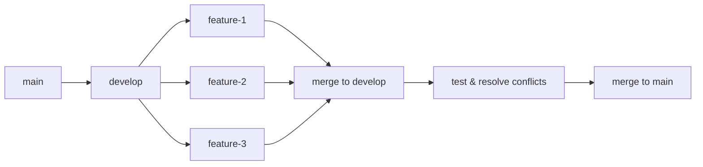

# Prevenzione dei Conflitti

## 🎯 Obiettivi
- Sviluppare strategie preventive efficaci
- Implementare workflow che minimizzano conflitti
- Creare pratiche di team collaborative

## 🛡️ Filosofia della Prevenzione

> "È meglio prevenire un conflitto che risolverlo" - Principio fondamentale

La prevenzione dei conflitti si basa su:
- **Comunicazione** efficace del team
- **Workflow** ben strutturati  
- **Pratiche** di sviluppo consistenti
- **Strumenti** automatizzati di supporto

## 📋 Strategie Preventive Principali

### 1. Git Flow Disciplinato

#### Feature Branch Piccoli e Focalizzati
```bash
# ❌ Branch troppo ampio
git checkout -b feature/complete-rewrite

# ✅ Branch focalizzato
git checkout -b feature/add-user-validation
git checkout -b feature/update-login-ui
git checkout -b feature/fix-password-reset
```

#### Merge Frequente dal Main
```bash
# Workflow giornaliero raccomandato
git checkout main
git pull origin main
git checkout feature/my-feature
git merge main  # Risolvi conflitti in anticipo

# Alternative con rebase
git rebase main  # Mantieni storia lineare
```

### 2. Comunicazione del Team

#### Coordinamento Aree di Lavoro
```text
📢 Team Communication Board
┌─────────────────┬─────────────────┬─────────────────┐
│ Developer A     │ Developer B     │ Developer C     │
├─────────────────┼─────────────────┼─────────────────┤
│ • auth module   │ • ui components │ • api routes    │
│ • user service  │ • styles        │ • database      │
│ • tests        │ • responsive    │ • middleware    │
└─────────────────┴─────────────────┴─────────────────┘
```

#### Slack/Discord Integration
```bash
# Git hooks per notifiche automatiche
#!/bin/bash
# post-commit hook
git log -1 --pretty=format:"🔨 %an committed to %s: %s" | \
  curl -X POST -H 'Content-type: application/json' \
  --data '{"text":"'"$(cat)"'"}' \
  YOUR_SLACK_WEBHOOK_URL
```

### 3. Architettura Modulare

#### Separazione Responsabilità
```text
src/
├── auth/           ← Team A
│   ├── login.js
│   ├── register.js
│   └── validation.js
├── ui/             ← Team B  
│   ├── components/
│   ├── styles/
│   └── layouts/
└── api/            ← Team C
    ├── routes/
    ├── models/
    └── middleware/
```

#### Convenzioni di Naming
```javascript
// ✅ Convenzioni chiare riducono conflitti
// Feature branches
feature/auth-login-validation
feature/ui-header-responsive  
feature/api-user-endpoints

// Commit messages
feat(auth): add password validation
fix(ui): resolve mobile header layout
docs(api): update endpoint documentation
```

## 🔄 Workflow Preventivi

### 1. Integration Branch Strategy



#### Implementazione
```bash
# Setup initial
git checkout -b develop
git push -u origin develop

# Feature development
git checkout develop
git pull origin develop
git checkout -b feature/new-feature

# Regular integration
git checkout develop
git pull origin develop
git checkout feature/new-feature
git merge develop

# Final integration
git checkout develop
git merge feature/new-feature
git push origin develop
```

### 2. Continuous Integration Pattern

#### GitHub Actions Workflow
```yaml
# .github/workflows/conflict-prevention.yml
name: Conflict Prevention
on:
  pull_request:
    branches: [main, develop]

jobs:
  check-conflicts:
    runs-on: ubuntu-latest
    steps:
      - uses: actions/checkout@v3
        with:
          fetch-depth: 0
      
      - name: Check for merge conflicts
        run: |
          git merge-tree $(git merge-base HEAD main) HEAD main
          
      - name: Run tests
        run: npm test
        
      - name: Check code style
        run: npm run lint
```

### 3. Pre-commit Hooks

#### Setup con Husky
```bash
# Install husky
npm install --save-dev husky

# Setup pre-commit hook
npx husky add .husky/pre-commit "npm run lint-staged"
```

#### Lint-staged Configuration
```json
{
  "lint-staged": {
    "*.js": ["eslint --fix", "prettier --write"],
    "*.css": ["stylelint --fix"],
    "*.md": ["markdownlint --fix"]
  }
}
```

## 🧰 Strumenti di Prevenzione

### 1. Code Formatters Automatici

#### Prettier Configuration
```json
// .prettierrc
{
  "semi": true,
  "trailingComma": "es5",
  "singleQuote": true,
  "printWidth": 80,
  "tabWidth": 2
}
```

#### ESLint Setup
```json
// .eslintrc.json
{
  "extends": ["eslint:recommended"],
  "rules": {
    "indent": ["error", 2],
    "quotes": ["error", "single"],
    "semi": ["error", "always"]
  }
}
```

### 2. EditorConfig
```ini
# .editorconfig
root = true

[*]
indent_style = space
indent_size = 2
end_of_line = lf
charset = utf-8
trim_trailing_whitespace = true
insert_final_newline = true

[*.md]
trim_trailing_whitespace = false
```

### 3. GitAttributes
```text
# .gitattributes
# Ensure consistent line endings
* text=auto

# Binary files
*.png binary
*.jpg binary
*.pdf binary

# Language specific
*.js text eol=lf
*.css text eol=lf
*.html text eol=lf
```

## 📊 Monitoring e Metrics

### 1. Conflict Tracking Script
```bash
#!/bin/bash
# conflict-stats.sh
echo "📊 Conflict Statistics"
echo "======================"

# Count merge commits in last month
MERGE_COMMITS=$(git log --oneline --grep="Merge" --since="1 month ago" | wc -l)
echo "Merge commits last month: $MERGE_COMMITS"

# Count conflict resolution commits  
CONFLICT_COMMITS=$(git log --oneline --grep="conflict\|resolve" --since="1 month ago" | wc -l)
echo "Conflict resolutions: $CONFLICT_COMMITS"

# Conflict rate
if [ $MERGE_COMMITS -gt 0 ]; then
  RATE=$((CONFLICT_COMMITS * 100 / MERGE_COMMITS))
  echo "Conflict rate: ${RATE}%"
fi
```

### 2. Team Health Dashboard
```javascript
// conflict-dashboard.js
const getConflictMetrics = async () => {
  const metrics = {
    totalMerges: await getTotalMerges(),
    conflictResolutions: await getConflictResolutions(),
    averageResolutionTime: await getAvgResolutionTime(),
    topConflictFiles: await getTopConflictFiles()
  };
  
  return metrics;
};
```

## 📋 Checklist Prevenzione

### ✅ Setup Iniziale Progetto
- [ ] Configurare pre-commit hooks
- [ ] Impostare code formatters (Prettier, ESLint)
- [ ] Creare .editorconfig
- [ ] Definire branching strategy
- [ ] Setup CI/CD pipeline

### ✅ Pratiche Quotidiane
- [ ] Pull daily da main/develop
- [ ] Feature branch piccoli (< 1 settimana)
- [ ] Commit frequenti e atomici
- [ ] Code review prima di merge
- [ ] Test prima di push

### ✅ Team Coordination
- [ ] Daily standup con coordinamento aree
- [ ] Shared calendar per release
- [ ] Documentazione convenzioni
- [ ] Channel dedicato per coordinamento

## 🎯 Casi Studio

### Caso 1: Team E-commerce
**Problema**: Conflitti frequenti in checkout flow

**Soluzione**:
```bash
# Modularizzazione
src/checkout/
├── payment/      ← Dev A
├── shipping/     ← Dev B  
├── validation/   ← Dev C
└── ui/           ← Dev D
```

**Risultato**: Conflitti ridotti del 80%

### Caso 2: Startup con Sviluppo Rapido
**Problema**: Deploy frequenti con conflitti

**Soluzione**:
```yaml
# Integration pipeline
develop → staging → production
  ↑         ↑         ↑
daily    weekly   bi-weekly
merge     test     deploy
```

**Risultato**: Zero conflitti in production

## 💡 Best Practices Avanzate

### 1. Semantic Commits
```bash
# Convenzione semantic commits
feat(auth): add OAuth2 integration
fix(ui): resolve mobile navigation bug  
docs(api): update authentication guide
style(css): format with prettier
refactor(db): optimize user queries
test(auth): add login validation tests
```

### 2. Branch Protection Rules
```yaml
# GitHub branch protection
main:
  required_status_checks: true
  required_pull_request_reviews: 2
  dismiss_stale_reviews: true
  require_code_owner_reviews: true
  restrictions: 
    users: ["team-lead"]
```

### 3. Automated Dependency Updates
```yaml
# Dependabot configuration
version: 2
updates:
  - package-ecosystem: "npm"
    directory: "/"
    schedule:
      interval: "weekly"
    reviewers:
      - "team-lead"
```

## ➡️ Prossimo Passo

Nel prossimo modulo esploreremo **strategie avanzate** per gestire conflitti complessi e scenari particolari.
