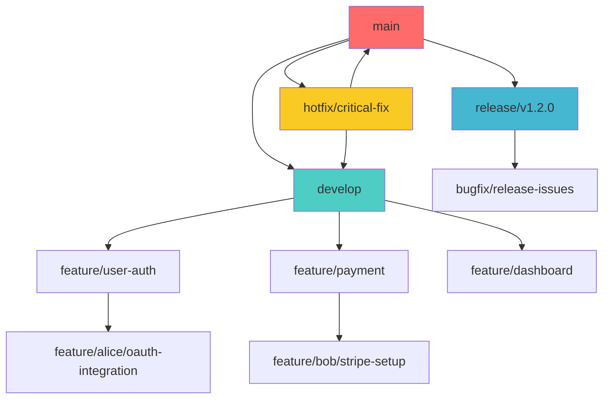

# 02 - Gestione Branch Collaborativi

## 🎯 Obiettivi del Modulo

In questa guida imparerai:
- Strategie avanzate per la gestione dei branch in team
- Naming conventions e organizzazione dei branch
- Tecniche per la sincronizzazione efficace
- Risoluzione di conflitti in ambiente collaborativo

## 🌳 Architettura dei Branch Collaborativi

### 1. 📋 Branch Naming Conventions

**Struttura Standard:**
```
<tipo>/<descrizione-breve>
<tipo>/<ticket-id>-<descrizione>
<tipo>/<username>/<descrizione>
```

**Categorie di Branch:**

**Feature Branches:**
```bash
feature/user-authentication
feature/JIRA-123-payment-gateway
feature/alice/dashboard-redesign
feature/api-v2-endpoints
```

**Bug Fix Branches:**
```bash
bugfix/login-timeout-issue
bugfix/ISSUE-456-carousel-responsive
hotfix/critical-security-patch
fix/broken-navigation-mobile
```

**Experimental Branches:**
```bash
experiment/new-ui-framework
spike/performance-optimization
research/ml-integration
prototype/voice-interface
```

**Release Branches:**
```bash
release/v1.2.0
release/2024-Q1-stable
release/major-refactor-v2
```

**Environment Branches:**
```bash
staging/pre-production
staging/qa-testing
develop/integration
```

### 2. 🏗️ Branch Hierarchy Strategy



**Regole di Hierarchy:**
- **main**: Solo codice stabile e testato
- **develop**: Integrazione continua delle feature
- **feature/***: Sviluppo isolato delle funzionalità
- **release/***: Stabilizzazione per rilascio
- **hotfix/***: Correzioni critiche immediate

### 3. 🔄 Lifecycle dei Branch

**Feature Branch Lifecycle:**
```bash
# 1. Creazione da develop
git checkout develop
git pull origin develop
git checkout -b feature/user-profile

# 2. Sviluppo iterativo
# ... lavoro quotidiano ...
git add .
git commit -m "feat(profile): add avatar upload"

# 3. Sincronizzazione periodica
git fetch origin
git rebase origin/develop

# 4. Preparazione per merge
git push origin feature/user-profile

# 5. Code review e merge
# ... Pull Request process ...

# 6. Cleanup dopo merge
git checkout develop
git pull origin develop
git branch -d feature/user-profile
git push origin --delete feature/user-profile
```

## 🤝 Strategie di Sincronizzazione

### 1. 🔄 Merge vs Rebase in Collaborazione

**Quando usare Merge:**
```bash
# ✅ Per integrare feature branch in develop
git checkout develop
git merge feature/user-auth --no-ff

# ✅ Per preservare il contesto di una feature completa
git merge feature/major-refactor --no-ff -m "Merge: Complete authentication system"

# ✅ Per release branch
git checkout main
git merge release/v1.2.0 --no-ff
```

**Quando usare Rebase:**
```bash
# ✅ Per aggiornare feature branch con develop
git checkout feature/my-feature
git rebase develop

# ✅ Per pulizia before Pull Request
git rebase -i HEAD~3  # Interactive rebase

# ✅ Per mantenere storia lineare di piccole feature
git checkout develop
git rebase feature/small-fix
```

### 2. ⚡ Strategie di Update Automatizzate

**Script di Sincronizzazione Automatica:**

**`sync-branch.sh`:**
```bash
#!/bin/bash
set -e

CURRENT_BRANCH=$(git rev-parse --abbrev-ref HEAD)
TARGET_BRANCH=${1:-develop}

echo "🔄 Sincronizzazione di $CURRENT_BRANCH con $TARGET_BRANCH"

# Fetch latest changes
echo "📥 Fetching da origin..."
git fetch origin

# Stash uncommitted changes
if ! git diff-index --quiet HEAD --; then
    echo "💾 Stashing uncommitted changes..."
    git stash push -m "Auto-stash before sync $(date)"
    STASHED=true
fi

# Update target branch
echo "🔄 Aggiornamento $TARGET_BRANCH..."
git checkout $TARGET_BRANCH
git pull origin $TARGET_BRANCH

# Rebase feature branch
echo "🔄 Rebase di $CURRENT_BRANCH..."
git checkout $CURRENT_BRANCH

if git rebase $TARGET_BRANCH; then
    echo "✅ Rebase completato con successo"
else
    echo "❌ Conflitti durante il rebase. Risolvi manualmente."
    echo "Dopo la risoluzione, esegui: git rebase --continue"
    exit 1
fi

# Restore stashed changes
if [ "$STASHED" = true ]; then
    echo "📤 Ripristino delle modifiche in stash..."
    git stash pop
fi

echo "🎉 Sincronizzazione completata!"
```

**Utilizzo:**
```bash
# Sincronizza con develop (default)
./sync-branch.sh

# Sincronizza con branch specifico
./sync-branch.sh main
```

### 3. 🛡️ Prevenzione Conflitti

**Configurazione Team per Evitare Conflitti:**

**1. File `.gitattributes` per gestire merge:**
```bash
# Merge strategies per file specifici
*.md merge=union
package-lock.json merge=ours
*.generated.* merge=ours

# Binary files
*.png binary
*.jpg binary
*.pdf binary
```

**2. Segregazione del lavoro per area:**
```bash
# Organizzazione per ridurre conflitti
frontend/
├── components/
│   ├── auth/           # Team A
│   ├── dashboard/      # Team B
│   └── common/         # Shared (careful coordination)
└── pages/
    ├── user/           # Team A
    └── admin/          # Team B

backend/
├── auth/               # Team A
├── api/
│   ├── user/          # Team A
│   └── admin/         # Team B
└── shared/            # Shared (careful coordination)
```

**3. Comunicazione proattiva:**
```bash
# Daily sync meeting checklist
- Chi sta lavorando su quali file?
- Ci sono modifiche ai file condivisi?
- Quali branch sono pronti per il merge?
- Ci sono dipendenze tra le feature?
```

## 🔀 Strategie di Merge Avanzate

### 1. 🎯 Smart Merging

**Merge con Validazione Automatica:**
```bash
#!/bin/bash
# smart-merge.sh

FEATURE_BRANCH=$1
TARGET_BRANCH=${2:-develop}

echo "🔍 Validazione pre-merge..."

# Check if branches exist
if ! git show-ref --verify --quiet refs/heads/$FEATURE_BRANCH; then
    echo "❌ Branch $FEATURE_BRANCH non esiste"
    exit 1
fi

# Run tests on feature branch
echo "🧪 Esecuzione test su $FEATURE_BRANCH..."
git checkout $FEATURE_BRANCH
if ! npm test; then
    echo "❌ Test falliti su $FEATURE_BRANCH"
    exit 1
fi

# Update target branch
echo "🔄 Aggiornamento $TARGET_BRANCH..."
git checkout $TARGET_BRANCH
git pull origin $TARGET_BRANCH

# Test merge compatibility
echo "🔍 Test compatibilità merge..."
if ! git merge --no-commit --no-ff $FEATURE_BRANCH; then
    echo "❌ Conflitti rilevati. Risolvi manualmente."
    git merge --abort
    exit 1
fi

# Run tests on merged code
echo "🧪 Test su codice merged..."
if ! npm test; then
    echo "❌ Test falliti dopo merge"
    git reset --hard HEAD
    exit 1
fi

# Complete merge
git commit -m "feat: merge $FEATURE_BRANCH into $TARGET_BRANCH

Validated with:
- Unit tests passed
- Integration tests passed
- No merge conflicts
- Code review approved"

echo "✅ Merge completato con successo!"
```

### 2. 🔧 Merge Strategies per Tipo di Modifica

**Piccole Bug Fix:**
```bash
# Fast-forward merge per piccole correzioni
git checkout main
git merge bugfix/typo-fix  # Fast-forward se possibile
```

**Feature Complete:**
```bash
# No-fast-forward per preservare il contesto
git checkout develop
git merge feature/user-authentication --no-ff -m "feat: complete user authentication system

Features included:
- Login/logout functionality
- Password reset
- Email verification
- Session management
- Security middleware

Reviewed-by: @teamlead
Tested-by: @qa-team"
```

**Experimental Changes:**
```bash
# Squash merge per experimental features
git checkout develop
git merge --squash experiment/new-ui-framework
git commit -m "feat: integrate new UI framework

Squashed experimental commits into single feature.
Includes:
- New component library
- Updated styling system
- Performance improvements

Breaking changes:
- Old component props deprecated
- CSS classes renamed"
```

## 🚦 Branch Protection e Governance

### 1. 🛡️ Regole di Protezione Avanzate

**Configurazione GitHub Branch Protection:**
```yaml
# Repository Settings > Branches
Branch Protection Rules for 'main':
  Restrict pushes that create files:
    - Restrict to: Collaborators with write access
  
  Require pull request reviews before merging:
    - Required approving reviews: 2
    - Dismiss stale reviews: ✅
    - Require review from code owners: ✅
    - Restrict reviews to code owners: ❌
  
  Require status checks before merging:
    - Require branches to be up to date: ✅
    - Status checks:
      - CI/CD Pipeline ✅
      - Code Quality Gate ✅
      - Security Scan ✅
      - Performance Tests ✅
  
  Require conversation resolution before merging: ✅
  Require signed commits: ✅
  Require linear history: ❌
  Allow force pushes: ❌
  Allow deletions: ❌
```

**CODEOWNERS File:**
```bash
# .github/CODEOWNERS

# Global owners
* @team-leads @senior-devs

# Frontend team
/frontend/ @frontend-team @ui-ux-team
/src/components/ @frontend-team
*.css @ui-ux-team

# Backend team
/backend/ @backend-team @devops-team
/api/ @backend-team
/infrastructure/ @devops-team

# Database
/migrations/ @backend-team @dba-team
/database/ @dba-team

# Documentation
/docs/ @tech-writers @team-leads
README.md @team-leads
CONTRIBUTING.md @team-leads

# Security sensitive
/auth/ @security-team @backend-team
/encryption/ @security-team
*.key @security-team
```

### 2. 📊 Monitoring e Metrics

**Branch Health Dashboard:**
```bash
#!/bin/bash
# branch-health.sh

echo "📊 Branch Health Report - $(date)"
echo "=================================="

# Active branches
echo "🌿 Branch attivi:"
git for-each-ref --format='%(refname:short) %(authoremail) %(authordate:relative)' refs/heads/ | sort -k3

# Stale branches (older than 2 weeks)
echo ""
echo "🥀 Branch stale (>2 settimane):"
git for-each-ref --format='%(refname:short) %(authoremail) %(authordate:relative)' refs/heads/ | awk '$3 ~ /weeks?|months?|years?/ { print }'

# Merged branches ready for cleanup
echo ""
echo "🧹 Branch merged (da eliminare):"
git branch --merged main | grep -v "main\|develop" | xargs -n 1 echo "  "

# Untracked remote branches
echo ""
echo "📡 Branch remoti non tracciati:"
git remote prune origin --dry-run

echo ""
echo "💡 Suggerimenti:"
echo "  - Elimina branch stale con: git branch -d <branch-name>"
echo "  - Pulisci remote con: git remote prune origin"
echo "  - Coordina con team per branch di lunga durata"
```

## 🔄 Workflow di Team Specifici

### 1. 👥 Team Frontend/Backend

**Workflow Coordinato:**
```bash
# Frontend team workflow
cd frontend/
git checkout develop
git pull origin develop
git checkout -b feature/user-dashboard

# Sviluppo frontend
npm run dev  # Development server
# ... modifiche UI ...

# Mock API durante sviluppo
npm run mock-api

git add .
git commit -m "feat(dashboard): add user statistics widget"

# Backend team workflow
cd ../backend/
git checkout develop
git pull origin develop
git checkout -b feature/dashboard-api

# Sviluppo API
# ... implementazione endpoints ...

git add .
git commit -m "feat(api): add user statistics endpoints"

# Integrazione coordinata
# Frontend aggiorna per usare API reale
cd ../frontend/
git checkout feature/user-dashboard
# Update API calls to real endpoints
git commit -m "feat(dashboard): integrate with real API endpoints"
```

### 2. 🌍 Team Distribuiti Geograficamente

**Sincronizzazione Multi-Timezone:**
```bash
# Configurazione per team globale
# Script per sync quotidiano automatico

#!/bin/bash
# daily-sync.sh (eseguito via cron)

# Check time zones for team activity
CURRENT_HOUR=$(date +%H)

# European working hours (8-18 UTC)
if [ $CURRENT_HOUR -ge 8 ] && [ $CURRENT_HOUR -le 18 ]; then
    echo "🇪🇺 European hours - More frequent sync"
    SYNC_INTERVAL=30  # 30 minutes
# US working hours (14-24 UTC) 
elif [ $CURRENT_HOUR -ge 14 ] && [ $CURRENT_HOUR -le 24 ]; then
    echo "🇺🇸 US hours - Overlap with Europe"
    SYNC_INTERVAL=20  # 20 minutes
# Asian working hours (0-8 UTC)
else
    echo "🌏 Asian hours - Standard sync"
    SYNC_INTERVAL=60  # 1 hour
fi

# Automated sync logic
git fetch origin
if [ $(git rev-list HEAD..origin/develop --count) -gt 0 ]; then
    echo "📥 Nuovi commit rilevati su develop"
    # Notify team via Slack/Teams
    curl -X POST -H 'Content-type: application/json' \
         --data '{"text":"🔄 New commits in develop branch - consider syncing your feature branches"}' \
         $SLACK_WEBHOOK_URL
fi
```

### 3. 🚀 Team DevOps Integration

**Branch-Based Deployments:**
```yaml
# .github/workflows/branch-deployment.yml
name: Branch Deployment

on:
  push:
    branches:
      - 'feature/*'
      - 'develop'
      - 'staging'

jobs:
  deploy:
    runs-on: ubuntu-latest
    steps:
      - uses: actions/checkout@v3
      
      - name: Determine environment
        id: env
        run: |
          if [[ $GITHUB_REF == refs/heads/develop ]]; then
            echo "environment=development" >> $GITHUB_OUTPUT
            echo "url=https://dev.example.com" >> $GITHUB_OUTPUT
          elif [[ $GITHUB_REF == refs/heads/staging ]]; then
            echo "environment=staging" >> $GITHUB_OUTPUT
            echo "url=https://staging.example.com" >> $GITHUB_OUTPUT
          elif [[ $GITHUB_REF == refs/heads/feature/* ]]; then
            BRANCH_NAME=${GITHUB_REF#refs/heads/}
            CLEAN_NAME=$(echo $BRANCH_NAME | sed 's/[^a-zA-Z0-9]/-/g' | tr '[:upper:]' '[:lower:]')
            echo "environment=preview" >> $GITHUB_OUTPUT
            echo "url=https://$CLEAN_NAME.preview.example.com" >> $GITHUB_OUTPUT
          fi
      
      - name: Deploy to environment
        run: |
          echo "Deploying to ${{ steps.env.outputs.environment }}"
          echo "URL: ${{ steps.env.outputs.url }}"
          # Actual deployment logic here
          
      - name: Comment PR with preview URL
        if: steps.env.outputs.environment == 'preview'
        uses: actions/github-script@v6
        with:
          script: |
            const { data: pullRequests } = await github.rest.pulls.list({
              owner: context.repo.owner,
              repo: context.repo.repo,
              head: `${context.repo.owner}:${context.ref.replace('refs/heads/', '')}`,
              state: 'open'
            });
            
            if (pullRequests.length > 0) {
              const pr = pullRequests[0];
              await github.rest.issues.createComment({
                owner: context.repo.owner,
                repo: context.repo.repo,
                issue_number: pr.number,
                body: `🚀 Preview deployment ready!\n\n🔗 **Preview URL**: ${{ steps.env.outputs.url }}\n\n*This preview will be available until the PR is closed.*`
              });
            }
```

## 🧪 Quiz di Autovalutazione

### Domanda 1
Quale naming convention è più appropriata per un branch che corregge un bug critico di sicurezza?

A) `feature/security-fix`  
B) `hotfix/critical-security-patch`  
C) `bugfix/security-issue`  
D) `fix/security-bug`  

<details>
<summary>🔍 Risposta</summary>

**B) `hotfix/critical-security-patch`**

Per bug critici di sicurezza che richiedono deploy immediato, si usa `hotfix/` che indica l'urgenza e la necessità di merge diretto in main/production.
</details>

### Domanda 2
Quando è appropriato usare `--no-ff` durante un merge?

A) Mai, rallenta il processo  
B) Solo per hotfix  
C) Per preservare il contesto di una feature completa  
D) Solo quando ci sono conflitti  

<details>
<summary>🔍 Risposta</summary>

**C) Per preservare il contesto di una feature completa**

`--no-ff` crea sempre un commit di merge, preservando la storia del branch e il contesto della feature, anche quando sarebbe possibile un fast-forward.
</details>

### Domanda 3
Quale strategia è migliore per aggiornare un feature branch con le ultime modifiche di develop?

A) `git merge develop`  
B) `git rebase develop`  
C) `git pull origin develop`  
D) Dipende dal contesto del team  

<details>
<summary>🔍 Risposta</summary>

**D) Dipende dal contesto del team**

La scelta tra merge e rebase dipende dalla policy del team: rebase per storia lineare, merge per preservare il contesto. Entrambi sono validi.
</details>

### Domanda 4
Cosa NON dovrebbe essere protetto da branch protection rules?

A) Feature branches temporanei  
B) Main branch  
C) Develop branch  
D) Release branches  

<details>
<summary>🔍 Risposta</summary>

**A) Feature branches temporanei**

I feature branch temporanei non necessitano di protezione poiché sono di proprietà del singolo sviluppatore. La protezione si applica ai branch condivisi.
</details>

### Domanda 5
Quale informazione NON è essenziale in un file CODEOWNERS?

A) Team responsible per directories specifiche  
B) Email personali degli sviluppatori  
C) Pattern di file per la security  
D) Owner per la documentazione  

<details>
<summary>🔍 Risposta</summary>

**B) Email personali degli sviluppatori**

CODEOWNERS dovrebbe usare username GitHub o team names, non email personali che potrebbero cambiare o essere private.
</details>

## 🎯 Punti Chiave da Ricordare

### 🔑 Concetti Essenziali
1. **Naming conventions consistenti** migliorano l'organizzazione
2. **Branch hierarchy** definisce responsabilità e workflow
3. **Sincronizzazione proattiva** previene conflitti
4. **Protection rules** garantiscono qualità del codice
5. **Monitoring branch health** mantiene repository pulito

### ⚡ Comandi Fondamentali
```bash
# Gestione branch collaborativi
git checkout -b feature/descriptive-name
git rebase develop
git merge --no-ff feature/name
git branch -d feature/name
git remote prune origin

# Sincronizzazione
git fetch origin
git checkout develop && git pull origin develop
git checkout feature/name && git rebase develop

# Cleanup
git branch --merged | grep -v main | xargs git branch -d
```

### 🛠️ Best Practices
- **Nomi descriptivi** per branch e commit
- **Review obbligatorio** per branch protetti
- **Automated testing** before merge
- **Regular cleanup** di branch stale
- **Clear ownership** attraverso CODEOWNERS

---

## 🔄 Navigazione

- [📑 Indice Modulo](../README.md)
- [⬅️ 01-Workflow-Collaborazione](./01-workflow-collaborazione.md)
- [➡️ 03-Code-Review-Best-Practices](./03-code-review-best-practices.md)

---

*Prossimo: Impara le best practices per code review efficaci!* 🔍
