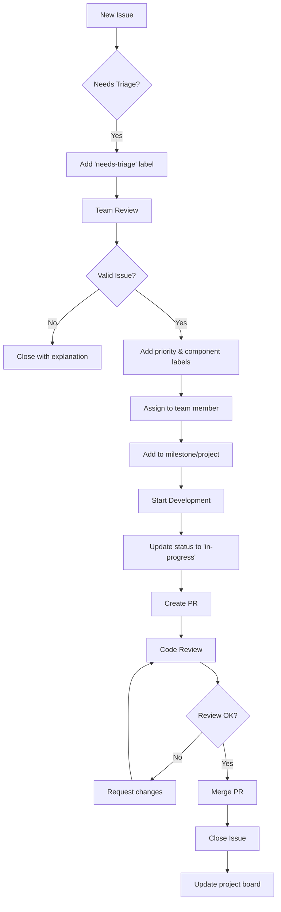

# Gestione Issues GitHub: Esempi Pratici

## Obiettivo
Imparare a gestire efficacemente issues, bug reports, feature requests e task tracking usando le funzionalità avanzate di GitHub Issues.

## Scenario: Team di Sviluppo E-commerce

Siamo parte di un team che sviluppa una piattaforma e-commerce. Useremo Issues per coordinare il lavoro e tracciare problemi.

## Parte 1: Configurazione Labels

### Step 1: Sistema di Labels Organizzato
```yaml
# Labels per Tipo
type: bug          # 🐛 Problemi da risolvere
type: feature      # ✨ Nuove funzionalità  
type: enhancement  # 🚀 Miglioramenti esistenti
type: task         # 📋 Task generali
type: documentation # 📚 Aggiornamenti doc

# Labels per Priorità
priority: critical  # 🚨 Blocca produzione
priority: high      # ⚡ Importante
priority: medium    # 📅 Normale
priority: low       # 🐌 Quando possibile

# Labels per Componenti
component: frontend  # 🎨 UI/UX
component: backend   # ⚙️ Server logic
component: database  # 🗄️ DB related
component: api       # 🔌 API endpoints
component: auth      # 🔐 Authentication

# Labels per Status
status: needs-triage     # 🔍 Da valutare
status: in-progress      # 🏗️ In lavorazione
status: needs-review     # 👀 Da revieware
status: blocked          # 🚫 Bloccato
status: ready-for-test   # 🧪 Pronto per test
```

### Step 2: Creazione Labels via GitHub CLI
```bash
# Installa GitHub CLI se non presente
gh auth login

# Script per creare labels
gh label create "type: bug" --color "d73a4a" --description "🐛 Something isn't working"
gh label create "type: feature" --color "0075ca" --description "✨ New feature or request"
gh label create "type: enhancement" --color "a2eeef" --description "🚀 Enhancement to existing feature"

gh label create "priority: critical" --color "b60205" --description "🚨 Critical priority"
gh label create "priority: high" --color "e99695" --description "⚡ High priority"
gh label create "priority: medium" --color "fbca04" --description "📅 Medium priority"
gh label create "priority: low" --color "0e8a16" --description "🐌 Low priority"

gh label create "component: frontend" --color "bfd4f2" --description "🎨 Frontend related"
gh label create "component: backend" --color "d4c5f9" --description "⚙️ Backend related"
gh label create "component: database" --color "c2e0c6" --description "🗄️ Database related"
```

## Parte 2: Templates per Issues

### Template 1: Bug Report
```markdown
<!-- .github/ISSUE_TEMPLATE/bug_report.md -->
---
name: 🐛 Bug Report
about: Segnala un bug per aiutarci a migliorare
title: '[BUG] '
labels: ['type: bug', 'status: needs-triage']
assignees: ''
---

## 📋 Descrizione del Bug
<!-- Descrizione chiara e concisa del bug -->

## 🔄 Passi per Riprodurre
1. Vai a '...'
2. Clicca su '...'
3. Inserisci '...'
4. Vedi errore

## ✅ Comportamento Atteso
<!-- Cosa dovrebbe succedere normalmente -->

## ❌ Comportamento Attuale
<!-- Cosa succede invece -->

## 📱 Environment
- **OS**: [es. macOS 13.1, Windows 11, Ubuntu 22.04]
- **Browser**: [es. Chrome 108, Firefox 107, Safari 16]
- **Versione App**: [es. v2.1.0]
- **Dispositivo**: [es. iPhone 14, Desktop, Tablet]

## 📸 Screenshot
<!-- Aggiungi screenshot se utili -->

## 📝 Log / Console Errors
```
<!-- Incolla eventuali errori da console o log -->
```

## 🔗 Link Correlati
<!-- Issues o PR correlati -->

## ℹ️ Informazioni Aggiuntive
<!-- Qualsiasi altro dettaglio utile -->

---
<!-- Checklist per chi assegna l'issue -->
### 👥 Per il Team
- [ ] Issue triaged e prioritizzato
- [ ] Assegnato al membro corretto
- [ ] Milestone impostato
- [ ] Labels aggiunti
```

### Template 2: Feature Request
```markdown
<!-- .github/ISSUE_TEMPLATE/feature_request.md -->
---
name: ✨ Feature Request
about: Suggerisci una nuova funzionalità
title: '[FEATURE] '
labels: ['type: feature', 'status: needs-triage']
assignees: ''
---

## 🎯 Problema da Risolvere
<!-- Descrivi il problema che questa feature risolverebbe -->
**Come utente, vorrei** [descrizione]
**In modo da** [beneficio]

## 💡 Soluzione Proposta
<!-- Descrivi la soluzione che vorresti vedere implementata -->

### 🎨 UI/UX Mockup
<!-- Aggiungi mockup, wireframe o descrizioni dell'interfaccia -->

### ⚙️ Comportamento Atteso
<!-- Descrivi come dovrebbe funzionare la feature -->

## 🔄 Alternative Considerate
<!-- Altre soluzioni che hai considerato -->

## 📊 Impatto e Priorità
<!-- Perché questa feature è importante -->
- **Numero di utenti interessati**: [stima]
- **Impatto sul business**: [Alto/Medio/Basso]
- **Complessità implementazione**: [Alta/Media/Bassa]

## 🧪 Criteri di Accettazione
<!-- Cosa deve essere vero perché la feature sia considerata completa -->
- [ ] Criterio 1
- [ ] Criterio 2
- [ ] Criterio 3

## 🔗 Risorse e Riferimenti
<!-- Link a documentazione, esempi, competitor, etc. -->

## 💬 Note Aggiuntive
<!-- Qualsiasi altra informazione rilevante -->

---
### 👥 Per il Team
- [ ] Feature valutata dal product team
- [ ] Effort estimate completato
- [ ] Roadmap position discussa
- [ ] Dependencies identificate
```

### Template 3: Task/Story
```markdown
<!-- .github/ISSUE_TEMPLATE/task.md -->
---
name: 📋 Task
about: Task di sviluppo o miglioramento
title: '[TASK] '
labels: ['type: task', 'status: needs-triage']
assignees: ''
---

## 📋 Descrizione Task
<!-- Descrizione chiara del task da completare -->

## 🎯 Obiettivo
<!-- Cosa vogliamo ottenere con questo task -->

## 📝 Checklist
<!-- Lista delle attività da completare -->
- [ ] Subtask 1
- [ ] Subtask 2
- [ ] Subtask 3
- [ ] Testing
- [ ] Documentation update

## 🔧 Dettagli Tecnici
<!-- Informazioni tecniche per implementazione -->

### 📁 File da Modificare
<!-- Lista dei file che potrebbero essere toccati -->

### 🔗 Dependencies
<!-- Altri issues o tasks che devono essere completati prima -->

## 📊 Definition of Done
<!-- Criteri per considerare il task completato -->
- [ ] Code implemented and tested
- [ ] Unit tests written/updated
- [ ] Documentation updated
- [ ] Code reviewed and approved
- [ ] Deployed to staging
- [ ] QA tested and approved

## ⏱️ Time Estimate
<!-- Stima del tempo necessario -->
**Estimate**: [X hours/days]

## 🔗 Related Issues
<!-- Issues correlati -->

---
### 👥 Per il Team
- [ ] Task breakdown completato
- [ ] Sprint assignment fatto
- [ ] Dependencies verificate
```

## Parte 3: Workflow di Gestione Issues

### Workflow Standard


### Automazione con GitHub Actions
```yaml
# .github/workflows/issue-management.yml
name: Issue Management

on:
  issues:
    types: [opened, labeled, assigned]
  issue_comment:
    types: [created]

jobs:
  auto-assign-triage:
    if: github.event.action == 'opened'
    runs-on: ubuntu-latest
    steps:
      - name: Add triage label
        uses: actions/github-script@v6
        with:
          script: |
            github.rest.issues.addLabels({
              issue_number: context.issue.number,
              owner: context.repo.owner,
              repo: context.repo.repo,
              labels: ['status: needs-triage']
            });

  assign-component-team:
    if: contains(github.event.label.name, 'component:')
    runs-on: ubuntu-latest
    steps:
      - name: Auto-assign team
        uses: actions/github-script@v6
        with:
          script: |
            const label = context.payload.label.name;
            let assignees = [];
            
            if (label.includes('frontend')) {
              assignees = ['frontend-team-lead'];
            } else if (label.includes('backend')) {
              assignees = ['backend-team-lead'];
            } else if (label.includes('database')) {
              assignees = ['database-admin'];
            }
            
            if (assignees.length > 0) {
              github.rest.issues.addAssignees({
                issue_number: context.issue.number,
                owner: context.repo.owner,
                repo: context.repo.repo,
                assignees: assignees
              });
            }

  notify-high-priority:
    if: contains(github.event.label.name, 'priority: critical')
    runs-on: ubuntu-latest
    steps:
      - name: Notify Slack
        uses: 8398a7/action-slack@v3
        with:
          status: custom
          custom_payload: |
            {
              text: "🚨 Critical Priority Issue Created",
              blocks: [
                {
                  type: "section",
                  text: {
                    type: "mrkdwn",
                    text: "Critical issue needs immediate attention: <${{ github.event.issue.html_url }}|${{ github.event.issue.title }}>"
                  }
                }
              ]
            }
        env:
          SLACK_WEBHOOK_URL: ${{ secrets.SLACK_WEBHOOK }}
```

## Parte 4: Esempi Pratici di Issues

### Esempio 1: Bug Report E-commerce
```markdown
---
title: "[BUG] Checkout fails when applying discount code"
labels: ["type: bug", "priority: high", "component: frontend"]
assignees: ["frontend-dev"]
---

## 📋 Descrizione del Bug
Il processo di checkout si interrompe quando l'utente tenta di applicare un codice sconto durante il pagamento.

## 🔄 Passi per Riprodurre
1. Aggiungi articoli al carrello (totale > €50)
2. Procedi al checkout
3. Inserisci codice sconto "SAVE20" nel campo apposito
4. Clicca "Applica Codice"
5. La pagina si blocca con spinner infinito

## ✅ Comportamento Atteso
- Il codice sconto viene applicato
- Il totale viene aggiornato (-20%)
- L'utente può procedere con il pagamento

## ❌ Comportamento Attuale
- Spinner infinito dopo aver cliccato "Applica Codice"
- Console error: "Cannot read property 'discountValue' of undefined"
- Utente costretto a ricaricare la pagina

## 📱 Environment
- **OS**: macOS 13.1, Windows 11
- **Browser**: Chrome 108, Firefox 107  
- **Versione App**: v2.3.1
- **User Agent**: Mozilla/5.0...

## 📝 Console Errors
```
Uncaught TypeError: Cannot read property 'discountValue' of undefined
    at DiscountCode.jsx:42
    at processDiscount (checkout.js:156)
```

## 🔗 Link Correlati
- Related to #234 (Discount system refactor)
- Possibly caused by #256 (API changes)

## 💰 Impatto Business
- Conversione checkout ridotta del 15%
- 23 report utenti nelle ultime 24h
- Revenue impact stimato: €2.3k/day
```

### Esempio 2: Feature Request
```markdown
---
title: "[FEATURE] Add wishlist functionality"
labels: ["type: feature", "priority: medium", "component: frontend"]
---

## 🎯 Problema da Risolvere
**Come utente registrato, vorrei** salvare prodotti in una wishlist
**In modo da** poterli acquistare in futuro senza dover cercare di nuovo

## 💡 Soluzione Proposta
Implementare sistema di wishlist che permetta di:
- Aggiungere/rimuovere prodotti dalla wishlist
- Visualizzare lista prodotti salvati
- Condividere wishlist con altri utenti
- Notifiche quando prodotti vanno in sconto

### 🎨 UI/UX Mockup
- Icon cuore sui product cards
- Pagina dedicata "My Wishlist" nel profilo utente
- Badge con numero prodotti nell'header

### ⚙️ Comportamento Atteso
1. Click su cuore → prodotto aggiunto a wishlist
2. Cuore pieno = prodotto in wishlist
3. Pagina wishlist con grid prodotti
4. Possibilità di spostare da wishlist a carrello

## 📊 Impatto e Priorità
- **Utenti interessati**: ~70% (da user survey)
- **Impatto business**: Alto (retention +25%)
- **Complessità**: Media (2-3 sprint)

## 🧪 Criteri di Accettazione
- [ ] Utenti possono aggiungere prodotti a wishlist
- [ ] Utenti possono rimuovere prodotti da wishlist
- [ ] Pagina wishlist mostra tutti i prodotti salvati
- [ ] Wishlist persiste tra sessioni
- [ ] Mobile responsive
- [ ] Performance: <2s loading time

## 🔧 Considerazioni Tecniche
- Database: nuova tabella `user_wishlists`
- API: endpoint GET/POST/DELETE /api/wishlist
- Frontend: nuovo componente WishlistButton
- Storage: localStorage per utenti non registrati
```

### Esempio 3: Task Tecnico
```markdown
---
title: "[TASK] Migrate user authentication to JWT"
labels: ["type: task", "priority: high", "component: backend"]
assignees: ["backend-lead"]
---

## 📋 Descrizione Task
Migrare il sistema di autenticazione da sessioni server-side a JWT tokens per migliorare scalabilità e performance.

## 🎯 Obiettivo
- Ridurre carico server (no session storage)
- Migliorare scalabilità per microservices
- Preparare per mobile app authentication

## 📝 Checklist
- [ ] Design JWT token structure
- [ ] Implement JWT generation/validation
- [ ] Update login endpoint
- [ ] Update middleware authentication
- [ ] Migrate existing user sessions
- [ ] Update frontend token handling
- [ ] Add token refresh mechanism
- [ ] Update documentation
- [ ] Security audit review
- [ ] Load testing

## 🔧 Dettagli Tecnici

### 📁 File da Modificare
- `src/auth/middleware.js` - Auth middleware
- `src/controllers/auth.js` - Auth controllers  
- `src/models/User.js` - User model
- `frontend/src/utils/auth.js` - Frontend auth utils
- `docs/api/authentication.md` - API docs

### 🔐 Security Considerations
- Short-lived access tokens (15 min)
- Refresh tokens stored securely
- Token blacklisting for logout
- Rate limiting on token endpoints

## ⏱️ Time Estimate
**Estimate**: 5-7 days

## 🧪 Testing Strategy
- Unit tests for JWT utils
- Integration tests for auth endpoints
- Security penetration testing
- Load testing with JMeter

## 📊 Definition of Done
- [ ] All endpoints use JWT authentication
- [ ] Frontend handles token refresh automatically
- [ ] Session cleanup script implemented
- [ ] Documentation updated
- [ ] Security review passed
- [ ] Performance benchmarks met
- [ ] Deployed and monitored for 48h
```

## Parte 5: Metriche e Analytics

### Dashboard Issues
```markdown
## 📊 Issue Metrics Dashboard

### Current Status
- 🐛 Open Bugs: 12 (-3 from last week)
- ✨ Open Features: 8 (+2 from last week)  
- 📋 Open Tasks: 15 (+1 from last week)
- ⏱️ Avg Resolution Time: 3.2 days (-0.5 from last week)

### Priority Breakdown
- 🚨 Critical: 2 (target: <5)
- ⚡ High: 7 (target: <10)
- 📅 Medium: 18 (target: <25)
- 🐌 Low: 8 (no target)

### Component Health
- 🎨 Frontend: 8 issues (healthy)
- ⚙️ Backend: 12 issues (attention needed)
- 🗄️ Database: 3 issues (healthy)
- 🔌 API: 5 issues (healthy)

### Team Performance
- Alice: 5 assigned, 2.1 days avg resolution
- Bob: 7 assigned, 4.3 days avg resolution  
- Carol: 4 assigned, 1.8 days avg resolution
```

### Reports Automatici
```javascript
// Script per generare report settimanale
const { Octokit } = require("@octokit/rest");

async function generateWeeklyReport() {
    const octokit = new Octokit({
        auth: process.env.GITHUB_TOKEN
    });

    const oneWeekAgo = new Date();
    oneWeekAgo.setDate(oneWeekAgo.getDate() - 7);

    // Issues create nella settimana
    const newIssues = await octokit.rest.issues.listForRepo({
        owner: 'your-org',
        repo: 'your-repo',
        since: oneWeekAgo.toISOString(),
        state: 'all'
    });

    // Issues chiuse nella settimana
    const closedIssues = newIssues.data.filter(issue => 
        issue.state === 'closed' && 
        new Date(issue.closed_at) > oneWeekAgo
    );

    const report = {
        created: newIssues.data.length,
        closed: closedIssues.length,
        avgResolutionTime: calculateAvgResolution(closedIssues),
        topLabels: getTopLabels(newIssues.data),
        teamPerformance: calculateTeamStats(closedIssues)
    };

    console.log('📊 Weekly Issues Report:', report);
}
```

## Conclusione

La gestione efficace delle issues è cruciale per:

1. **Tracciamento problemi**: Bug tracking sistematico
2. **Pianificazione features**: Roadmap e prioritizzazione  
3. **Coordinamento team**: Assignment e comunicazione
4. **Metriche qualità**: KPI e performance monitoring
5. **Documentazione**: Knowledge base per il team

### Best Practices Apprese
- **Labels consistenti**: Sistema organizzato e intuitivo
- **Templates strutturati**: Informazioni complete e standardizzate
- **Automazione**: Workflow automatizzati per efficiency
- **Metriche**: Monitoring per continuous improvement
- **Communication**: Aggiornamenti regolari e feedback

L'uso professionale di GitHub Issues trasforma il caos in ordine, migliorando produttività e qualità del software.
