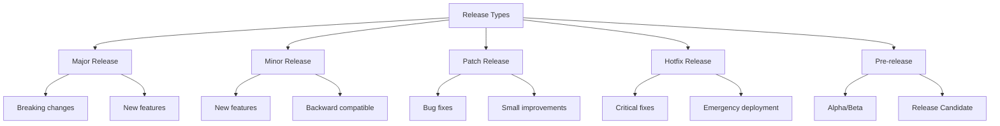

# Release Management Strategies

## 🎯 Obiettivi di Apprendimento
- Comprendere il processo di release management
- Implementare strategie di versioning semantico
- Gestire release branches e hotfix
- Automatizzare il processo di release
- Coordinare rilasci in team

## 📋 Concetti Fondamentali

### Che cos'è il Release Management?

Il **Release Management** è il processo di pianificazione, costruzione, testing e deployment di software releases. Include:

- 📅 **Pianificazione delle release**
- 🔄 **Gestione del ciclo di vita**
- 🏷️ **Versioning e tagging**
- 🚀 **Deployment e rollback**
- 📊 **Monitoraggio post-release**

### Tipi di Release



## 🔢 Semantic Versioning (SemVer)

### Schema di Versioning

```
MAJOR.MINOR.PATCH[-PRERELEASE][+BUILD]
```

**Esempi:**
- `1.0.0` - Release stabile
- `2.1.3` - Patch release
- `3.0.0-alpha.1` - Pre-release
- `1.2.0+20240115` - Con metadata build

### Regole SemVer

```bash
# MAJOR version - Breaking changes
1.0.0 → 2.0.0

# MINOR version - New features (backward compatible)
1.0.0 → 1.1.0

# PATCH version - Bug fixes
1.0.0 → 1.0.1

# PRE-RELEASE
1.0.0-alpha.1 → 1.0.0-alpha.2 → 1.0.0-beta.1 → 1.0.0-rc.1 → 1.0.0
```

## 🌳 Git Flow Release Strategy

### Release Branch Workflow

```bash
# 1. Inizia una nuova release dal develop
git checkout develop
git pull origin develop
git checkout -b release/v2.1.0

# 2. Aggiorna versione e metadata
echo "2.1.0" > VERSION
git add VERSION
git commit -m "Bump version to 2.1.0"

# 3. Finalize e merge
git checkout main
git merge --no-ff release/v2.1.0
git tag -a v2.1.0 -m "Release version 2.1.0"

# 4. Merge back to develop
git checkout develop
git merge --no-ff release/v2.1.0

# 5. Cleanup
git branch -d release/v2.1.0
git push origin main develop --tags
```

### Struttura Branch Release

```
main (production)
├── v1.0.0 (tag)
├── v1.1.0 (tag)
└── v2.0.0 (tag)

develop (integration)
├── feature/user-auth
├── feature/dashboard
└── release/v2.1.0

hotfix/v2.0.1 (emergency fix)
└── merge to main & develop
```

## 🚀 Release Automation Scripts

### 1. Script di Release Automatica

```bash
#!/bin/bash
# release.sh - Script per automatizzare le release

set -e

# Colori per output
RED='\033[0;31m'
GREEN='\033[0;32m'
YELLOW='\033[1;33m'
NC='\033[0m' # No Color

# Funzioni helper
log_info() {
    echo -e "${GREEN}[INFO]${NC} $1"
}

log_warn() {
    echo -e "${YELLOW}[WARN]${NC} $1"
}

log_error() {
    echo -e "${RED}[ERROR]${NC} $1"
}

# Validazione input
validate_version() {
    local version=$1
    if [[ ! $version =~ ^[0-9]+\.[0-9]+\.[0-9]+$ ]]; then
        log_error "Formato versione non valido. Usa: MAJOR.MINOR.PATCH"
        exit 1
    fi
}

# Controlli pre-release
pre_release_checks() {
    log_info "Eseguendo controlli pre-release..."
    
    # Verifica che siamo su develop
    current_branch=$(git rev-parse --abbrev-ref HEAD)
    if [ "$current_branch" != "develop" ]; then
        log_error "Devi essere sul branch 'develop' per creare una release"
        exit 1
    fi
    
    # Verifica working directory pulita
    if [ -n "$(git status --porcelain)" ]; then
        log_error "Working directory non pulita. Commit le modifiche prima della release"
        exit 1
    fi
    
    # Verifica sincronizzazione con remote
    git fetch origin
    local_commit=$(git rev-parse develop)
    remote_commit=$(git rev-parse origin/develop)
    
    if [ "$local_commit" != "$remote_commit" ]; then
        log_error "Branch develop non sincronizzato con origin. Esegui git pull"
        exit 1
    fi
    
    # Esegui test
    log_info "Eseguendo test suite..."
    if command -v npm &> /dev/null; then
        npm test
    elif command -v pytest &> /dev/null; then
        pytest
    fi
    
    log_info "Controlli pre-release completati ✓"
}

# Aggiorna file di versione
update_version_files() {
    local version=$1
    
    log_info "Aggiornando file di versione a $version..."
    
    # package.json
    if [ -f "package.json" ]; then
        sed -i.bak "s/\"version\": \".*\"/\"version\": \"$version\"/" package.json
        rm package.json.bak
        git add package.json
        log_info "Aggiornato package.json"
    fi
    
    # VERSION file
    echo "$version" > VERSION
    git add VERSION
    log_info "Aggiornato VERSION"
    
    # Python setup.py
    if [ -f "setup.py" ]; then
        sed -i.bak "s/version='.*'/version='$version'/" setup.py
        rm setup.py.bak
        git add setup.py
        log_info "Aggiornato setup.py"
    fi
    
    # Cargo.toml (Rust)
    if [ -f "Cargo.toml" ]; then
        sed -i.bak "s/version = \".*\"/version = \"$version\"/" Cargo.toml
        rm Cargo.toml.bak
        git add Cargo.toml
        log_info "Aggiornato Cargo.toml"
    fi
}

# Genera changelog
generate_changelog() {
    local version=$1
    local last_tag=$(git describe --tags --abbrev=0 2>/dev/null || echo "")
    
    log_info "Generando changelog per v$version..."
    
    if [ -n "$last_tag" ]; then
        echo "## v$version - $(date +%Y-%m-%d)" > changelog_temp.md
        echo "" >> changelog_temp.md
        
        # Commit messages dal ultimo tag
        git log --oneline --pretty=format:"- %s" "$last_tag"..HEAD >> changelog_temp.md
        echo "" >> changelog_temp.md
        echo "" >> changelog_temp.md
        
        # Prepend al CHANGELOG esistente
        if [ -f "CHANGELOG.md" ]; then
            cat CHANGELOG.md >> changelog_temp.md
            mv changelog_temp.md CHANGELOG.md
        else
            mv changelog_temp.md CHANGELOG.md
        fi
    else
        echo "## v$version - $(date +%Y-%m-%d)" > CHANGELOG.md
        echo "" >> CHANGELOG.md
        echo "- Initial release" >> CHANGELOG.md
    fi
    
    git add CHANGELOG.md
    log_info "Changelog generato ✓"
}

# Funzione principale di release
create_release() {
    local version=$1
    local release_branch="release/v$version"
    
    log_info "Creando release v$version..."
    
    # Crea release branch
    git checkout -b "$release_branch"
    log_info "Creato branch $release_branch"
    
    # Aggiorna versioni
    update_version_files "$version"
    
    # Genera changelog
    generate_changelog "$version"
    
    # Commit delle modifiche
    git commit -m "chore(release): bump version to $version
    
- Update version files
- Generate changelog
- Prepare for release v$version"
    
    log_info "Release branch preparato ✓"
    
    # Merge su main
    log_info "Merging su main..."
    git checkout main
    git pull origin main
    git merge --no-ff "$release_branch" -m "Release v$version"
    
    # Crea tag
    git tag -a "v$version" -m "Release version $version
    
Release notes:
$(head -20 CHANGELOG.md)"
    
    # Merge back su develop
    log_info "Merging back su develop..."
    git checkout develop
    git merge --no-ff "$release_branch" -m "chore: merge release v$version back to develop"
    
    # Cleanup
    git branch -d "$release_branch"
    
    log_info "Release v$version creata con successo! ✓"
    
    # Push everything
    read -p "Vuoi fare push di tutto su origin? (y/N) " -n 1 -r
    echo
    if [[ $REPLY =~ ^[Yy]$ ]]; then
        git push origin main develop --tags
        log_info "Push completato ✓"
    else
        log_warn "Ricorda di fare push manualmente:"
        echo "git push origin main develop --tags"
    fi
}

# Funzione per hotfix
create_hotfix() {
    local version=$1
    local hotfix_branch="hotfix/v$version"
    
    log_info "Creando hotfix v$version..."
    
    # Crea hotfix branch da main
    git checkout main
    git pull origin main
    git checkout -b "$hotfix_branch"
    
    log_info "Creato branch $hotfix_branch da main"
    log_warn "Applica le tue modifiche di hotfix e poi esegui:"
    echo "  git add ."
    echo "  git commit -m 'fix: description of hotfix'"
    echo "  ./release.sh --finalize-hotfix $version"
}

# Finalizza hotfix
finalize_hotfix() {
    local version=$1
    local hotfix_branch="hotfix/v$version"
    
    log_info "Finalizzando hotfix v$version..."
    
    # Aggiorna versioni
    update_version_files "$version"
    generate_changelog "$version"
    
    git add .
    git commit -m "chore(hotfix): bump version to $version"
    
    # Merge su main
    git checkout main
    git merge --no-ff "$hotfix_branch" -m "Hotfix v$version"
    git tag -a "v$version" -m "Hotfix version $version"
    
    # Merge su develop
    git checkout develop
    git merge --no-ff "$hotfix_branch" -m "chore: merge hotfix v$version to develop"
    
    # Cleanup
    git branch -d "$hotfix_branch"
    
    log_info "Hotfix v$version completato ✓"
}

# Main script logic
main() {
    case "${1:-}" in
        --hotfix)
            if [ -z "$2" ]; then
                log_error "Specifica la versione per l'hotfix"
                exit 1
            fi
            validate_version "$2"
            create_hotfix "$2"
            ;;
        --finalize-hotfix)
            if [ -z "$2" ]; then
                log_error "Specifica la versione per finalizzare l'hotfix"
                exit 1
            fi
            validate_version "$2"
            finalize_hotfix "$2"
            ;;
        --help|-h)
            echo "Usage: $0 [VERSION] | --hotfix [VERSION] | --finalize-hotfix [VERSION]"
            echo ""
            echo "Examples:"
            echo "  $0 2.1.0                    # Create standard release"
            echo "  $0 --hotfix 2.0.1           # Start hotfix"
            echo "  $0 --finalize-hotfix 2.0.1  # Finalize hotfix"
            exit 0
            ;;
        "")
            log_error "Specifica una versione"
            echo "Usage: $0 [VERSION]"
            exit 1
            ;;
        *)
            validate_version "$1"
            pre_release_checks
            create_release "$1"
            ;;
    esac
}

# Esegui main con tutti gli argomenti
main "$@"
```

### 2. Script di Validazione Pre-Release

```bash
#!/bin/bash
# validate-release.sh - Validazione pre-release

set -e

echo "🔍 Validazione Pre-Release"
echo "========================="

# Controllo branch
current_branch=$(git rev-parse --abbrev-ref HEAD)
echo "📍 Branch corrente: $current_branch"

if [[ $current_branch != release/* ]]; then
    echo "❌ Non sei su un release branch"
    exit 1
fi

# Estrai versione dal branch name
version=${current_branch#release/v}
echo "🏷️  Versione: $version"

# Controllo file di versione
echo ""
echo "🔍 Controllo consistenza versioni..."

# package.json
if [ -f "package.json" ]; then
    pkg_version=$(grep '"version"' package.json | sed 's/.*"version": "\(.*\)".*/\1/')
    if [ "$pkg_version" != "$version" ]; then
        echo "❌ Versione in package.json non corrisponde: $pkg_version"
        exit 1
    fi
    echo "✅ package.json: $pkg_version"
fi

# VERSION file
if [ -f "VERSION" ]; then
    file_version=$(cat VERSION)
    if [ "$file_version" != "$version" ]; then
        echo "❌ Versione in VERSION non corrisponde: $file_version"
        exit 1
    fi
    echo "✅ VERSION: $file_version"
fi

# Controllo CHANGELOG
echo ""
echo "🔍 Controllo CHANGELOG..."
if [ -f "CHANGELOG.md" ]; then
    if grep -q "## v$version" CHANGELOG.md; then
        echo "✅ CHANGELOG aggiornato per v$version"
    else
        echo "❌ CHANGELOG non contiene v$version"
        exit 1
    fi
else
    echo "⚠️  CHANGELOG.md non trovato"
fi

# Controllo test
echo ""
echo "🧪 Esecuzione test..."
if command -v npm &> /dev/null && [ -f "package.json" ]; then
    npm test
elif command -v pytest &> /dev/null; then
    pytest
elif command -v mvn &> /dev/null && [ -f "pom.xml" ]; then
    mvn test
else
    echo "⚠️  Nessun sistema di test rilevato"
fi

# Controllo build
echo ""
echo "🏗️  Controllo build..."
if command -v npm &> /dev/null && [ -f "package.json" ]; then
    npm run build
elif command -v cargo &> /dev/null && [ -f "Cargo.toml" ]; then
    cargo build --release
else
    echo "⚠️  Nessun sistema di build rilevato"
fi

# Controllo sicurezza
echo ""
echo "🔒 Controllo sicurezza..."
if command -v npm &> /dev/null; then
    npm audit
fi

# Controllo git status
echo ""
echo "🔍 Controllo Git status..."
if [ -n "$(git status --porcelain)" ]; then
    echo "❌ Working directory non pulita"
    git status --short
    exit 1
else
    echo "✅ Working directory pulita"
fi

echo ""
echo "✅ Validazione completata con successo!"
echo "🚀 La release v$version è pronta per il deployment"
```

## 📈 Release Planning e Roadmap

### 1. Template Release Plan

```yaml
# release-plan.yml
release:
  version: "2.1.0"
  codename: "Lightning"
  planned_date: "2024-02-15"
  release_manager: "Mario Rossi"
  
features:
  - name: "Advanced Dashboard"
    status: "in_progress"
    assignee: "team-frontend"
    completion: 80
    
  - name: "API v2 Migration"
    status: "completed"
    assignee: "team-backend"
    completion: 100
    
  - name: "Mobile Responsive Design"
    status: "testing"
    assignee: "team-ui"
    completion: 95

milestones:
  - name: "Feature Freeze"
    date: "2024-02-01"
    completed: true
    
  - name: "Code Freeze"
    date: "2024-02-10"
    completed: false
    
  - name: "Release Candidate"
    date: "2024-02-12"
    completed: false
    
  - name: "Production Release"
    date: "2024-02-15"
    completed: false

testing:
  unit_tests: 
    status: "passing"
    coverage: 85
  integration_tests:
    status: "passing"
    coverage: 78
  e2e_tests:
    status: "in_progress"
    coverage: 60

risks:
  - description: "API breaking changes"
    probability: "medium"
    impact: "high"
    mitigation: "Comprehensive migration guide"
    
  - description: "Performance regression"
    probability: "low"
    impact: "medium"
    mitigation: "Load testing before release"

communication:
  internal_announcement: "2024-02-01"
  beta_users_notification: "2024-02-05"
  public_announcement: "2024-02-15"
  documentation_update: "2024-02-15"
```

### 2. Script di Monitoraggio Release

```python
#!/usr/bin/env python3
# release-monitor.py - Monitoraggio dello stato delle release

import requests
import json
import sys
from datetime import datetime, timedelta
import yaml

class ReleaseMonitor:
    def __init__(self, config_file="release-plan.yml"):
        with open(config_file, 'r') as f:
            self.config = yaml.safe_load(f)
        
    def check_milestone_status(self):
        """Controlla lo stato dei milestone"""
        print("📅 Stato Milestone:")
        print("=" * 50)
        
        for milestone in self.config['milestones']:
            name = milestone['name']
            date = datetime.strptime(milestone['date'], '%Y-%m-%d')
            completed = milestone['completed']
            
            status_icon = "✅" if completed else "⏳"
            days_remaining = (date - datetime.now()).days
            
            if days_remaining < 0 and not completed:
                status_icon = "🚨"
                status = f"OVERDUE by {abs(days_remaining)} days"
            elif days_remaining == 0:
                status = "DUE TODAY"
            elif days_remaining > 0:
                status = f"{days_remaining} days remaining"
            else:
                status = "COMPLETED"
            
            print(f"{status_icon} {name}: {status}")
    
    def check_feature_progress(self):
        """Controlla il progresso delle feature"""
        print("\n🚀 Progresso Feature:")
        print("=" * 50)
        
        total_features = len(self.config['features'])
        completed_features = 0
        total_completion = 0
        
        for feature in self.config['features']:
            name = feature['name']
            status = feature['status']
            completion = feature['completion']
            assignee = feature['assignee']
            
            total_completion += completion
            if completion == 100:
                completed_features += 1
            
            status_icons = {
                'completed': '✅',
                'in_progress': '🔄',
                'testing': '🧪',
                'blocked': '🚫',
                'not_started': '⏸️'
            }
            
            icon = status_icons.get(status, '❓')
            progress_bar = self.create_progress_bar(completion)
            
            print(f"{icon} {name}")
            print(f"    {progress_bar} {completion}% - {assignee}")
    
    def create_progress_bar(self, percentage, width=20):
        """Crea una barra di progresso ASCII"""
        filled = int(width * percentage / 100)
        bar = '█' * filled + '░' * (width - filled)
        return f"[{bar}]"
    
    def check_testing_status(self):
        """Controlla lo stato dei test"""
        print("\n🧪 Stato Testing:")
        print("=" * 50)
        
        testing = self.config['testing']
        
        for test_type, info in testing.items():
            status = info['status']
            coverage = info['coverage']
            
            status_icons = {
                'passing': '✅',
                'failing': '❌',
                'in_progress': '🔄'
            }
            
            icon = status_icons.get(status, '❓')
            coverage_status = "🟢" if coverage >= 80 else "🟡" if coverage >= 60 else "🔴"
            
            print(f"{icon} {test_type.replace('_', ' ').title()}: {status}")
            print(f"    {coverage_status} Coverage: {coverage}%")
    
    def check_risks(self):
        """Analizza i rischi del progetto"""
        print("\n⚠️  Analisi Rischi:")
        print("=" * 50)
        
        for risk in self.config['risks']:
            probability = risk['probability']
            impact = risk['impact']
            description = risk['description']
            mitigation = risk['mitigation']
            
            # Calcola priorità rischio
            priority_matrix = {
                ('low', 'low'): '🟢',
                ('low', 'medium'): '🟡',
                ('low', 'high'): '🟡',
                ('medium', 'low'): '🟡',
                ('medium', 'medium'): '🟠',
                ('medium', 'high'): '🔴',
                ('high', 'low'): '🟡',
                ('high', 'medium'): '🔴',
                ('high', 'high'): '🚨'
            }
            
            priority_icon = priority_matrix.get((probability, impact), '❓')
            
            print(f"{priority_icon} {description}")
            print(f"    Probabilità: {probability}, Impatto: {impact}")
            print(f"    Mitigazione: {mitigation}")
    
    def generate_report(self):
        """Genera un report completo"""
        print(f"📊 REPORT RELEASE v{self.config['release']['version']}")
        print(f"Codename: {self.config['release']['codename']}")
        print(f"Data Prevista: {self.config['release']['planned_date']}")
        print(f"Release Manager: {self.config['release']['release_manager']}")
        print("=" * 60)
        
        self.check_milestone_status()
        self.check_feature_progress()
        self.check_testing_status()
        self.check_risks()
        
        # Summary
        print("\n📋 RIEPILOGO:")
        print("=" * 50)
        
        # Calcola stato generale
        completed_milestones = sum(1 for m in self.config['milestones'] if m['completed'])
        total_milestones = len(self.config['milestones'])
        
        completed_features = sum(1 for f in self.config['features'] if f['completion'] == 100)
        total_features = len(self.config['features'])
        
        avg_completion = sum(f['completion'] for f in self.config['features']) / total_features
        
        print(f"Milestone completati: {completed_milestones}/{total_milestones}")
        print(f"Feature completate: {completed_features}/{total_features}")
        print(f"Completamento medio: {avg_completion:.1f}%")
        
        # Determina stato release
        if avg_completion >= 95 and completed_milestones == total_milestones:
            print("🎉 STATO: PRONTA PER RELEASE")
        elif avg_completion >= 80:
            print("🟡 STATO: IN DIRITTURA D'ARRIVO")
        else:
            print("🔴 STATO: IN SVILUPPO")

if __name__ == "__main__":
    monitor = ReleaseMonitor()
    monitor.generate_report()
```

## 🔄 Continuous Release Pipeline

### 1. GitHub Actions per Release Automation

```yaml
# .github/workflows/release.yml
name: Automated Release

on:
  push:
    branches: [ main ]
    tags: [ 'v*' ]

env:
  NODE_VERSION: '18'
  PYTHON_VERSION: '3.9'

jobs:
  validate:
    runs-on: ubuntu-latest
    steps:
      - uses: actions/checkout@v4
        with:
          fetch-depth: 0
      
      - name: Setup Node.js
        uses: actions/setup-node@v4
        with:
          node-version: ${{ env.NODE_VERSION }}
          cache: 'npm'
      
      - name: Install dependencies
        run: npm ci
      
      - name: Run tests
        run: npm test
      
      - name: Run linting
        run: npm run lint
      
      - name: Build project
        run: npm run build
      
      - name: Security audit
        run: npm audit --audit-level moderate

  release:
    needs: validate
    runs-on: ubuntu-latest
    if: startsWith(github.ref, 'refs/tags/v')
    
    steps:
      - uses: actions/checkout@v4
        with:
          fetch-depth: 0
      
      - name: Extract version
        id: version
        run: echo "VERSION=${GITHUB_REF#refs/tags/v}" >> $GITHUB_OUTPUT
      
      - name: Setup Node.js
        uses: actions/setup-node@v4
        with:
          node-version: ${{ env.NODE_VERSION }}
          cache: 'npm'
      
      - name: Install dependencies
        run: npm ci
      
      - name: Build for production
        run: npm run build:prod
      
      - name: Generate changelog
        id: changelog
        run: |
          # Genera changelog dal ultimo tag
          LAST_TAG=$(git describe --tags --abbrev=0 HEAD^ 2>/dev/null || echo "")
          if [ -n "$LAST_TAG" ]; then
            CHANGELOG=$(git log --oneline --pretty=format:"- %s" $LAST_TAG..HEAD)
          else
            CHANGELOG="- Initial release"
          fi
          echo "CHANGELOG<<EOF" >> $GITHUB_OUTPUT
          echo "$CHANGELOG" >> $GITHUB_OUTPUT
          echo "EOF" >> $GITHUB_OUTPUT
      
      - name: Create GitHub Release
        uses: actions/create-release@v1
        env:
          GITHUB_TOKEN: ${{ secrets.GITHUB_TOKEN }}
        with:
          tag_name: ${{ github.ref }}
          release_name: Release v${{ steps.version.outputs.VERSION }}
          body: |
            ## Changes in v${{ steps.version.outputs.VERSION }}
            
            ${{ steps.changelog.outputs.CHANGELOG }}
            
            ## Installation
            
            ```bash
            npm install myproject@${{ steps.version.outputs.VERSION }}
            ```
            
            ## Docker
            
            ```bash
            docker pull myproject:${{ steps.version.outputs.VERSION }}
            ```
          draft: false
          prerelease: ${{ contains(steps.version.outputs.VERSION, '-') }}
      
      - name: Publish to NPM
        if: "!contains(steps.version.outputs.VERSION, '-')"
        run: |
          echo "//registry.npmjs.org/:_authToken=${{ secrets.NPM_TOKEN }}" > ~/.npmrc
          npm publish
      
      - name: Build and push Docker image
        run: |
          echo ${{ secrets.DOCKER_PASSWORD }} | docker login -u ${{ secrets.DOCKER_USERNAME }} --password-stdin
          docker build -t myproject:${{ steps.version.outputs.VERSION }} .
          docker push myproject:${{ steps.version.outputs.VERSION }}
          
          # Tag as latest se non è pre-release
          if [[ "${{ steps.version.outputs.VERSION }}" != *"-"* ]]; then
            docker tag myproject:${{ steps.version.outputs.VERSION }} myproject:latest
            docker push myproject:latest
          fi
      
      - name: Deploy to staging
        if: contains(steps.version.outputs.VERSION, '-')
        run: |
          # Deploy pre-release su staging
          curl -X POST "${{ secrets.STAGING_WEBHOOK_URL }}" \
            -H "Content-Type: application/json" \
            -d '{"version": "${{ steps.version.outputs.VERSION }}"}'
      
      - name: Deploy to production
        if: "!contains(steps.version.outputs.VERSION, '-')"
        run: |
          # Deploy release stabile su production
          curl -X POST "${{ secrets.PRODUCTION_WEBHOOK_URL }}" \
            -H "Content-Type: application/json" \
            -d '{"version": "${{ steps.version.outputs.VERSION }}"}'
      
      - name: Notify team
        uses: 8398a7/action-slack@v3
        with:
          status: ${{ job.status }}
          text: |
            🚀 Release v${{ steps.version.outputs.VERSION }} deployed!
            
            Changes:
            ${{ steps.changelog.outputs.CHANGELOG }}
        env:
          SLACK_WEBHOOK_URL: ${{ secrets.SLACK_WEBHOOK }}

  post-release:
    needs: release
    runs-on: ubuntu-latest
    
    steps:
      - name: Update documentation
        run: |
          # Trigger documentation update
          curl -X POST "${{ secrets.DOCS_WEBHOOK_URL }}" \
            -H "Content-Type: application/json" \
            -d '{"version": "${{ steps.version.outputs.VERSION }}"}'
      
      - name: Update dependency tracking
        run: |
          # Notifica sistemi di dependency tracking
          curl -X POST "https://api.dependabot.com/update" \
            -H "Authorization: Bearer ${{ secrets.DEPENDABOT_TOKEN }}" \
            -d '{"repository": "${{ github.repository }}", "version": "${{ steps.version.outputs.VERSION }}"}'
```

## 📊 Metriche e Monitoraggio Release

### 1. Dashboard di Release Metrics

```javascript
// release-metrics.js
class ReleaseMetrics {
    constructor() {
        this.metrics = {
            leadTime: [],
            deploymentFrequency: [],
            changeFailureRate: [],
            recoveryTime: []
        };
    }
    
    // Lead Time: Tempo da commit a production
    calculateLeadTime(commitDate, releaseDate) {
        const lead = new Date(releaseDate) - new Date(commitDate);
        const days = lead / (1000 * 60 * 60 * 24);
        this.metrics.leadTime.push(days);
        return days;
    }
    
    // Deployment Frequency: Frequenza dei rilasci
    calculateDeploymentFrequency(releases, timeframe = 30) {
        const recentReleases = releases.filter(r => {
            const releaseDate = new Date(r.date);
            const cutoff = new Date();
            cutoff.setDate(cutoff.getDate() - timeframe);
            return releaseDate >= cutoff;
        });
        
        return recentReleases.length / (timeframe / 7); // releases per week
    }
    
    // Change Failure Rate: Percentuale di rilasci con problemi
    calculateChangeFailureRate(releases) {
        const failed = releases.filter(r => r.status === 'failed' || r.rollback).length;
        return (failed / releases.length) * 100;
    }
    
    // Recovery Time: Tempo per risolvere problemi
    calculateRecoveryTime(incidents) {
        const recoveryTimes = incidents.map(incident => {
            const start = new Date(incident.started);
            const end = new Date(incident.resolved);
            return (end - start) / (1000 * 60 * 60); // hours
        });
        
        return recoveryTimes.reduce((a, b) => a + b, 0) / recoveryTimes.length;
    }
    
    // Genera report DORA metrics
    generateDORAReport(releases, incidents) {
        const report = {
            leadTime: {
                average: this.average(this.metrics.leadTime),
                median: this.median(this.metrics.leadTime),
                trend: this.calculateTrend(this.metrics.leadTime)
            },
            deploymentFrequency: this.calculateDeploymentFrequency(releases),
            changeFailureRate: this.calculateChangeFailureRate(releases),
            recoveryTime: this.calculateRecoveryTime(incidents)
        };
        
        // Classificazione performance
        report.performance = this.classifyPerformance(report);
        
        return report;
    }
    
    classifyPerformance(metrics) {
        const classifications = {
            leadTime: metrics.leadTime.median <= 1 ? 'Elite' : 
                     metrics.leadTime.median <= 7 ? 'High' : 
                     metrics.leadTime.median <= 30 ? 'Medium' : 'Low',
            
            deploymentFrequency: metrics.deploymentFrequency >= 1 ? 'Elite' :
                               metrics.deploymentFrequency >= 0.5 ? 'High' :
                               metrics.deploymentFrequency >= 0.25 ? 'Medium' : 'Low',
            
            changeFailureRate: metrics.changeFailureRate <= 15 ? 'Elite' :
                             metrics.changeFailureRate <= 20 ? 'High' :
                             metrics.changeFailureRate <= 30 ? 'Medium' : 'Low',
            
            recoveryTime: metrics.recoveryTime <= 1 ? 'Elite' :
                        metrics.recoveryTime <= 24 ? 'High' :
                        metrics.recoveryTime <= 168 ? 'Medium' : 'Low'
        };
        
        return classifications;
    }
    
    average(arr) {
        return arr.reduce((a, b) => a + b, 0) / arr.length;
    }
    
    median(arr) {
        const sorted = [...arr].sort((a, b) => a - b);
        const mid = Math.floor(sorted.length / 2);
        return sorted.length % 2 === 0 ? 
               (sorted[mid - 1] + sorted[mid]) / 2 : 
               sorted[mid];
    }
    
    calculateTrend(arr) {
        if (arr.length < 2) return 'stable';
        
        const recent = arr.slice(-5);
        const older = arr.slice(-10, -5);
        
        const recentAvg = this.average(recent);
        const olderAvg = this.average(older);
        
        const change = ((recentAvg - olderAvg) / olderAvg) * 100;
        
        if (change > 10) return 'improving';
        if (change < -10) return 'degrading';
        return 'stable';
    }
}

// Usage example
const metrics = new ReleaseMetrics();

// Dati di esempio
const releases = [
    { date: '2024-01-15', version: '2.1.0', status: 'success' },
    { date: '2024-01-08', version: '2.0.1', status: 'success', rollback: false },
    { date: '2024-01-01', version: '2.0.0', status: 'failed', rollback: true }
];

const incidents = [
    { started: '2024-01-16T10:00:00Z', resolved: '2024-01-16T12:30:00Z' },
    { started: '2024-01-02T14:00:00Z', resolved: '2024-01-02T16:45:00Z' }
];

const report = metrics.generateDORAReport(releases, incidents);
console.log('DORA Metrics Report:', report);
```

## 🎯 Best Practices per Release Management

### 1. Checklist Release

```markdown
## Pre-Release Checklist

### Pianificazione
- [ ] Release plan documentato e comunicato
- [ ] Milestone e deadlines definiti
- [ ] Team assignments chiari
- [ ] Rischi identificati e mitigati

### Sviluppo
- [ ] Tutte le feature completate e testate
- [ ] Code review completate
- [ ] Documentazione aggiornata
- [ ] Breaking changes documentati

### Testing
- [ ] Unit tests passano (>=80% coverage)
- [ ] Integration tests passano
- [ ] E2E tests passano
- [ ] Performance testing completato
- [ ] Security testing completato

### Preparazione Release
- [ ] Version bump effettuato
- [ ] Changelog generato
- [ ] Release notes preparate
- [ ] Migration scripts testati
- [ ] Rollback plan definito

### Deploy
- [ ] Staging deployment verificato
- [ ] Production deployment schedulato
- [ ] Monitoring configurato
- [ ] Alerting configurato
- [ ] Backup effettuato

### Post-Release
- [ ] Health checks verificati
- [ ] Metriche monitorate
- [ ] User feedback raccolto
- [ ] Incident response plan attivo
- [ ] Post-mortem schedulato
```

### 2. Comunicazione Release

```markdown
## Template Comunicazione Release

### Internal Team Announcement

**Subject**: 🚀 Release v2.1.0 "Lightning" - Ready for Production

Hi Team,

We're excited to announce that Release v2.1.0 "Lightning" is ready for production deployment!

**🗓️ Timeline:**
- Code Freeze: February 10, 2024 ✅
- Staging Deployment: February 12, 2024 ✅
- Production Deployment: February 15, 2024 🚀

**✨ Key Features:**
- Advanced Dashboard with real-time analytics
- API v2 with improved performance (+40% faster)
- Mobile-responsive design
- Enhanced security features

**📊 Quality Metrics:**
- Test Coverage: 87%
- Performance Tests: All passing
- Security Scan: No critical issues

**🎯 Next Steps:**
1. Final production deployment (John - Feb 15, 9 AM)
2. Post-deployment monitoring (Sarah - Feb 15-16)
3. User feedback collection (All - Feb 15-22)

Questions? Reach out in #releases

Best,
Release Team

---

### Customer Communication

**Subject**: 🎉 Introducing v2.1.0 - Lightning Fast Performance!

Dear Valued Customers,

We're thrilled to announce the release of MyProject v2.1.0, packed with powerful new features and significant performance improvements!

**🚀 What's New:**

**Advanced Dashboard**
Experience real-time analytics with our completely redesigned dashboard featuring:
- Live data updates
- Customizable widgets
- Advanced filtering options

**40% Performance Boost**
Our new API v2 delivers lightning-fast responses, making your workflows more efficient than ever.

**Mobile-First Design**
Access all features seamlessly across devices with our new responsive interface.

**🔧 Migration Guide:**
For customers using API v1, we've prepared a comprehensive migration guide: [link]

**📅 Rollout Schedule:**
- SaaS customers: Automatic update on February 15
- On-premise customers: Update available February 15
- API v1 deprecated: June 15, 2024

**🆘 Support:**
Our team is ready to help! Contact support@myproject.com or visit our updated documentation.

Thank you for being part of our journey!

The MyProject Team
```

## 📚 Strumenti di Release Management

### Software di Release Management

1. **GitLab Release Management**
   - Integrated with CI/CD
   - Release boards
   - Automated deployments

2. **Jira + Confluence**
   - Release planning
   - Progress tracking
   - Documentation integration

3. **Azure DevOps**
   - Release pipelines
   - Approval workflows
   - Integration testing

4. **Octopus Deploy**
   - Multi-environment deployments
   - Configuration management
   - Rollback capabilities

### Monitoring e Alerting

1. **Datadog/New Relic**
   - Performance monitoring
   - Error tracking
   - Custom dashboards

2. **PagerDuty**
   - Incident management
   - Alert routing
   - Escalation policies

3. **Slack/Microsoft Teams**
   - Release notifications
   - Team communication
   - Bot integrations

---

## 🎯 Esercizi Pratici

1. **Implementa un Release Script**: Crea uno script personalizzato per il tuo progetto
2. **Configura Release Pipeline**: Imposta automazione completa con GitHub Actions
3. **Crea Release Dashboard**: Sviluppa un dashboard per monitorare le metriche
4. **Simula Hotfix Process**: Pratica la gestione di una release di emergenza
5. **Analizza DORA Metrics**: Calcola e analizza le metriche del tuo team

Il release management efficace è fondamentale per il successo di qualsiasi progetto software. Una strategia ben definita riduce i rischi, migliora la qualità e aumenta la fiducia del team e degli utenti nel prodotto finale.
