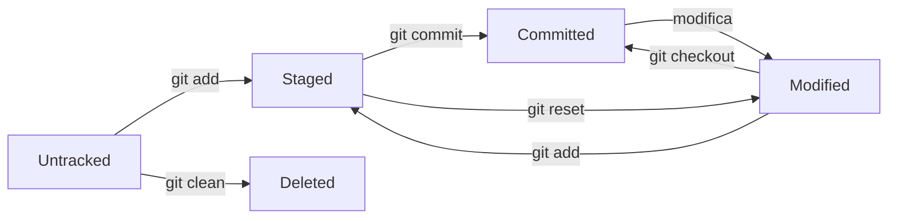

# 📊 Stati dei File in Git

## 📋 Introduzione

In Git, ogni file nel tuo progetto può trovarsi in uno dei quattro stati principali. Comprendere questi stati è fondamentale per padroneggiare il workflow di Git e sapere sempre cosa sta succedendo nel tuo repository.

---

## 🔄 I Quattro Stati dei File



### 1. **🔘 Untracked** - Non Tracciato

**Definizione:** File che esistono nella tua directory di lavoro ma non sono ancora tracciati da Git.

```bash
# Stato iniziale dopo la creazione di un file
$ echo "Nuovo file" > nuovo-file.txt
$ git status
On branch main
Untracked files:
  (use "git add <file>..." to include in what will be committed)
    nuovo-file.txt

nothing added to commit but untracked files present
```

**Caratteristiche:**
- 🆕 File appena creati
- 🚫 Non compaiono nella cronologia Git
- ⚠️ Non vengono inclusi nei commit
- 🗑️ Possono essere eliminati senza perdere cronologia

### 2. **📋 Staged** - In Area di Staging

**Definizione:** File che sono stati aggiunti all'area di staging e sono pronti per il prossimo commit.

```bash
# Aggiungere file all'area di staging
$ git add nuovo-file.txt
$ git status
On branch main
Changes to be committed:
  (use "git restore --staged <file>..." to unstage)
    new file:   nuovo-file.txt
```

**Caratteristiche:**
- ✅ Pronti per il commit
- 📸 Snapshot del file al momento dell'`add`
- 🔄 Possono essere modificati ulteriormente
- ↩️ Possono essere rimossi dallo staging

### 3. **💾 Committed** - Salvato nel Repository

**Definizione:** File che sono stati salvati permanentemente nel database Git.

```bash
# Committare i file in staging
$ git commit -m "Aggiunto nuovo file"
[main a1b2c3d] Aggiunto nuovo file
 1 file changed, 1 insertion(+)
 create mode 100644 nuovo-file.txt

$ git status
On branch main
nothing to commit, working tree clean
```

**Caratteristiche:**
- 🏦 Salvati nel database Git
- 📚 Parte della cronologia del progetto
- 🔒 Sicuri e recuperabili
- 🎯 Stato "pulito" della working directory

### 4. **✏️ Modified** - Modificato

**Definizione:** File che sono tracciati da Git e sono stati modificati ma non ancora aggiunti all'area di staging.

```bash
# Modificare un file esistente
$ echo "Contenuto aggiornato" >> nuovo-file.txt
$ git status
On branch main
Changes not staged for commit:
  (use "git add <file>..." to update what will be committed)
  (use "git restore <file>..." to discard changes in working directory)
    modified:   nuovo-file.txt

no changes added to commit
```

**Caratteristiche:**
- 📝 Differenze rispetto all'ultimo commit
- ⏳ Modifiche in working directory
- 🔄 Necessita di `git add` per staging
- ↩️ Possono essere annullate

---

## 🎯 Workflow Completo degli Stati

### Scenario Pratico Completo

```bash
# 1. UNTRACKED: Creare un nuovo file
$ echo "<!DOCTYPE html>" > index.html
$ git status --porcelain
?? index.html                    # ?? = Untracked

# 2. STAGED: Aggiungere al tracking
$ git add index.html
$ git status --porcelain
A  index.html                    # A = Added (staged)

# 3. COMMITTED: Salvare nel repository
$ git commit -m "Add: struttura base HTML"
$ git status --porcelain
                                 # Nessun output = tutto pulito

# 4. MODIFIED: Modificare il file
$ echo "<html><head><title>Test</title></head></html>" > index.html
$ git status --porcelain
 M index.html                    # M = Modified

# 5. STAGED AGAIN: Preparare per nuovo commit
$ git add index.html
$ git status --porcelain
M  index.html                    # M (prima colonna) = staged modification

# 6. MODIFIED AGAIN: Ulteriori modifiche
$ echo "<body>Contenuto</body>" >> index.html
$ git status --porcelain
MM index.html                    # MM = staged + modified
```

---

## 📊 Visualizzazioni dello Stato

### Comando `git status`

#### **Formato Standard**
```bash
$ git status
On branch main
Changes to be committed:
  (use "git restore --staged <file>..." to unstage)
    modified:   README.md
    new file:   src/app.js

Changes not staged for commit:
  (use "git add <file>..." to update what will be committed)
  (use "git restore <file>..." to discard changes in working directory)
    modified:   index.html
    deleted:    old-file.txt

Untracked files:
  (use "git add <file>..." to include in what will be committed)
    new-feature.js
    temp/
```

#### **Formato Breve**
```bash
$ git status --short
M  README.md        # Staged modification
A  src/app.js       # Staged new file
 M index.html       # Modified (not staged)
 D old-file.txt     # Deleted (not staged)
?? new-feature.js   # Untracked
?? temp/            # Untracked directory
```

#### **Formato Porcelain**
```bash
$ git status --porcelain
M  README.md
A  src/app.js
 M index.html
 D old-file.txt
?? new-feature.js
?? temp/
```

---

## 🎨 Codici di Stato

### Tabella Completa dei Codici

| Codice | Staging | Working Dir | Significato |
|--------|---------|-------------|-------------|
| `??` | - | - | Untracked |
| `A ` | Added | Clean | Nuovo file in staging |
| `M ` | Modified | Clean | Modificato e in staging |
| `D ` | Deleted | Clean | Eliminato e in staging |
| ` M` | Clean | Modified | Modificato ma non in staging |
| ` D` | Clean | Deleted | Eliminato ma non in staging |
| `MM` | Modified | Modified | In staging + ulteriori modifiche |
| `AM` | Added | Modified | Nuovo file + modifiche dopo add |
| `AD` | Added | Deleted | Nuovo file poi eliminato |

---

## 🛠️ Operazioni per Cambiare Stato

### Transizioni tra Stati

#### **Untracked → Staged**
```bash
$ git add file.txt
$ git add .                    # Tutti i file
$ git add *.js                 # Pattern matching
$ git add --all                # Inclusi i file eliminati
```

#### **Staged → Committed**
```bash
$ git commit -m "Messaggio commit"
$ git commit --amend           # Modifica ultimo commit
```

#### **Staged → Modified**
```bash
$ git restore --staged file.txt    # Git 2.23+
$ git reset HEAD file.txt          # Versioni precedenti
```

#### **Modified → Committed (Clean)**
```bash
$ git restore file.txt              # Scarta modifiche
$ git checkout -- file.txt         # Versioni precedenti
```

#### **Modified → Staged**
```bash
$ git add file.txt
$ git add --update                  # Solo file già tracciati
```

---

## 🔍 Ispezione Dettagliata

### Differenze tra Stati

#### **Working Directory vs Staging**
```bash
$ git diff                         # Modifiche non in staging
$ git diff --color-words           # Evidenzia parole cambiate
$ git diff --stat                  # Statistiche sintetiche
```

#### **Staging vs Last Commit**
```bash
$ git diff --staged                # Modifiche in staging
$ git diff --cached                # Alias di --staged
```

#### **Working Directory vs Last Commit**
```bash
$ git diff HEAD                    # Tutte le modifiche
$ git diff HEAD~1                  # Confronto con commit precedente
```

### Cronologia delle Modifiche

```bash
# File specifico
$ git log --follow -- file.txt
$ git log -p file.txt              # Con diff di ogni commit

# Modifiche recenti
$ git whatchanged --since="2 weeks ago"
$ git log --stat --since="yesterday"
```

---

## 🎯 Best Practices

### ✅ Strategie Consigliate

1. **📊 Controlla sempre lo stato**
```bash
$ git status --short               # Prima di ogni operazione
```

2. **📋 Staging incrementale**
```bash
$ git add --patch                  # Aggiunge parti specifiche
$ git add --interactive            # Modalità interattiva
```

3. **💾 Commit atomici**
```bash
# Un concetto per commit
$ git add feature-auth.js
$ git commit -m "Add: sistema autenticazione utenti"

$ git add bug-fix.js
$ git commit -m "Fix: correzione memoria leak in auth"
```

4. **🔍 Review prima del commit**
```bash
$ git diff --staged                # Verifica cosa stai committando
$ git status                       # Controllo finale
```

### ❌ Errori Comuni

- **🚫 Commit tutto insieme**: `git add . && git commit -m "varie"`
- **📝 Messaggi vaghi**: `git commit -m "fix"`
- **🔄 Dimenticare lo stato**: non controllare `git status`
- **📋 Staging accidentale**: `git add *` senza controllo

---

## 🔧 Troubleshooting

### Problemi Comuni

#### **File sempre "modified"**
```bash
# Problema: fine riga o permessi
$ git config core.autocrlf false
$ git config core.filemode false
$ git add file.txt
```

#### **File in stato "both modified"**
```bash
# Durante un merge conflict
$ git status
both modified: conflicted-file.txt

# Risolvi e aggiungi
$ git add conflicted-file.txt
```

#### **Staging accidentale**
```bash
# Rimuovere dall'area di staging
$ git restore --staged .
$ git reset HEAD .
```

---

## 🎯 Esercizio Pratico

**Pratica completa degli stati:**

```bash
# Setup
mkdir stati-git-test && cd stati-git-test
git init

# 1. UNTRACKED
echo "Primo file" > file1.txt
echo "Secondo file" > file2.txt
git status --porcelain            # ?? file1.txt, ?? file2.txt

# 2. STAGED
git add file1.txt
git status --porcelain            # A  file1.txt, ?? file2.txt

# 3. COMMITTED + STAGED
git commit -m "Add: primo file"
git add file2.txt
git status --porcelain            # A  file2.txt

# 4. MODIFIED
echo "Modifica" >> file1.txt
git status --porcelain            # A  file2.txt,  M file1.txt

# 5. STAGED + MODIFIED
git add file1.txt
echo "Altra modifica" >> file1.txt
git status --porcelain            # A  file2.txt, MM file1.txt

# 6. Analisi finale
git status
git diff                          # Working vs staging
git diff --staged                 # Staging vs last commit
```

---

## 🔗 Collegamenti Utili

- **📚 Prossima guida**: [04 - Primo Commit](./04-primo-commit.md)
- **📖 Guida precedente**: [02 - Anatomia Directory Git](./02-anatomia-directory-git.md)
- **🎯 Esempi pratici**: [03 - Tracking File Diversi](../esempi/03-tracking-file-diversi.md)
