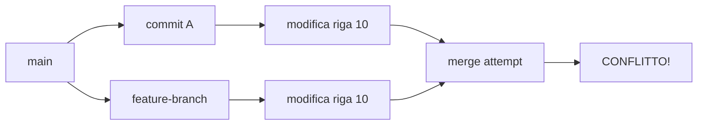

# Cosa Sono i Conflitti di Merge

## 🎯 Obiettivi
- Comprendere la natura dei conflitti in Git
- Identificare le cause principali
- Riconoscere i tipi di conflitto

## 📚 Definizione

Un **conflitto di merge** si verifica quando Git non può automaticamente combinare le modifiche di due branch diversi. Questo succede quando:

- Due persone modificano la stessa riga di un file
- Una persona elimina un file mentre un'altra lo modifica
- Modifiche incompatibili nella struttura del progetto

## 🔍 Perché Avvengono i Conflitti

### Scenario Tipico


### Cause Principali

1. **Modifiche Concorrenti**
   - Due sviluppatori modificano la stessa riga
   - Modifiche sovrapposte nelle stesse sezioni

2. **Modifica vs Eliminazione**
   - Un branch modifica un file
   - Un altro branch lo elimina

3. **Rinominazione Conflittuale**
   - File rinominato diversamente in branch diversi
   - Spostamento in directory diverse

## 📋 Tipi di Conflitto

### 1. Conflitto di Contenuto
Il più comune - modifiche alle stesse righe:

```text
File: config.js

Branch A:
const PORT = 3000;

Branch B:  
const PORT = 8080;

Risultato: CONFLITTO!
```

### 2. Conflitto di Rinominazione
```bash
# Branch A
git mv file.txt document.txt

# Branch B
git mv file.txt readme.txt

# Merge = conflitto di rinominazione
```

### 3. Conflitto Strutturale
```bash
# Branch A: modifica src/app.js
# Branch B: elimina src/app.js
# Merge = conflitto modify/delete
```

## 🚦 Quando Git Può Mergiare Automaticamente

Git ha successo quando:

### ✅ Modifiche Non Sovrapposte
```text
File: index.html

Branch A modifica riga 5:
<title>Nuovo Titolo</title>

Branch B modifica riga 20:
<p>Nuovo paragrafo</p>

Risultato: Merge automatico riuscito ✅
```

### ✅ Modifiche in File Diversi
```bash
Branch A: modifica styles.css
Branch B: modifica script.js
Risultato: Merge automatico ✅
```

## 🔍 Identificare i Conflitti

### Messaggi di Git
```bash
$ git merge feature-branch
Auto-merging index.html
CONFLICT (content): Merge conflict in index.html
Automatic merge failed; fix conflicts and then commit the result.
```

### Status Durante Conflitto
```bash
$ git status
On branch main
You have unmerged paths.
  (fix conflicts and run "git commit")
  (use "git merge --abort" to abort the merge)

Unmerged paths:
  (use "git add <file>..." to mark resolution)
        both modified:   index.html
```

## 🛠️ Processo di Risoluzione

### 1. Identificazione
```bash
git status  # Vedi file in conflitto
```

### 2. Analisi
```bash
git diff    # Esamina le differenze
```

### 3. Risoluzione
- Modifica manuale dei file
- Uso di merge tools
- Scelta di una versione

### 4. Finalizzazione
```bash
git add <file-risolto>
git commit
```

## 💡 Prevenzione

### Best Practices
1. **Commit frequenti e piccoli**
2. **Pull regolare da main**
3. **Comunicazione del team**
4. **Feature branch focalizzati**
5. **Code review preventive**

### Workflow Preventivo
```bash
# Prima di lavorare
git checkout main
git pull origin main
git checkout -b feature/my-feature

# Durante lo sviluppo (quotidiano)
git checkout main
git pull origin main
git checkout feature/my-feature
git merge main  # Risolvi conflitti in anticipo
```

## 🔍 Punti Chiave

- I conflitti sono **normali** nello sviluppo collaborativo
- Git segnala sempre dove sono i conflitti
- La risoluzione richiede **decisioni umane**
- La prevenzione è meglio della risoluzione
- Sempre **testare** dopo la risoluzione

## 📚 Termini Importanti

- **HEAD**: Il commit corrente del tuo branch
- **Incoming**: Le modifiche dal branch che stai mergendo
- **Marker di conflitto**: I simboli `<<<<<<<`, `=======`, `>>>>>>>`
- **Merge commit**: Il commit che unisce due branch

## ➡️ Prossimo Passo

Nel prossimo modulo impareremo a leggere e interpretare i **marker di conflitto** che Git inserisce nei file.
