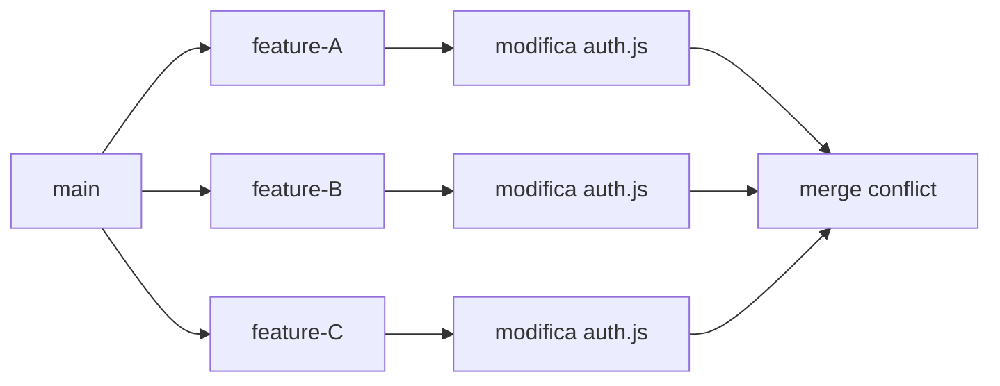
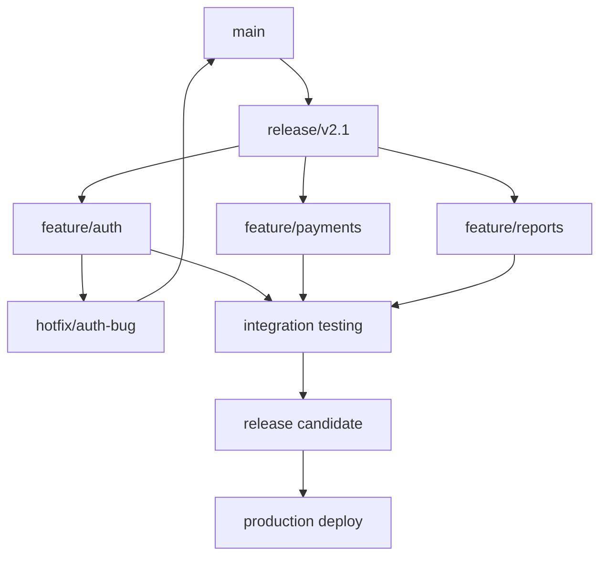

# Strategie Avanzate per Conflitti Complessi

## 🎯 Obiettivi
- Gestire conflitti multi-branch complessi
- Utilizzare tecniche avanzate di risoluzione
- Implementare strategie per progetti enterprise

## 🔥 Scenari Complessi

### 1. Conflitti Multi-Branch
Quando più feature branch modificano le stesse aree simultaneamente.



#### Strategia: Integration Branch
```bash
# Crea branch di integrazione
git checkout main
git checkout -b integration/auth-refactor

# Merge progressivo con risoluzione
git merge feature-A
# Risolvi conflitti per feature-A

git merge feature-B  
# Risolvi conflitti considerando feature-A

git merge feature-C
# Risolvi conflitti considerando A+B

# Test completo dell'integrazione
npm test
npm run e2e-tests

# Merge finale in main
git checkout main
git merge integration/auth-refactor
```

### 2. Refactoring Major con Conflitti
Quando si deve refactorizzare codice modificato da altri.

#### File di Esempio: `src/auth/AuthService.js`
```javascript
// Stato iniziale (main)
class AuthService {
  constructor(config) {
    this.apiUrl = config.apiUrl;
    this.timeout = config.timeout || 5000;
  }
  
  async login(username, password) {
    const response = await fetch(`${this.apiUrl}/login`, {
      method: 'POST',
      body: JSON.stringify({ username, password })
    });
    return response.json();
  }
}

// Feature A: Aggiunge validazione
async login(username, password) {
  if (!username || !password) {
    throw new Error('Username and password required');
  }
  
  const response = await fetch(`${this.apiUrl}/login`, {
    method: 'POST',
    body: JSON.stringify({ username, password })
  });
  return response.json();
}

// Feature B: Cambia architettura (TypeScript + async/await)
interface AuthConfig {
  apiUrl: string;
  timeout?: number;
}

class AuthService {
  private apiUrl: string;
  private timeout: number;
  
  constructor(config: AuthConfig) {
    this.apiUrl = config.apiUrl;
    this.timeout = config.timeout || 5000;
  }
  
  async login(username: string, password: string): Promise<AuthResponse> {
    const controller = new AbortController();
    setTimeout(() => controller.abort(), this.timeout);
    
    const response = await fetch(`${this.apiUrl}/login`, {
      method: 'POST',
      signal: controller.signal,
      headers: { 'Content-Type': 'application/json' },
      body: JSON.stringify({ username, password })
    });
    
    if (!response.ok) {
      throw new Error(`HTTP ${response.status}: ${response.statusText}`);
    }
    
    return response.json();
  }
}
```

#### Strategia di Risoluzione Intelligente
```javascript
// Risoluzione che combina validazione + architettura TypeScript
interface AuthConfig {
  apiUrl: string;
  timeout?: number;
}

interface AuthResponse {
  token: string;
  user: {
    id: string;
    username: string;
  };
}

class AuthService {
  private apiUrl: string;
  private timeout: number;
  
  constructor(config: AuthConfig) {
    this.apiUrl = config.apiUrl;
    this.timeout = config.timeout || 5000;
  }
  
  async login(username: string, password: string): Promise<AuthResponse> {
    // Validazione da Feature A
    if (!username || !password) {
      throw new Error('Username and password are required');
    }
    
    // Architettura avanzata da Feature B
    const controller = new AbortController();
    const timeoutId = setTimeout(() => controller.abort(), this.timeout);
    
    try {
      const response = await fetch(`${this.apiUrl}/login`, {
        method: 'POST',
        signal: controller.signal,
        headers: { 'Content-Type': 'application/json' },
        body: JSON.stringify({ username, password })
      });
      
      if (!response.ok) {
        throw new Error(`Authentication failed: ${response.status} ${response.statusText}`);
      }
      
      return await response.json();
    } catch (error) {
      if (error.name === 'AbortError') {
        throw new Error('Login request timed out');
      }
      throw error;
    } finally {
      clearTimeout(timeoutId);
    }
  }
}
```

## 🛠️ Tecniche Avanzate

### 1. Three-Way Merge Manuale

#### Comprensione dei Tre Stati
```bash
# Durante un conflitto, hai accesso a:
git show :1:file.txt  # Base (ancestor comune)
git show :2:file.txt  # Ours (HEAD)  
git show :3:file.txt  # Theirs (incoming)
```

#### Script per Analisi Avanzata
```bash
#!/bin/bash
# analyze-conflict.sh
FILE=$1

echo "=== BASE (Common Ancestor) ==="
git show :1:$FILE

echo "=== OURS (Current Branch) ==="  
git show :2:$FILE

echo "=== THEIRS (Incoming Branch) ==="
git show :3:$FILE

echo "=== CURRENT CONFLICT STATE ==="
cat $FILE
```

### 2. Partial Merge con Cherry-Pick

Quando vuoi solo alcune modifiche da un branch:

```bash
# Invece di merge completo
git merge feature-branch  # Potrebbe causare troppi conflitti

# Cherry-pick selettivo
git log feature-branch --oneline
# a1b2c3d Add user validation
# e4f5g6h Update UI components  
# i7j8k9l Fix database queries

# Prendi solo i commit che servono
git cherry-pick a1b2c3d  # validation
git cherry-pick i7j8k9l  # database fix
# Salti UI components che potrebbero confliggere
```

### 3. Merge con Strategia Personalizzata

#### Strategia Ours/Theirs
```bash
# Prendi sempre la tua versione per file specifici
git merge -X ours feature-branch

# Prendi sempre la loro versione
git merge -X theirs feature-branch

# Strategia per file specifici
echo "config.json merge=ours" >> .gitattributes
git config merge.ours.driver true
```

#### Driver di Merge Personalizzato
```bash
# Per file sempre da aggiornare automaticamente
#!/bin/bash
# custom-merge-driver.sh
cp $3 $1  # Usa sempre la versione theirs
exit 0
```

```bash
# Configurazione
git config merge.take-theirs.driver './custom-merge-driver.sh %O %A %B %L'
echo "package-lock.json merge=take-theirs" >> .gitattributes
```

## 🔄 Workflow per Progetti Enterprise

### 1. Release Branch Strategy



#### Implementazione
```bash
# Crea release branch
git checkout main
git checkout -b release/v2.1

# Feature development
git checkout -b feature/auth
# ... development ...
git checkout release/v2.1
git merge feature/auth

# Integration testing
npm run test:integration
npm run test:e2e

# Hotfix durante release
git checkout -b hotfix/auth-bug
# ... fix ...
git checkout main
git merge hotfix/auth-bug
git checkout release/v2.1
git merge hotfix/auth-bug
```

### 2. Conflict Resolution Committee

Per team grandi, stabilisci ruoli chiari:

```yaml
# conflict-resolution-roles.yml
roles:
  technical_lead:
    - Final decision on architecture conflicts
    - Breaking changes approval
    
  domain_experts:
    auth: "alice@company.com"
    ui: "bob@company.com"  
    api: "charlie@company.com"
    
  conflict_escalation:
    level_1: team_lead
    level_2: technical_lead
    level_3: engineering_manager
```

### 3. Automated Conflict Detection

#### Pre-merge Analysis
```javascript
// pre-merge-check.js
const { execSync } = require('child_process');

function checkPotentialConflicts(sourceBranch, targetBranch) {
  try {
    // Simulate merge without actually merging
    const result = execSync(
      `git merge-tree $(git merge-base ${targetBranch} ${sourceBranch}) ${targetBranch} ${sourceBranch}`,
      { encoding: 'utf8' }
    );
    
    if (result.includes('<<<<<<<')) {
      console.log('⚠️  Potential conflicts detected!');
      return analyzeConflicts(result);
    }
    
    console.log('✅ No conflicts detected');
    return null;
  } catch (error) {
    console.error('Error checking conflicts:', error.message);
  }
}

function analyzeConflicts(mergeTreeOutput) {
  const conflicts = [];
  const lines = mergeTreeOutput.split('\n');
  
  let currentConflict = null;
  for (const line of lines) {
    if (line.startsWith('<<<<<<<')) {
      currentConflict = { type: 'content', lines: [] };
    } else if (line.startsWith('>>>>>>>') && currentConflict) {
      conflicts.push(currentConflict);
      currentConflict = null;
    } else if (currentConflict) {
      currentConflict.lines.push(line);
    }
  }
  
  return conflicts;
}
```

## 📊 Monitoring e Analytics

### 1. Conflict Metrics Dashboard
```javascript
// conflict-analytics.js
class ConflictAnalytics {
  async getMetrics(timeframe = '30 days') {
    return {
      totalConflicts: await this.getTotalConflicts(timeframe),
      resolutionTime: await this.getAvgResolutionTime(timeframe),
      conflictHotspots: await this.getConflictHotspots(timeframe),
      teamPerformance: await this.getTeamMetrics(timeframe)
    };
  }
  
  async getTotalConflicts(timeframe) {
    const commits = await this.getCommits(timeframe);
    return commits.filter(commit => 
      commit.message.toLowerCase().includes('conflict') ||
      commit.message.toLowerCase().includes('merge')
    ).length;
  }
  
  async getConflictHotspots(timeframe) {
    // Identifica file con più conflitti
    const conflictCommits = await this.getConflictCommits(timeframe);
    const fileStats = {};
    
    for (const commit of conflictCommits) {
      const files = await this.getCommitFiles(commit.hash);
      for (const file of files) {
        fileStats[file] = (fileStats[file] || 0) + 1;
      }
    }
    
    return Object.entries(fileStats)
      .sort(([,a], [,b]) => b - a)
      .slice(0, 10);
  }
}
```

### 2. Proactive Conflict Warning
```bash
#!/bin/bash
# daily-conflict-check.sh

echo "🔍 Daily Conflict Check Report"
echo "=============================="

# Check all active feature branches
for branch in $(git branch -r | grep -v main | grep -v HEAD); do
  echo "Checking $branch..."
  
  conflicts=$(git merge-tree $(git merge-base main $branch) main $branch | grep -c "^<<<<<<<" || echo "0")
  
  if [ "$conflicts" -gt 0 ]; then
    echo "⚠️  $branch has $conflicts potential conflicts with main"
    # Send notification to team
    curl -X POST "$SLACK_WEBHOOK" -d "{\"text\":\"⚠️ Branch $branch has potential conflicts\"}"
  else
    echo "✅ $branch is clean"
  fi
done
```

## 🎯 Best Practices per Conflitti Complessi

### 1. Documentazione delle Decisioni
```markdown
<!-- CONFLICT_RESOLUTION.md -->
# Conflict Resolution Log

## 2024-01-15: AuthService Refactor Conflict

**Branches**: feature/validation + feature/typescript-migration
**Files**: src/auth/AuthService.js
**Resolution**: Combined both approaches
**Rationale**: Validation logic essential for security, TypeScript migration improves maintainability
**Testing**: All auth tests pass + new type checking
**Reviewer**: @technical-lead
```

### 2. Conflict Resolution Templates
```bash
# conflict-resolution-template.md
## Conflict Resolution Report

**Date**: $(date)
**Branches**: [source] → [target]
**Files Affected**: 
- [ ] file1.js
- [ ] file2.css

**Resolution Strategy**:
- [ ] Manual merge
- [ ] Take ours
- [ ] Take theirs  
- [ ] Custom solution

**Testing Done**:
- [ ] Unit tests pass
- [ ] Integration tests pass
- [ ] Manual testing complete

**Reviewers**: @reviewer1 @reviewer2
```

### 3. Emergency Procedures
```bash
# emergency-conflict-resolution.sh
#!/bin/bash
echo "🚨 Emergency Conflict Resolution"

# Create backup
git branch backup-$(date +%Y%m%d-%H%M%S)

# Quick resolution options
echo "1. Abort merge and seek help"
echo "2. Accept all our changes"  
echo "3. Accept all their changes"
echo "4. Open merge tool"

read -p "Choose option (1-4): " choice

case $choice in
  1) git merge --abort ;;
  2) git checkout --ours . && git add . ;;
  3) git checkout --theirs . && git add . ;;
  4) git mergetool ;;
esac
```

## ➡️ Prossimo Passo

Con queste strategie avanzate, sei preparato per gestire anche i conflitti più complessi. Il prossimo modulo coprirà esempi pratici ed esercizi di consolidamento.
