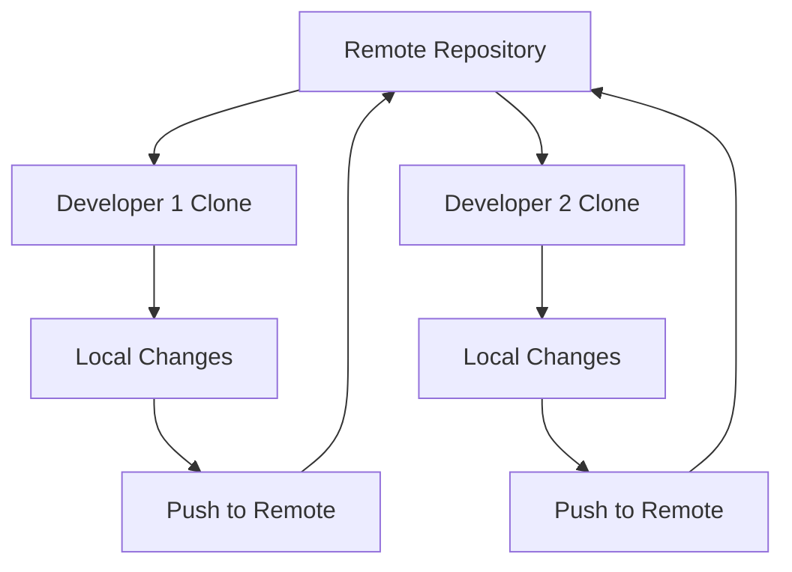
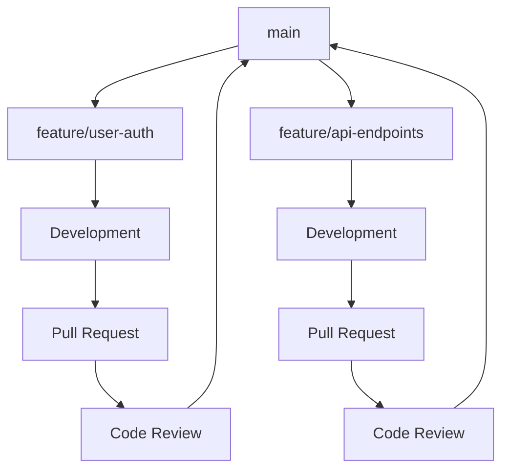
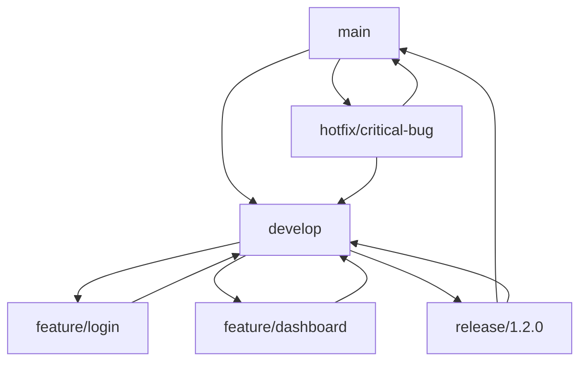
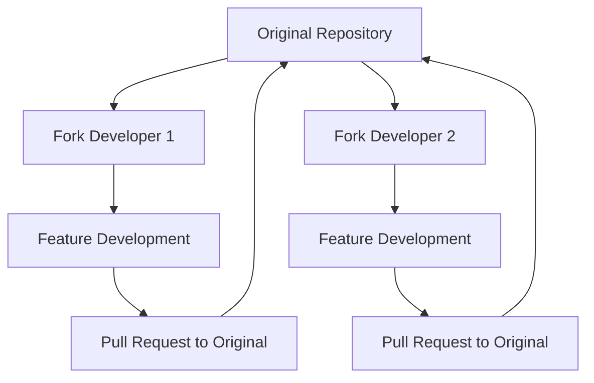

# 02 - Workflow Collaborativo

## 🎯 Obiettivi del Modulo

In questa guida imparerai:
- I principi fondamentali della collaborazione in Git
- I diversi workflow di collaborazione
- Le best practices per il lavoro in team
- Come organizzare progetti collaborativi

## 📚 Workflow di Collaborazione Fondamentali

### 1. 🚀 Centralized Workflow

Il workflow centralizzato è il più semplice per iniziare:



**Caratteristiche:**
- Un singolo repository centrale
- Tutti i developer clonano da questo repository
- I cambiamenti vengono pushati direttamente al branch principale
- Conflitti risolti durante il push/pull

**Vantaggi:**
- ✅ Semplice da comprendere
- ✅ Facile da implementare
- ✅ Adatto per team piccoli

**Svantaggi:**
- ❌ Conflitti frequenti
- ❌ Difficult code review
- ❌ Rischio di destabilizzare il main branch

### 2. 🌿 Feature Branch Workflow

Un approccio più strutturato usando branch dedicati:



**Processo:**
1. Crea un branch per ogni feature
2. Sviluppa la feature nel branch dedicato
3. Crea una Pull Request
4. Code review e discussione
5. Merge nel branch principale

**Vantaggi:**
- ✅ Isolamento delle feature
- ✅ Code review strutturato
- ✅ Storia pulita
- ✅ Rollback facile

### 3. 🔀 Gitflow Workflow

Un workflow strutturato per progetti con rilasci regolari:



**Branch Types:**
- **main**: Codice in produzione
- **develop**: Integrazione delle feature
- **feature/***: Sviluppo nuove funzionalità
- **release/***: Preparazione rilasci
- **hotfix/***: Correzioni urgenti

### 4. 🍴 Forking Workflow

Utilizzato principalmente per progetti open source:



**Processo:**
1. Fork del repository originale
2. Clone del proprio fork
3. Sviluppo in branch locali
4. Push al proprio fork
5. Pull Request al repository originale

## 🤝 Principi di Collaborazione Efficace

### 1. 📝 Comunicazione Clara

**Commit Messages:**
```bash
# ❌ Messaggio vago
git commit -m "fix bug"

# ✅ Messaggio descrittivo
git commit -m "fix: resolve user authentication timeout issue

- Increase session timeout from 30min to 2h
- Add proper error handling for expired tokens
- Update user notification for session expiry

Fixes #123"
```

**Pull Request Descriptions:**
```markdown
## 🎯 Obiettivo
Implementare il sistema di autenticazione utente

## 🔧 Modifiche
- Aggiunto middleware di autenticazione
- Creato sistema di session management
- Implementato logout automatico

## 🧪 Test
- [ ] Test unitari per auth middleware
- [ ] Test integration per login/logout
- [ ] Test sicurezza per session handling

## 📸 Screenshots
[Includi screenshot se necessario]

## 🔗 Issue Correlate
Closes #45, Related to #67
```

### 2. 🔄 Sincronizzazione Frequente

**Best Practice per mantenere il codice aggiornato:**

```bash
# 1. Aggiorna il branch principale
git checkout main
git pull origin main

# 2. Aggiorna il branch di feature
git checkout feature/my-feature
git merge main

# 3. Oppure usa rebase per una storia più pulita
git rebase main
```

### 3. 🛡️ Code Review Efficace

**Checklist per Code Review:**

**Aspetti Funzionali:**
- [ ] Il codice funziona come previsto?
- [ ] Tutti i casi edge sono gestiti?
- [ ] I test sono presenti e passano?
- [ ] La documentazione è aggiornata?

**Aspetti di Qualità:**
- [ ] Il codice è leggibile e ben commentato?
- [ ] Segue le convenzioni del progetto?
- [ ] Non introduce duplicazioni?
- [ ] Le performance sono accettabili?

**Aspetti di Sicurezza:**
- [ ] Non introduce vulnerabilità?
- [ ] I dati sensibili sono protetti?
- [ ] L'input è validato correttamente?

### 4. 🚦 Gestione dei Conflitti

**Strategie per Minimizzare i Conflitti:**

1. **Comunicazione del Team:**
   - Coordina le modifiche ai file condivisi
   - Usa branch di feature piccoli e focalizzati
   - Merge frequentemente dal branch principale

2. **Organizzazione del Codice:**
   - Modularizza il codice
   - Evita file monolitici
   - Usa dependency injection

3. **Workflow Disciplinato:**
   - Pull frequente dal branch principale
   - Push piccoli e atomici
   - Code review tempestivo

## ⚡ Workflow Pratici per Diverse Situazioni

### 🏢 Team Aziendale (Feature Branch)

```bash
# 1. Setup iniziale
git clone https://github.com/company/project.git
cd project
git checkout -b feature/user-dashboard

# 2. Sviluppo
# ... lavoro quotidiano ...
git add .
git commit -m "feat(dashboard): add user profile section"

# 3. Sincronizzazione
git checkout main
git pull origin main
git checkout feature/user-dashboard
git merge main

# 4. Condivisione
git push origin feature/user-dashboard

# 5. Pull Request su GitHub
# Crea PR attraverso interfaccia web

# 6. Dopo approvazione
git checkout main
git pull origin main
git branch -d feature/user-dashboard
```

### 🌍 Progetto Open Source (Fork)

```bash
# 1. Fork su GitHub tramite interfaccia web

# 2. Clone del tuo fork
git clone https://github.com/tuousername/project.git
cd project

# 3. Aggiungi upstream
git remote add upstream https://github.com/original/project.git

# 4. Crea branch per feature
git checkout -b feature/new-feature

# 5. Sviluppo e commit
# ... lavoro ...
git commit -m "feat: add awesome new feature"

# 6. Sincronizza con upstream
git fetch upstream
git checkout main
git merge upstream/main
git checkout feature/new-feature
git rebase main

# 7. Push al tuo fork
git push origin feature/new-feature

# 8. Crea Pull Request su GitHub
```

### 🚀 Release Emergency (Hotfix)

```bash
# 1. Crea hotfix branch da main
git checkout main
git pull origin main
git checkout -b hotfix/critical-security-fix

# 2. Applica fix
# ... correzione urgente ...
git commit -m "fix: patch critical security vulnerability CVE-2023-1234"

# 3. Test rapidi
npm test  # o pytest, etc.

# 4. Merge diretto in main
git checkout main
git merge hotfix/critical-security-fix
git tag v1.2.1
git push origin main --tags

# 5. Merge anche in develop (se esiste)
git checkout develop
git merge hotfix/critical-security-fix
git push origin develop

# 6. Cleanup
git branch -d hotfix/critical-security-fix
```

## 🔧 Tool e Configurazioni per la Collaborazione

### 1. 📋 Templates per Repository

**Pull Request Template (`.github/pull_request_template.md`):**
```markdown
## 📋 Descrizione
Breve descrizione delle modifiche

## 🎯 Tipo di Modifica
- [ ] Bug fix
- [ ] Nuova feature
- [ ] Breaking change
- [ ] Documentazione

## 🧪 Test
- [ ] I test esistenti passano
- [ ] Aggiunti nuovi test
- [ ] Test manuali completati

## 📝 Checklist
- [ ] Il codice segue le convenzioni del progetto
- [ ] Self-review completato
- [ ] Documentazione aggiornata
- [ ] Nessun warning di build
```

**Issue Template (`.github/ISSUE_TEMPLATE/bug_report.md`):**
```markdown
---
name: Bug Report
about: Segnala un bug
title: '[BUG] '
labels: bug
---

## 🐛 Descrizione del Bug
Descrizione chiara del problema

## 🔄 Come Riprodurre
1. Vai a '...'
2. Clicca su '....'
3. Scorri fino a '....'
4. Vedi errore

## ✅ Comportamento Atteso
Cosa dovrebbe succedere

## 📱 Screenshots
Aggiungi screenshot se utili

## 🖥️ Ambiente
- OS: [es. iOS]
- Browser: [es. chrome, safari]
- Versione: [es. 22]
```

### 2. ⚙️ Git Hooks per Team

**Pre-commit Hook (`.git/hooks/pre-commit`):**
```bash
#!/bin/sh
# Run tests before commit
npm test
if [ $? -ne 0 ]; then
  echo "❌ Tests failed. Commit aborted."
  exit 1
fi

# Run linter
npm run lint
if [ $? -ne 0 ]; then
  echo "❌ Linting failed. Commit aborted."
  exit 1
fi

echo "✅ Pre-commit checks passed"
```

### 3. 🔐 Configurazioni di Sicurezza

**Protezione Branch su GitHub:**
```yaml
# Configurazione consigliata per branch main
Branch Protection Rules:
  - Require pull request reviews: ✅
  - Dismiss stale reviews: ✅
  - Require status checks: ✅
  - Require branches to be up to date: ✅
  - Require conversation resolution: ✅
  - Restrict pushes to matching branches: ✅
  - Allow force pushes: ❌
  - Allow deletions: ❌
```

## 📊 Metriche e Monitoraggio

### 1. 📈 KPI per la Collaborazione

**Metriche di Sviluppo:**
- Tempo medio per merge delle PR
- Numero di revisioni per PR
- Frequenza di commit per developer
- Dimensione media delle PR (righe di codice)

**Metriche di Qualità:**
- Numero di bug introdotti per release
- Coverage del codice
- Tempo di risoluzione dei bug
- Soddisfazione del team (survey)

**Strumenti di Monitoraggio:**
- GitHub Insights
- SonarQube
- CodeClimate
- Custom dashboards con GitHub API

### 2. 🎯 Obiettivi SMART per Team

**Setup Obiettivi:**
```markdown
## Q1 2024 Team Goals

### 🚀 Delivery
- [ ] Ridurre tempo medio PR review da 3 a 1.5 giorni
- [ ] Aumentare coverage test dal 70% al 85%
- [ ] Zero deploy con rollback in produzione

### 🛡️ Qualità
- [ ] Ridurre bug in produzione del 50%
- [ ] Implementare automated testing per 100% delle feature

### 🤝 Collaborazione
- [ ] 100% delle PR con almeno 1 reviewer
- [ ] Documentation aggiornata per tutte le nuove feature
```

## 🧪 Quiz di Autovalutazione

### Domanda 1
Quale workflow è più adatto per un team di 3 sviluppatori che lavora su un progetto interno aziendale?

A) Forking Workflow  
B) Centralized Workflow  
C) Feature Branch Workflow  
D) Gitflow Workflow  

<details>
<summary>🔍 Risposta</summary>

**C) Feature Branch Workflow**

Per un team piccolo di 3 sviluppatori su un progetto interno, il Feature Branch Workflow offre il giusto equilibrio tra semplicità e controllo qualità, permettendo code review senza la complessità del Gitflow.
</details>

### Domanda 2
Cosa NON dovrebbe essere incluso in un commit message?

A) Riferimento all'issue correlata  
B) Descrizione tecnica dettagliata dell'implementazione  
C) Breve summary delle modifiche  
D) Tipo di modifica (feat, fix, docs)  

<details>
<summary>🔍 Risposta</summary>

**B) Descrizione tecnica dettagliata dell'implementazione**

Il commit message dovrebbe essere conciso e focalizzato sul "cosa" e "perché", non sul "come". I dettagli tecnici dell'implementazione dovrebbero essere nel codice stesso e nei commenti.
</details>

### Domanda 3
Quale comando è migliore per mantenere una storia lineare quando si aggiorna un feature branch?

A) `git merge main`  
B) `git rebase main`  
C) `git pull origin main`  
D) `git cherry-pick main`  

<details>
<summary>🔍 Risposta</summary>

**B) `git rebase main`**

Il rebase mantiene una storia lineare applicando i commit del feature branch sopra l'ultimo commit del main, evitando commit di merge inutili.
</details>

### Domanda 4
In un Code Review, quale aspetto NON è prioritario?

A) Funzionalità del codice  
B) Stile di coding personale del reviewer  
C) Sicurezza e vulnerabilità  
D) Performance e ottimizzazioni  

<details>
<summary>🔍 Risposta</summary>

**B) Stile di coding personale del reviewer**

Il code review dovrebbe basarsi sugli standard del progetto e del team, non sulle preferenze personali del reviewer. È importante seguire linee guida concordate.
</details>

### Domanda 5
Quale NON è una best practice per minimizzare i conflitti di merge?

A) Fare commit piccoli e frequenti  
B) Comunicare con il team sui file condivisi  
C) Lavorare su feature branch di lunga durata  
D) Fare pull frequenti dal branch principale  

<details>
<summary>🔍 Risposta</summary>

**C) Lavorare su feature branch di lunga durata**

Feature branch di lunga durata aumentano la probabilità di conflitti. È meglio fare branch piccoli, focalizzati e di breve durata.
</details>

## 🎯 Punti Chiave da Ricordare

### 🔑 Concetti Essenziali
1. **Scegli il workflow giusto** per il tuo team e progetto
2. **Comunica chiaramente** attraverso commit e PR
3. **Sincronizza frequentemente** per evitare conflitti
4. **Fai code review di qualità** per mantenere standard alti
5. **Automatizza i controlli** dove possibile

### ⚡ Comandi Fondamentali
```bash
# Workflow collaborativo base
git clone <repo>
git checkout -b feature/name
git add . && git commit -m "clear message"
git push origin feature/name

# Sincronizzazione
git checkout main
git pull origin main
git checkout feature/name
git rebase main

# Cleanup dopo merge
git branch -d feature/name
git remote prune origin
```

### 🛠️ Setup Consigliato
- **Branch protection** su repository principale
- **PR templates** per consistency
- **Automated checks** (tests, linting)
- **Clear contributing guidelines**

---

## 🔄 Navigazione

- [📑 Indice Modulo](../README.md)
- [⬅️ 16-Clone-Push-Pull](../../16-Clone-Push-Pull/README.md)
- [➡️ 02-Gestione-Branch-Collaborativi](./02-gestione-branch-collaborativi.md)

---

*Prossimo: Impara a gestire branch in contesti collaborativi complessi!* 🚀
