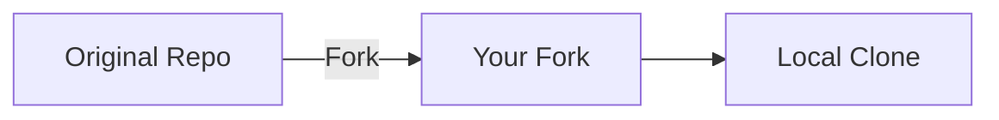

# 01 - Fork Workflow

## 📖 Spiegazione Concettuale

Il **Fork Workflow** è un modello di collaborazione distribuita che permette a chiunque di contribuire a un progetto senza avere accesso diretto di scrittura al repository principale.

### Cos'è un Fork?

Un **fork** è una copia personale di un repository di qualcun altro che vive nel tuo account GitHub. È completamente indipendente dall'originale ma mantiene un collegamento che permette di:

- Sincronizzare le modifiche dall'originale
- Proporre modifiche all'originale tramite Pull Request

### Perché Usare il Fork Workflow?

#### ✅ **Vantaggi**
- **Sicurezza**: Nessuno può danneggiare il progetto principale
- **Libertà**: Puoi sperimentare senza limitazioni
- **Inclusività**: Tutti possono contribuire, anche senza permessi
- **Qualità**: Ogni modifica passa attraverso review

#### 🔄 **Quando Usarlo**
- Progetti open source
- Contribuzioni esterne
- Sperimentazione su progetti di altri
- Learning e practice

## 🏗️ Anatomia del Fork Workflow

### 1. Repository Structure

```
┌─────────────────────────────────────┐
│ UPSTREAM (Original Repository)      │
│ github.com/original-owner/project   │
│                                     │
│ main: A---B---C---D                │
└─────────────────────────────────────┘
                │
                │ Fork
                ▼
┌─────────────────────────────────────┐
│ ORIGIN (Your Fork)                  │
│ github.com/your-username/project    │
│                                     │
│ main: A---B---C---D                │
│ feature: A---B---C---D---E---F      │
└─────────────────────────────────────┘
                │
                │ Clone
                ▼
┌─────────────────────────────────────┐
│ LOCAL (Your Computer)               │
│                                     │
│ main: A---B---C---D                │
│ feature: A---B---C---D---E---F      │
└─────────────────────────────────────┘
```

### 2. Remote Configuration

```bash
# Dopo il setup completo, avrai:
git remote -v

origin    https://github.com/your-username/project.git (fetch)
origin    https://github.com/your-username/project.git (push)
upstream  https://github.com/original-owner/project.git (fetch)
upstream  https://github.com/original-owner/project.git (push)
```

## 🔧 Fork Workflow Step-by-Step

### Step 1: Fork il Repository

**Su GitHub Web Interface:**

1. Vai al repository che vuoi forkare
2. Clicca il pulsante "Fork" in alto a destra
3. Seleziona il tuo account come destinazione
4. Opzionalmente personalizza nome e descrizione



### Step 2: Clone del Fork

```bash
# Clone il TUO fork (non l'originale)
git clone https://github.com/YOUR-USERNAME/PROJECT-NAME.git
cd PROJECT-NAME

# Verifica remote
git remote -v
# origin    https://github.com/YOUR-USERNAME/PROJECT-NAME.git
```

### Step 3: Configura Upstream

```bash
# Aggiungi l'originale come "upstream"
git remote add upstream https://github.com/ORIGINAL-OWNER/PROJECT-NAME.git

# Verifica configurazione
git remote -v
# origin    https://github.com/YOUR-USERNAME/PROJECT-NAME.git (fetch)
# origin    https://github.com/YOUR-USERNAME/PROJECT-NAME.git (push)
# upstream  https://github.com/ORIGINAL-OWNER/PROJECT-NAME.git (fetch)
# upstream  https://github.com/ORIGINAL-OWNER/PROJECT-NAME.git (push)
```

### Step 4: Sincronizza con Upstream

```bash
# Fetch le ultime modifiche da upstream
git fetch upstream

# Merge nel tuo main
git checkout main
git merge upstream/main

# Push aggiornamenti al tuo fork
git push origin main
```

### Step 5: Crea Feature Branch

```bash
# Sempre partire da main aggiornato
git checkout main
git pull upstream main

# Crea branch per la tua feature
git checkout -b feature/amazing-new-feature

# Lavora sulla feature
echo "Amazing code" > new-feature.js
git add new-feature.js
git commit -m "Add: amazing new feature"
```

### Step 6: Push Feature Branch

```bash
# Push al TUO fork
git push origin feature/amazing-new-feature
```

### Step 7: Crea Pull Request

**Su GitHub Web Interface:**

1. Vai al tuo fork su GitHub
2. GitHub mostrerà un banner con "Compare & pull request"
3. Clicca e compila il Pull Request
4. Aspetta review e feedback

## 🎯 Casi d'Uso Pratici

### Caso 1: Bug Fix per Progetto Open Source

```bash
# 1. Fork progetto su GitHub UI
# 2. Clone del fork
git clone https://github.com/tuonome/awesome-project.git
cd awesome-project

# 3. Setup upstream
git remote add upstream https://github.com/maintainer/awesome-project.git

# 4. Crea branch per bugfix
git checkout -b bugfix/fix-login-issue

# 5. Fix il bug
sed -i 's/==/===/g' login.js  # esempio fix
git add login.js
git commit -m "Fix: correct equality operator in login validation"

# 6. Push e PR
git push origin bugfix/fix-login-issue
# Crea PR su GitHub
```

### Caso 2: Contribuzione Documentazione

```bash
# Stesso workflow, ma per docs
git checkout -b docs/improve-readme

# Migliora documentazione
echo "## New Installation Method" >> README.md
echo "You can also use..." >> README.md

git add README.md
git commit -m "Docs: add alternative installation method"
git push origin docs/improve-readme
```

### Caso 3: Feature Experimentale

```bash
# Branch per sperimentazione
git checkout -b experimental/new-algorithm

# Sviluppo experimentale
# ... molti commit ...

# Se funziona, proponi la feature
git push origin experimental/new-algorithm
# PR con descrizione dettagliata dell'esperimento
```

## ⚠️ Errori Comuni

### 1. **Push diretto all'upstream**

❌ **Sbagliato:**
```bash
git push upstream main  # ERRORE! Non hai permessi
```

✅ **Corretto:**
```bash
git push origin main    # Push al TUO fork
```

### 2. **Branch da main non aggiornato**

❌ **Sbagliato:**
```bash
git checkout main
# Non sync con upstream
git checkout -b new-feature  # Branch da main vecchio
```

✅ **Corretto:**
```bash
git checkout main
git pull upstream main        # Aggiorna prima
git checkout -b new-feature   # Branch da main aggiornato
```

### 3. **Fork non sincronizzato**

❌ **Problema:**
```bash
# Fork diventa obsoleto nel tempo
# Upstream: A---B---C---D---E---F
# Fork:     A---B---C
```

✅ **Soluzione:**
```bash
# Sync regolare
git fetch upstream
git checkout main
git merge upstream/main
git push origin main
```

### 4. **Commit su main invece che su feature branch**

❌ **Sbagliato:**
```bash
git checkout main
# fai modifiche
git commit -m "Add feature"  # Direttamente su main
```

✅ **Corretto:**
```bash
git checkout main
git checkout -b feature/new-feature
# fai modifiche
git commit -m "Add feature"  # Su feature branch
```

## 🏆 Best Practices

### 1. **Naming Convention**

```bash
# Branch naming
feature/user-authentication
bugfix/memory-leak-fix
docs/api-documentation
experimental/machine-learning-model
hotfix/security-vulnerability
```

### 2. **Commit Messages per Open Source**

```bash
# Formato standard
git commit -m "Category: brief description

Longer explanation if needed.
- Detail 1
- Detail 2

Fixes #123
Closes #456"

# Esempi
git commit -m "Fix: resolve memory leak in user session handling

- Clear session data properly on logout
- Add garbage collection for expired sessions
- Update tests for session management

Fixes #789"
```

### 3. **PR Description Template**

```markdown
## Description
Brief description of changes

## Type of Change
- [ ] Bug fix
- [ ] New feature
- [ ] Breaking change
- [ ] Documentation update

## Testing
- [ ] Tests pass locally
- [ ] New tests added for features
- [ ] Manual testing completed

## Screenshots (if applicable)

## Related Issues
Fixes #123
```

### 4. **Keep Fork Updated**

```bash
# Setup alias per sync frequente
git config alias.sync '!git fetch upstream && git checkout main && git merge upstream/main && git push origin main'

# Uso
git sync  # Sincronizza in un comando
```

## 🔄 Advanced Fork Patterns

### Pattern 1: Multiple Upstream Sources

```bash
# Aggiungi più fonti
git remote add upstream-original https://github.com/original/project.git
git remote add upstream-community https://github.com/community/project.git

# Scegli da quale sincronizzare
git fetch upstream-original
git fetch upstream-community
```

### Pattern 2: Fork di Fork

```bash
# Forka da un fork esistente
# Utile per collaborazioni complesse
upstream -> fork1 -> fork2 (il tuo)
```

### Pattern 3: Temporary Forks

```bash
# Fork temporaneo per PR veloce
# 1. Fork
# 2. Quick fix
# 3. PR
# 4. Delete fork dopo merge
```

## 📊 Fork Workflow Benefits

### Per Contributors

- ✅ **Libertà completa** di sperimentazione
- ✅ **Portfolio personale** di contribuzioni
- ✅ **Learning safe** su progetti reali
- ✅ **Network building** nella community

### Per Maintainers

- ✅ **Protezione** del repository principale
- ✅ **Quality control** tramite PR review
- ✅ **Scalabilità** per molti contributors
- ✅ **Community building** organico

### Per Progetti

- ✅ **Contribuzioni diverse** e creative
- ✅ **Testing distribuito** su più ambienti
- ✅ **Innovation** da prospettive esterne
- ✅ **Sustainability** a lungo termine

## 🧭 Navigazione del Corso

- [📑 Indice](../README.md)
- [➡️ Pull Request Lifecycle](02-pull-request-lifecycle.md)
