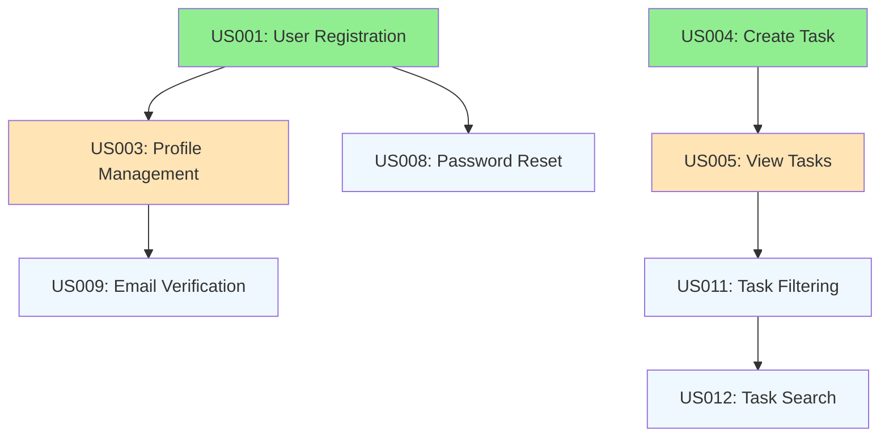

# GitHub Project Boards: Gestione Progetti Agile

## Obiettivo
Implementare un sistema completo di project management usando GitHub Projects v2 per gestire lo sviluppo di un'applicazione web con metodologie Agile/Scrum.

## Scenario: Sviluppo App Task Management

Il nostro team sviluppa un'app di task management. Useremo GitHub Projects per organizzare sprint, backlog e tracking del progresso.

## Parte 1: Setup del Project Board

### Step 1: Creazione Nuovo Project
```
1. Vai alla tua organizzazione/profilo GitHub
2. Tab "Projects" → "New project"
3. Seleziona "Team planning" template
4. Nome: "TaskApp Development"
5. Descrizione: "Agile development board for TaskApp project"
```

### Step 2: Configurazione Campi Custom
```yaml
# Campi personalizzati da aggiungere
Sprint:
  type: "Single select"
  options: ["Backlog", "Sprint 1", "Sprint 2", "Sprint 3", "Current"]

Story Points:
  type: "Number"
  description: "Effort estimation (Fibonacci scale)"

Epic:
  type: "Single select"  
  options: ["User Management", "Task CRUD", "Notifications", "Analytics", "Mobile"]

Priority:
  type: "Single select"
  options: ["P0 - Critical", "P1 - High", "P2 - Medium", "P3 - Low"]

Team:
  type: "Single select"
  options: ["Frontend", "Backend", "DevOps", "Design", "QA"]

Definition of Done:
  type: "Single select"
  options: ["TODO", "In Progress", "Code Review", "Testing", "Done"]
```

### Step 3: Views del Project

#### View 1: Sprint Board (Kanban)
```
Layout: Board
Group by: Status
Columns:
- 📋 Backlog
- 🏗️ To Do  
- 🔄 In Progress
- 👀 Review
- 🧪 Testing
- ✅ Done

Filters:
- Sprint = "Current"
- State != "Closed"

Sort by: Priority (P0 first)
```

#### View 2: Product Backlog
```
Layout: Table
Columns:
- Title
- Epic
- Priority  
- Story Points
- Assignees
- Sprint
- Created

Filters:
- State = "Open"
- Sprint != "Done"

Sort by: Priority, then Story Points
```

#### View 3: Sprint Planning
```
Layout: Table
Columns:
- Title
- Epic
- Story Points
- Team
- Definition of Done
- Assignees

Filters:
- Sprint = "Current" OR Sprint = "Next"

Group by: Epic
Sort by: Story Points (ascending)
```

#### View 4: Team Workload
```
Layout: Table
Columns:
- Assignees
- Count of items
- Sum of Story Points
- Status breakdown

Group by: Assignees
Filters:
- Sprint = "Current"
- State = "Open"
```

## Parte 2: Struttura Epic e User Stories

### Epic 1: User Management
```markdown
# Epic: User Management System

## Goal
Implementare sistema completo di gestione utenti con autenticazione, autorizzazione e profili.

## User Stories:

### US001: User Registration
**As a** new user
**I want to** create an account with email and password
**So that** I can access the task management features

**Acceptance Criteria:**
- [ ] Email validation and uniqueness check
- [ ] Password strength requirements (8+ chars, numbers, symbols)
- [ ] Email verification process
- [ ] Success/error feedback messages
- [ ] Redirect to dashboard after registration

**Story Points:** 5
**Priority:** P1 - High
**Team:** Backend + Frontend

### US002: User Login
**As a** registered user
**I want to** log in with email and password
**So that** I can access my tasks

**Acceptance Criteria:**
- [ ] Secure authentication with JWT
- [ ] Remember me functionality
- [ ] Forgot password flow
- [ ] Account lockout after failed attempts
- [ ] Responsive login form

**Story Points:** 3
**Priority:** P1 - High
**Team:** Backend + Frontend

### US003: User Profile Management
**As a** logged-in user
**I want to** update my profile information
**So that** I can keep my account current

**Acceptance Criteria:**
- [ ] Edit name, email, avatar
- [ ] Change password functionality
- [ ] Account deletion option
- [ ] Privacy settings
- [ ] Activity log viewing

**Story Points:** 8
**Priority:** P2 - Medium
**Team:** Frontend + Backend
```

### Epic 2: Task CRUD Operations
```markdown
# Epic: Task Management Core

## Goal
Implementare operazioni CRUD complete per la gestione delle task con categorizzazione e priorità.

### US004: Create Task
**As a** user
**I want to** create new tasks with details
**So that** I can organize my work

**Acceptance Criteria:**
- [ ] Title and description fields
- [ ] Due date picker
- [ ] Priority selection (High/Medium/Low)
- [ ] Category/tag assignment
- [ ] File attachment support
- [ ] Save as draft functionality

**Story Points:** 5
**Priority:** P0 - Critical
**Team:** Frontend + Backend

### US005: View Tasks List
**As a** user
**I want to** see all my tasks in an organized list
**So that** I can have overview of my work

**Acceptance Criteria:**
- [ ] Filterable by status, priority, category
- [ ] Sortable by due date, created date, priority
- [ ] Search functionality
- [ ] Pagination for large lists
- [ ] Bulk actions (complete, delete)
- [ ] Export functionality

**Story Points:** 8
**Priority:** P0 - Critical
**Team:** Frontend + Backend

### US006: Edit Task
**As a** user
**I want to** modify existing tasks
**So that** I can update details as needed

**Story Points:** 3
**Priority:** P1 - High
**Team:** Frontend + Backend

### US007: Delete Task
**As a** user
**I want to** remove tasks I no longer need
**So that** my list stays clean and relevant

**Story Points:** 2
**Priority:** P1 - High
**Team:** Frontend + Backend
```

## Parte 3: Sprint Planning e Execution

### Sprint 1 Planning (2 settimane)
```
🎯 Sprint Goal: Implement basic user authentication and task creation

📊 Capacity: 40 story points (team of 4, 2 weeks)

📋 Selected Items:
- US001: User Registration (5 pts) - Alice (Backend) + Bob (Frontend)
- US002: User Login (3 pts) - Alice (Backend) + Bob (Frontend)  
- US004: Create Task (5 pts) - Carol (Backend) + Dave (Frontend)
- US006: Edit Task (3 pts) - Carol (Backend) + Dave (Frontend)
- US007: Delete Task (2 pts) - Carol (Backend) + Dave (Frontend)

Total: 18 story points (leaving buffer for unexpected work)

🎯 Definition of Done:
- [ ] Code developed and unit tested
- [ ] Code reviewed and merged to main
- [ ] Integration tests passing
- [ ] UI/UX approved by design team
- [ ] Manual testing completed
- [ ] Documentation updated
```

### Daily Standup Template
```markdown
## Daily Standup - [Date]

### Alice (Backend Developer)
**Yesterday:**
- Completed JWT authentication middleware
- Started work on user registration API

**Today:**  
- Finish user registration endpoint
- Begin email verification system

**Blockers:**
- Need email service configuration details

### Bob (Frontend Developer)
**Yesterday:**
- Designed login/register forms
- Set up routing structure

**Today:**
- Implement login form validation
- Connect to authentication API

**Blockers:**
- Waiting for API endpoints from Alice

### Sprint Progress:
- 🟢 On track: 12 story points completed
- 🟡 At risk: Email verification (dependency on external service)
- 🔴 Blocked: None

### Actions:
- [ ] Alice to provide API endpoints by EOD
- [ ] Team to review email service options
- [ ] Schedule design review for Thursday
```

## Parte 4: Automazione con GitHub Actions

### Automation 1: Auto-move Cards
```yaml
# .github/workflows/project-automation.yml
name: Project Board Automation

on:
  pull_request:
    types: [opened, closed]
  issues:
    types: [opened, assigned, closed]

jobs:
  update-project-board:
    runs-on: ubuntu-latest
    steps:
      - name: Move issue to In Progress when assigned
        if: github.event.action == 'assigned'
        uses: actions/github-script@v6
        with:
          github-token: ${{ secrets.GITHUB_TOKEN }}
          script: |
            // Get project and move item to "In Progress"
            const projectId = "PROJECT_ID";
            const itemId = context.payload.issue.node_id;
            
            await github.graphql(`
              mutation {
                updateProjectV2ItemFieldValue(
                  input: {
                    projectId: "${projectId}"
                    itemId: "${itemId}"
                    fieldId: "STATUS_FIELD_ID"
                    value: {
                      singleSelectOptionId: "IN_PROGRESS_OPTION_ID"
                    }
                  }
                ) {
                  projectV2Item {
                    id
                  }
                }
              }
            `);

      - name: Move to Review when PR opened
        if: github.event.action == 'opened' && github.event.pull_request
        uses: actions/github-script@v6
        with:
          github-token: ${{ secrets.GITHUB_TOKEN }}
          script: |
            // Extract issue number from PR title or description
            const prTitle = context.payload.pull_request.title;
            const issueMatch = prTitle.match(/#(\d+)/);
            
            if (issueMatch) {
              const issueNumber = issueMatch[1];
              // Move associated issue to "Review" column
              // Implementation depends on your project structure
            }

      - name: Move to Done when issue closed
        if: github.event.action == 'closed' && github.event.issue
        uses: actions/github-script@v6
        with:
          github-token: ${{ secrets.GITHUB_TOKEN }}
          script: |
            // Move to Done column
            // Update story points in team metrics
```

### Automation 2: Sprint Reports
```yaml
# .github/workflows/sprint-report.yml
name: Sprint Report Generator

on:
  schedule:
    - cron: '0 9 * * MON'  # Every Monday at 9 AM
  workflow_dispatch:

jobs:
  generate-sprint-report:
    runs-on: ubuntu-latest
    steps:
      - name: Generate Sprint Report
        uses: actions/github-script@v6
        with:
          github-token: ${{ secrets.GITHUB_TOKEN }}
          script: |
            const { graphql } = github;
            
            // Query project data
            const projectData = await graphql(`
              query {
                organization(login: "your-org") {
                  projectV2(number: 1) {
                    items(first: 100) {
                      nodes {
                        id
                        fieldValues(first: 10) {
                          nodes {
                            ... on ProjectV2ItemFieldTextValue {
                              text
                              field {
                                ... on ProjectV2FieldCommon {
                                  name
                                }
                              }
                            }
                            ... on ProjectV2ItemFieldSingleSelectValue {
                              name
                              field {
                                ... on ProjectV2FieldCommon {
                                  name
                                }
                              }
                            }
                          }
                        }
                        content {
                          ... on Issue {
                            title
                            number
                            state
                            assignees(first: 5) {
                              nodes {
                                login
                              }
                            }
                          }
                        }
                      }
                    }
                  }
                }
              }
            `);
            
            // Process data and generate report
            const sprintItems = projectData.organization.projectV2.items.nodes
              .filter(item => {
                const sprintField = item.fieldValues.nodes
                  .find(field => field.field?.name === 'Sprint');
                return sprintField?.name === 'Current';
              });
            
            const completed = sprintItems.filter(item => 
              item.content.state === 'CLOSED'
            ).length;
            
            const total = sprintItems.length;
            const completionRate = (completed / total * 100).toFixed(1);
            
            const report = `
            ## 📊 Sprint Progress Report - Week of ${new Date().toDateString()}
            
            ### Sprint Overview
            - **Total Items**: ${total}
            - **Completed**: ${completed}
            - **In Progress**: ${total - completed}
            - **Completion Rate**: ${completionRate}%
            
            ### Team Performance
            ${generateTeamStats(sprintItems)}
            
            ### Blockers & Risks
            ${identifyBlockers(sprintItems)}
            `;
            
            // Create issue with report
            await github.rest.issues.create({
              owner: context.repo.owner,
              repo: context.repo.repo,
              title: `Sprint Report - ${new Date().toDateString()}`,
              body: report,
              labels: ['sprint-report', 'automated']
            });
```

## Parte 5: Metrics e KPIs

### Sprint Metrics Dashboard
```javascript
// Metrics tracking per sprint
const sprintMetrics = {
  "Sprint 1": {
    planned: 18,
    completed: 16,
    carryover: 2,
    velocityPoints: 16,
    burndownData: [18, 15, 12, 8, 5, 2, 0], // Daily remaining
    teamSatisfaction: 4.2, // 1-5 scale
    impediments: [
      "Email service config delayed 1 day",
      "Design review took longer than expected"
    ],
    retrospectiveActions: [
      "Start design reviews earlier in sprint",
      "Pre-configure external services",
      "Add buffer time for new technology"
    ]
  },
  
  "Sprint 2": {
    planned: 20,
    completed: 19,
    carryover: 1,
    velocityPoints: 19,
    improvementRate: "18.75%", // vs Sprint 1
    cycleTime: {
      "Todo to InProgress": "0.5 days",
      "InProgress to Review": "1.2 days", 
      "Review to Done": "0.8 days"
    }
  }
};

// Team performance tracking
const teamMetrics = {
  "Alice (Backend)": {
    completedStoryPoints: 12,
    averageCycleTime: "2.3 days",
    codeReviewParticipation: "85%",
    knowledgeSharing: 3 // sessions conducted
  },
  
  "Bob (Frontend)": {
    completedStoryPoints: 10,
    averageCycleTime: "2.1 days", 
    codeReviewParticipation: "92%",
    pairProgrammingSessions: 5
  }
};
```

### Automated Burndown Chart
```html
<!-- Burndown chart usando Chart.js -->
<canvas id="burndownChart"></canvas>

<script>
const ctx = document.getElementById('burndownChart').getContext('2d');
const burndownChart = new Chart(ctx, {
    type: 'line',
    data: {
        labels: ['Day 1', 'Day 2', 'Day 3', 'Day 4', 'Day 5', 'Day 6', 'Day 7', 'Day 8', 'Day 9', 'Day 10'],
        datasets: [{
            label: 'Planned Burndown',
            data: [18, 16, 14, 12, 10, 8, 6, 4, 2, 0],
            borderColor: 'blue',
            backgroundColor: 'rgba(0, 0, 255, 0.1)',
            borderDash: [5, 5]
        }, {
            label: 'Actual Burndown',
            data: [18, 17, 15, 13, 12, 9, 7, 5, 2, 0],
            borderColor: 'red',
            backgroundColor: 'rgba(255, 0, 0, 0.1)'
        }]
    },
    options: {
        responsive: true,
        scales: {
            y: {
                beginAtZero: true,
                title: {
                    display: true,
                    text: 'Story Points Remaining'
                }
            },
            x: {
                title: {
                    display: true,
                    text: 'Sprint Days'
                }
            }
        },
        plugins: {
            title: {
                display: true,
                text: 'Sprint 1 Burndown Chart'
            }
        }
    }
});
</script>
```

## Parte 6: Advanced Project Management

### Epic Progress Tracking
```markdown
## Epic Progress Dashboard

### Epic 1: User Management (30% Complete)
**Progress**: ████████░░░░░░░░░░░░░░░░░░░░ 8/26 story points

**Completed Stories:**
- ✅ US002: User Login (3 pts)
- ✅ US001: User Registration (5 pts)

**In Progress:**
- 🔄 US003: User Profile Management (8 pts) - 60% complete

**Remaining:**
- 📋 US008: Password Reset Flow (5 pts)
- 📋 US009: Email Verification (3 pts)  
- 📋 US010: Account Settings (2 pts)

**Risks:**
- Email service integration complexity
- GDPR compliance requirements

**Next Actions:**
- Complete profile management by Friday
- Start technical design for password reset
- Research email service providers
```

### Dependency Management


### Release Planning
```yaml
Release 1.0 (MVP):
  Target Date: "2024-03-15"
  Epic Coverage:
    - User Management: 100%
    - Task CRUD: 100%
    - Basic UI: 100%
  
  Must Have Features:
    - User registration/login
    - Create/edit/delete tasks
    - Basic task listing
    - Responsive design
  
  Success Criteria:
    - 100 beta users registered
    - <2s page load time
    - 95%+ uptime
    - Zero critical bugs

Release 1.1 (Enhancement):
  Target Date: "2024-04-30"
  Epic Coverage:
    - Notifications: 80%
    - Advanced Filtering: 100%
    - Team Collaboration: 60%
  
  New Features:
    - Email notifications
    - Advanced search/filtering
    - Task sharing
    - Due date reminders
```

## Conclusione e Best Practices

### Key Learnings
1. **Project Structure**: Hierarchy chiara Epic → Story → Task
2. **Automation**: Riduci manual work con GitHub Actions
3. **Metrics**: Track velocity e cycle time per improvement
4. **Visibility**: Dashboard sempre aggiornati per stakeholder
5. **Collaboration**: Regular reviews e retrospectives

### Best Practices
```markdown
✅ Do:
- Use consistent story point estimation
- Write clear acceptance criteria
- Update boards daily
- Run regular retrospectives
- Automate repetitive tasks
- Link PRs to issues
- Track team velocity
- Maintain definition of done

❌ Don't:
- Skip sprint planning
- Ignore blockers
- Over-commit in sprints
- Forget to update status
- Work without clear requirements
- Skip code reviews
- Ignore technical debt
- Bypass process for "urgent" work
```

### Tools Integration
```yaml
Recommended Integrations:
  - Slack: Notifications e daily standups
  - Figma: Design specs linkati alle stories
  - Sentry: Error tracking collegato ai bug
  - Linear: Advanced project management features
  - Notion: Documentation e knowledge base
  - Time Tracking: Harvest, Toggl per effort tracking
```

Il project management efficace su GitHub Projects trasforma il caos in produttività organizzata, migliorando la delivery predictability e la team satisfaction.
