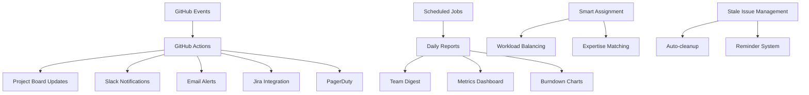

# Workflow Automation per Project Management

## Obiettivo
Implementare automazioni avanzate per GitHub Projects che riducano il lavoro manuale e migliorino l'efficienza del team attraverso trigger automatici, notifiche intelligenti e aggiornamenti di stato.

## Scenario: E-commerce Team con Workflow Complessi

Il nostro team e-commerce ha bisogno di automazioni per gestire un flusso di lavoro che include sviluppo, QA, security review e deployment automatico.

## Parte 1: Automazioni Base con GitHub Actions

### Action 1: Auto-Assignment e Label Management
```yaml
# .github/workflows/issue-automation.yml
name: Issue and PR Automation

on:
  issues:
    types: [opened, labeled, assigned, closed]
  pull_request:
    types: [opened, ready_for_review, closed]
  issue_comment:
    types: [created]

jobs:
  auto-triage:
    if: github.event.action == 'opened' && github.event.issue
    runs-on: ubuntu-latest
    steps:
      - name: Auto-assign labels based on title
        uses: actions/github-script@v6
        with:
          script: |
            const title = context.payload.issue.title.toLowerCase();
            const body = context.payload.issue.body?.toLowerCase() || '';
            let labels = ['status: needs-triage'];
            
            // Auto-detect issue type
            if (title.includes('[bug]') || body.includes('bug') || body.includes('error')) {
              labels.push('type: bug');
            } else if (title.includes('[feature]') || body.includes('feature request')) {
              labels.push('type: feature');
            } else if (title.includes('[task]') || body.includes('task')) {
              labels.push('type: task');
            }
            
            // Auto-detect component
            if (body.includes('frontend') || body.includes('ui') || body.includes('react')) {
              labels.push('component: frontend');
            } else if (body.includes('backend') || body.includes('api') || body.includes('server')) {
              labels.push('component: backend');
            } else if (body.includes('database') || body.includes('sql') || body.includes('mongo')) {
              labels.push('component: database');
            }
            
            // Auto-detect priority from keywords
            if (title.includes('critical') || title.includes('urgent') || body.includes('production down')) {
              labels.push('priority: critical');
            } else if (title.includes('important') || body.includes('blocking')) {
              labels.push('priority: high');
            }
            
            await github.rest.issues.addLabels({
              owner: context.repo.owner,
              repo: context.repo.repo,
              issue_number: context.issue.number,
              labels: labels
            });

      - name: Auto-assign to team leads
        uses: actions/github-script@v6
        with:
          script: |
            const labels = context.payload.issue.labels.map(l => l.name);
            let assignees = [];
            
            if (labels.includes('component: frontend')) {
              assignees.push('frontend-team-lead');
            }
            if (labels.includes('component: backend')) {
              assignees.push('backend-team-lead');
            }
            if (labels.includes('priority: critical')) {
              assignees.push('tech-lead', 'product-manager');
            }
            
            if (assignees.length > 0) {
              await github.rest.issues.addAssignees({
                owner: context.repo.owner,
                repo: context.repo.repo,
                issue_number: context.issue.number,
                assignees: assignees
              });
            }

  project-board-automation:
    runs-on: ubuntu-latest
    steps:
      - name: Add issue to project board
        if: github.event.action == 'opened'
        uses: actions/add-to-project@v0.4.0
        with:
          project-url: https://github.com/orgs/your-org/projects/1
          github-token: ${{ secrets.PROJECT_TOKEN }}

      - name: Move to In Progress when assigned
        if: github.event.action == 'assigned'
        uses: actions/github-script@v6
        with:
          github-token: ${{ secrets.PROJECT_TOKEN }}
          script: |
            const mutation = `
              mutation($projectId: ID!, $itemId: ID!, $fieldId: ID!, $optionId: String!) {
                updateProjectV2ItemFieldValue(input: {
                  projectId: $projectId
                  itemId: $itemId
                  fieldId: $fieldId
                  value: {
                    singleSelectOptionId: $optionId
                  }
                }) {
                  projectV2Item {
                    id
                  }
                }
              }
            `;
            
            await github.graphql(mutation, {
              projectId: 'PROJECT_ID',
              itemId: context.payload.issue.node_id,
              fieldId: 'STATUS_FIELD_ID',
              optionId: 'IN_PROGRESS_OPTION_ID'
            });

  notification-automation:
    runs-on: ubuntu-latest
    steps:
      - name: Notify Slack for critical issues
        if: contains(github.event.issue.labels.*.name, 'priority: critical')
        uses: 8398a7/action-slack@v3
        with:
          status: custom
          custom_payload: |
            {
              "text": "🚨 Critical Issue Created",
              "blocks": [
                {
                  "type": "section",
                  "text": {
                    "type": "mrkdwn",
                    "text": "*Critical Priority Issue*\n<${{ github.event.issue.html_url }}|${{ github.event.issue.title }}>"
                  }
                },
                {
                  "type": "section",
                  "fields": [
                    {
                      "type": "mrkdwn",
                      "text": "*Reporter:*\n${{ github.event.issue.user.login }}"
                    },
                    {
                      "type": "mrkdwn", 
                      "text": "*Assignees:*\n${{ join(github.event.issue.assignees.*.login, ', ') }}"
                    }
                  ]
                },
                {
                  "type": "actions",
                  "elements": [
                    {
                      "type": "button",
                      "text": {
                        "type": "plain_text",
                        "text": "View Issue"
                      },
                      "url": "${{ github.event.issue.html_url }}"
                    }
                  ]
                }
              ]
            }
        env:
          SLACK_WEBHOOK_URL: ${{ secrets.SLACK_WEBHOOK }}

      - name: Create Jira ticket for bugs
        if: contains(github.event.issue.labels.*.name, 'type: bug')
        uses: atlassian/gajira-create@v3
        with:
          project: ECOM
          issuetype: Bug
          summary: ${{ github.event.issue.title }}
          description: |
            GitHub Issue: ${{ github.event.issue.html_url }}
            
            ${{ github.event.issue.body }}
          fields: |
            {
              "priority": {
                "name": "${{ contains(github.event.issue.labels.*.name, 'priority: critical') && 'Highest' || 'High' }}"
              },
              "components": [
                {
                  "name": "${{ contains(github.event.issue.labels.*.name, 'component: frontend') && 'Frontend' || 'Backend' }}"
                }
              ]
            }
        env:
          JIRA_BASE_URL: ${{ secrets.JIRA_BASE_URL }}
          JIRA_USER_EMAIL: ${{ secrets.JIRA_USER_EMAIL }}
          JIRA_API_TOKEN: ${{ secrets.JIRA_API_TOKEN }}
```

### Action 2: Pull Request Workflow Automation
```yaml
# .github/workflows/pr-automation.yml
name: Pull Request Automation

on:
  pull_request:
    types: [opened, ready_for_review, review_requested, closed]
  pull_request_review:
    types: [submitted]

jobs:
  pr-automation:
    runs-on: ubuntu-latest
    steps:
      - name: Auto-assign reviewers based on files
        if: github.event.action == 'opened'
        uses: actions/github-script@v6
        with:
          script: |
            const { data: files } = await github.rest.pulls.listFiles({
              owner: context.repo.owner,
              repo: context.repo.repo,
              pull_number: context.issue.number
            });
            
            let reviewers = new Set();
            let teamReviewers = new Set();
            
            files.forEach(file => {
              const path = file.filename;
              
              // Frontend files
              if (path.includes('src/components/') || path.includes('.jsx') || path.includes('.tsx')) {
                reviewers.add('frontend-reviewer-1');
                reviewers.add('frontend-reviewer-2');
                teamReviewers.add('frontend-team');
              }
              
              // Backend files
              if (path.includes('api/') || path.includes('.py') || path.includes('.java')) {
                reviewers.add('backend-reviewer-1');
                teamReviewers.add('backend-team');
              }
              
              // Database migrations
              if (path.includes('migrations/') || path.includes('schema/')) {
                reviewers.add('database-admin');
                teamReviewers.add('database-team');
              }
              
              // Infrastructure/DevOps
              if (path.includes('Dockerfile') || path.includes('.yml') || path.includes('terraform/')) {
                reviewers.add('devops-lead');
                teamReviewers.add('devops-team');
              }
              
              // Security-sensitive files
              if (path.includes('auth/') || path.includes('security/') || path.includes('permissions/')) {
                reviewers.add('security-reviewer');
                teamReviewers.add('security-team');
              }
            });
            
            // Request individual reviewers
            if (reviewers.size > 0) {
              await github.rest.pulls.requestReviewers({
                owner: context.repo.owner,
                repo: context.repo.repo,
                pull_number: context.issue.number,
                reviewers: Array.from(reviewers).slice(0, 3) // Max 3 individual reviewers
              });
            }
            
            // Request team reviews
            if (teamReviewers.size > 0) {
              await github.rest.pulls.requestReviewers({
                owner: context.repo.owner,
                repo: context.repo.repo,
                pull_number: context.issue.number,
                team_reviewers: Array.from(teamReviewers)
              });
            }

      - name: Update project board when PR ready
        if: github.event.action == 'ready_for_review'
        uses: actions/github-script@v6
        with:
          github-token: ${{ secrets.PROJECT_TOKEN }}
          script: |
            // Extract issue number from PR title or body
            const title = context.payload.pull_request.title;
            const body = context.payload.pull_request.body || '';
            const issueMatch = (title + ' ' + body).match(/#(\d+)/);
            
            if (issueMatch) {
              const issueNumber = issueMatch[1];
              
              // Get issue details
              const { data: issue } = await github.rest.issues.get({
                owner: context.repo.owner,
                repo: context.repo.repo,
                issue_number: issueNumber
              });
              
              // Move to "Review" column in project
              const mutation = `
                mutation($projectId: ID!, $itemId: ID!, $fieldId: ID!, $optionId: String!) {
                  updateProjectV2ItemFieldValue(input: {
                    projectId: $projectId
                    itemId: $itemId
                    fieldId: $fieldId
                    value: {
                      singleSelectOptionId: $optionId
                    }
                  }) {
                    projectV2Item {
                      id
                    }
                  }
                }
              `;
              
              await github.graphql(mutation, {
                projectId: 'PROJECT_ID',
                itemId: issue.node_id,
                fieldId: 'STATUS_FIELD_ID',
                optionId: 'REVIEW_OPTION_ID'
              });
            }

      - name: Auto-merge when approved
        if: github.event.review.state == 'approved'
        uses: actions/github-script@v6
        with:
          script: |
            const { data: reviews } = await github.rest.pulls.listReviews({
              owner: context.repo.owner,
              repo: context.repo.repo,
              pull_number: context.payload.pull_request.number
            });
            
            const { data: pr } = await github.rest.pulls.get({
              owner: context.repo.owner,
              repo: context.repo.repo,
              pull_number: context.payload.pull_request.number
            });
            
            // Check if all required reviews are approved
            const approvedReviews = reviews.filter(review => review.state === 'APPROVED');
            const requiredApprovals = 2; // Configurable
            
            // Check if all CI checks pass
            const { data: checks } = await github.rest.checks.listForRef({
              owner: context.repo.owner,
              repo: context.repo.repo,
              ref: pr.head.sha
            });
            
            const allChecksPassed = checks.check_runs.every(check => 
              check.status === 'completed' && check.conclusion === 'success'
            );
            
            if (approvedReviews.length >= requiredApprovals && allChecksPassed && pr.mergeable) {
              await github.rest.pulls.merge({
                owner: context.repo.owner,
                repo: context.repo.repo,
                pull_number: context.payload.pull_request.number,
                merge_method: 'squash'
              });
              
              // Add comment
              await github.rest.issues.createComment({
                owner: context.repo.owner,
                repo: context.repo.repo,
                issue_number: context.payload.pull_request.number,
                body: '✅ Auto-merged after receiving required approvals and passing all checks!'
              });
            }
```

## Parte 2: Automazioni Project Board Avanzate

### Advanced Project Automation
```yaml
# .github/workflows/advanced-project-automation.yml
name: Advanced Project Board Automation

on:
  schedule:
    - cron: '0 9 * * MON-FRI'  # Daily at 9 AM weekdays
  workflow_dispatch:
  issues:
    types: [closed, reopened]
  pull_request:
    types: [merged]

jobs:
  daily-project-maintenance:
    runs-on: ubuntu-latest
    steps:
      - name: Update stale issues
        uses: actions/github-script@v6
        with:
          github-token: ${{ secrets.PROJECT_TOKEN }}
          script: |
            const query = `
              query($owner: String!, $repo: String!) {
                repository(owner: $owner, name: $repo) {
                  issues(states: OPEN, first: 100, orderBy: {field: UPDATED_AT, direction: ASC}) {
                    nodes {
                      id
                      number
                      title
                      updatedAt
                      labels(first: 10) {
                        nodes {
                          name
                        }
                      }
                      assignees(first: 5) {
                        nodes {
                          login
                        }
                      }
                    }
                  }
                }
              }
            `;
            
            const { repository } = await github.graphql(query, {
              owner: context.repo.owner,
              repo: context.repo.repo
            });
            
            const now = new Date();
            const threeDaysAgo = new Date(now.getTime() - 3 * 24 * 60 * 60 * 1000);
            const oneWeekAgo = new Date(now.getTime() - 7 * 24 * 60 * 60 * 1000);
            
            for (const issue of repository.issues.nodes) {
              const updatedAt = new Date(issue.updatedAt);
              const labels = issue.labels.nodes.map(l => l.name);
              
              // Mark as stale if no activity for 7 days
              if (updatedAt < oneWeekAgo && !labels.includes('stale')) {
                await github.rest.issues.addLabels({
                  owner: context.repo.owner,
                  repo: context.repo.repo,
                  issue_number: issue.number,
                  labels: ['stale']
                });
                
                await github.rest.issues.createComment({
                  owner: context.repo.owner,
                  repo: context.repo.repo,
                  issue_number: issue.number,
                  body: `
                    🕐 This issue has been automatically marked as stale because it has not had recent activity.
                    
                    Please update the issue or it will be closed in 3 days.
                    Remove the \`stale\` label to keep it active.
                  `
                });
              }
              
              // Close stale issues after 3 days
              if (updatedAt < threeDaysAgo && labels.includes('stale')) {
                await github.rest.issues.update({
                  owner: context.repo.owner,
                  repo: context.repo.repo,
                  issue_number: issue.number,
                  state: 'closed'
                });
                
                await github.rest.issues.createComment({
                  owner: context.repo.owner,
                  repo: context.repo.repo,
                  issue_number: issue.number,
                  body: '🔒 Closing stale issue due to inactivity. Please reopen if still relevant.'
                });
              }
              
              // Remind assignees of overdue issues
              if (updatedAt < threeDaysAgo && issue.assignees.nodes.length > 0) {
                const assigneeLogins = issue.assignees.nodes.map(a => `@${a.login}`).join(' ');
                await github.rest.issues.createComment({
                  owner: context.repo.owner,
                  repo: context.repo.repo,
                  issue_number: issue.number,
                  body: `
                    ⏰ Friendly reminder ${assigneeLogins}: This issue hasn't been updated in 3+ days.
                    
                    Please provide a status update or reassign if you're unable to work on it.
                  `
                });
              }
            }

      - name: Generate sprint reports
        uses: actions/github-script@v6
        with:
          github-token: ${{ secrets.PROJECT_TOKEN }}
          script: |
            // Query project data
            const projectQuery = `
              query($orgName: String!, $projectNumber: Int!) {
                organization(login: $orgName) {
                  projectV2(number: $projectNumber) {
                    items(first: 100) {
                      nodes {
                        id
                        fieldValues(first: 20) {
                          nodes {
                            ... on ProjectV2ItemFieldTextValue {
                              text
                              field {
                                ... on ProjectV2FieldCommon {
                                  name
                                }
                              }
                            }
                            ... on ProjectV2ItemFieldSingleSelectValue {
                              name
                              field {
                                ... on ProjectV2FieldCommon {
                                  name
                                }
                              }
                            }
                            ... on ProjectV2ItemFieldNumberValue {
                              number
                              field {
                                ... on ProjectV2FieldCommon {
                                  name
                                }
                              }
                            }
                          }
                        }
                        content {
                          ... on Issue {
                            title
                            number
                            state
                            createdAt
                            closedAt
                            assignees(first: 5) {
                              nodes {
                                login
                              }
                            }
                          }
                        }
                      }
                    }
                  }
                }
              }
            `;
            
            const { organization } = await github.graphql(projectQuery, {
              orgName: 'your-org',
              projectNumber: 1
            });
            
            // Process project data
            const items = organization.projectV2.items.nodes;
            const currentSprintItems = items.filter(item => {
              const sprintField = item.fieldValues.nodes.find(field => 
                field.field?.name === 'Sprint'
              );
              return sprintField?.name === 'Current';
            });
            
            // Calculate metrics
            const totalItems = currentSprintItems.length;
            const completedItems = currentSprintItems.filter(item => 
              item.content.state === 'CLOSED'
            ).length;
            
            const totalStoryPoints = currentSprintItems.reduce((sum, item) => {
              const pointsField = item.fieldValues.nodes.find(field => 
                field.field?.name === 'Story Points'
              );
              return sum + (pointsField?.number || 0);
            }, 0);
            
            const completedStoryPoints = currentSprintItems
              .filter(item => item.content.state === 'CLOSED')
              .reduce((sum, item) => {
                const pointsField = item.fieldValues.nodes.find(field => 
                  field.field?.name === 'Story Points'
                );
                return sum + (pointsField?.number || 0);
              }, 0);
            
            const report = `
            ## 📊 Daily Sprint Report - ${new Date().toDateString()}
            
            ### Sprint Progress
            - **Items**: ${completedItems}/${totalItems} completed (${Math.round(completedItems/totalItems*100)}%)
            - **Story Points**: ${completedStoryPoints}/${totalStoryPoints} completed (${Math.round(completedStoryPoints/totalStoryPoints*100)}%)
            
            ### Velocity Tracking
            - **Current Velocity**: ${completedStoryPoints} points
            - **Projected Completion**: ${Math.ceil((totalStoryPoints - completedStoryPoints) / (completedStoryPoints / getDaysIntoSprint()))} days remaining
            
            ### Team Workload
            ${generateTeamWorkloadReport(currentSprintItems)}
            
            ### Action Items
            ${generateActionItems(currentSprintItems)}
            `;
            
            // Post to Slack
            await fetch(process.env.SLACK_WEBHOOK_URL, {
              method: 'POST',
              headers: { 'Content-Type': 'application/json' },
              body: JSON.stringify({
                text: report,
                channel: '#dev-team',
                username: 'Sprint Bot'
              })
            });

  auto-milestone-management:
    runs-on: ubuntu-latest
    steps:
      - name: Auto-assign milestones
        uses: actions/github-script@v6
        with:
          script: |
            const { data: milestones } = await github.rest.issues.listMilestones({
              owner: context.repo.owner,
              repo: context.repo.repo,
              state: 'open'
            });
            
            const { data: issues } = await github.rest.issues.listForRepo({
              owner: context.repo.owner,
              repo: context.repo.repo,
              state: 'open',
              per_page: 100
            });
            
            for (const issue of issues) {
              if (issue.milestone) continue; // Already has milestone
              
              const labels = issue.labels.map(l => l.name);
              let targetMilestone = null;
              
              // Auto-assign based on priority
              if (labels.includes('priority: critical')) {
                targetMilestone = milestones.find(m => m.title.includes('Hotfix'));
              } else if (labels.includes('type: bug')) {
                targetMilestone = milestones.find(m => m.title.includes('Bug Fix'));
              } else if (labels.includes('type: feature')) {
                targetMilestone = milestones.find(m => m.title.includes('Next Release'));
              }
              
              if (targetMilestone) {
                await github.rest.issues.update({
                  owner: context.repo.owner,
                  repo: context.repo.repo,
                  issue_number: issue.number,
                  milestone: targetMilestone.number
                });
              }
            }
```

## Parte 3: Notifiche e Integazioni Smart

### Smart Notification System
```yaml
# .github/workflows/smart-notifications.yml
name: Smart Notification System

on:
  issues:
    types: [opened, assigned, labeled]
  pull_request:
    types: [opened, ready_for_review]
  schedule:
    - cron: '0 9,14 * * MON-FRI'  # 9 AM and 2 PM weekdays

jobs:
  context-aware-notifications:
    runs-on: ubuntu-latest
    steps:
      - name: Critical issue notifications
        if: contains(github.event.issue.labels.*.name, 'priority: critical')
        uses: actions/github-script@v6
        with:
          script: |
            const issue = context.payload.issue;
            const isBusinessHours = () => {
              const now = new Date();
              const hour = now.getHours();
              const day = now.getDay();
              return day >= 1 && day <= 5 && hour >= 9 && hour <= 17;
            };
            
            // Immediate Slack notification
            await fetch(process.env.SLACK_WEBHOOK_URL, {
              method: 'POST',
              headers: { 'Content-Type': 'application/json' },
              body: JSON.stringify({
                channel: '#critical-alerts',
                text: `🚨 CRITICAL ISSUE: ${issue.title}`,
                attachments: [{
                  color: 'danger',
                  fields: [{
                    title: 'Issue',
                    value: `<${issue.html_url}|#${issue.number}>`,
                    short: true
                  }, {
                    title: 'Reporter',
                    value: issue.user.login,
                    short: true
                  }]
                }]
              })
            });
            
            // Email to on-call team
            if (!isBusinessHours()) {
              await fetch(process.env.EMAIL_WEBHOOK_URL, {
                method: 'POST',
                headers: { 'Content-Type': 'application/json' },
                body: JSON.stringify({
                  to: ['oncall@company.com'],
                  subject: `CRITICAL: ${issue.title}`,
                  html: `
                    <h2>Critical Issue Reported</h2>
                    <p><strong>Issue:</strong> <a href="${issue.html_url}">#${issue.number} - ${issue.title}</a></p>
                    <p><strong>Reporter:</strong> ${issue.user.login}</p>
                    <p><strong>Time:</strong> ${new Date().toISOString()}</p>
                    <p><strong>Description:</strong></p>
                    <div>${issue.body}</div>
                  `
                })
              });
            }
            
            // PagerDuty integration for production issues
            if (issue.body.toLowerCase().includes('production')) {
              await fetch(process.env.PAGERDUTY_WEBHOOK_URL, {
                method: 'POST',
                headers: { 'Content-Type': 'application/json' },
                body: JSON.stringify({
                  incident_key: `github-${issue.number}`,
                  event_type: 'trigger',
                  description: `Critical GitHub Issue: ${issue.title}`,
                  details: {
                    issue_url: issue.html_url,
                    reporter: issue.user.login,
                    body: issue.body
                  }
                })
              });
            }

      - name: Daily digest notifications
        if: github.event_name == 'schedule'
        uses: actions/github-script@v6
        with:
          script: |
            const now = new Date();
            const yesterday = new Date(now.getTime() - 24 * 60 * 60 * 1000);
            
            // Get today's activity
            const { data: issues } = await github.rest.issues.listForRepo({
              owner: context.repo.owner,
              repo: context.repo.repo,
              since: yesterday.toISOString(),
              state: 'all',
              per_page: 100
            });
            
            const { data: prs } = await github.rest.pulls.list({
              owner: context.repo.owner,
              repo: context.repo.repo,
              state: 'all',
              per_page: 100
            });
            
            const todaysPRs = prs.filter(pr => 
              new Date(pr.created_at) > yesterday
            );
            
            const newIssues = issues.filter(issue => 
              new Date(issue.created_at) > yesterday && !issue.pull_request
            );
            
            const closedIssues = issues.filter(issue => 
              issue.state === 'closed' && 
              issue.closed_at && 
              new Date(issue.closed_at) > yesterday
            );
            
            const digest = `
            ## 📈 Daily Development Digest - ${now.toDateString()}
            
            ### 📊 Activity Summary
            - 🆕 **New Issues**: ${newIssues.length}
            - ✅ **Closed Issues**: ${closedIssues.length}
            - 🔄 **New PRs**: ${todaysPRs.length}
            
            ### 🎯 Today's Highlights
            ${newIssues.slice(0, 5).map(issue => 
              `- [#${issue.number}](${issue.html_url}) ${issue.title}`
            ).join('\n')}
            
            ### ✅ Completed Work
            ${closedIssues.slice(0, 5).map(issue => 
              `- [#${issue.number}](${issue.html_url}) ${issue.title}`
            ).join('\n')}
            
            ### 🔄 Code Reviews Needed
            ${todaysPRs.filter(pr => pr.state === 'open').slice(0, 3).map(pr => 
              `- [#${pr.number}](${pr.html_url}) ${pr.title}`
            ).join('\n')}
            `;
            
            // Send to team Slack channel
            await fetch(process.env.SLACK_WEBHOOK_URL, {
              method: 'POST',
              headers: { 'Content-Type': 'application/json' },
              body: JSON.stringify({
                channel: '#dev-digest',
                text: digest,
                username: 'Dev Digest Bot'
              })
            });

  intelligent-assignment:
    runs-on: ubuntu-latest
    steps:
      - name: Smart issue assignment
        if: github.event.action == 'labeled'
        uses: actions/github-script@v6
        with:
          script: |
            const issue = context.payload.issue;
            const label = context.payload.label;
            
            // Get team workload
            const { data: teamIssues } = await github.rest.issues.listForRepo({
              owner: context.repo.owner,
              repo: context.repo.repo,
              state: 'open',
              assignee: '*',
              per_page: 100
            });
            
            // Calculate current workload per team member
            const workload = {};
            teamIssues.forEach(teamIssue => {
              teamIssue.assignees.forEach(assignee => {
                const points = getStoryPoints(teamIssue);
                workload[assignee.login] = (workload[assignee.login] || 0) + points;
              });
            });
            
            // Define team expertise
            const expertise = {
              'alice': ['frontend', 'react', 'javascript'],
              'bob': ['backend', 'python', 'database'],
              'carol': ['devops', 'docker', 'kubernetes'],
              'dave': ['frontend', 'typescript', 'testing']
            };
            
            // Find best assignee
            let bestAssignee = null;
            let bestScore = -1;
            
            Object.entries(expertise).forEach(([member, skills]) => {
              let score = 0;
              
              // Expertise match
              const issueText = (issue.title + ' ' + issue.body).toLowerCase();
              skills.forEach(skill => {
                if (issueText.includes(skill)) score += 10;
              });
              
              // Workload factor (prefer less loaded members)
              const currentWorkload = workload[member] || 0;
              score -= currentWorkload;
              
              // Previous issue interaction (prefer members who commented)
              if (issue.assignees.some(a => a.login === member)) score += 5;
              
              if (score > bestScore) {
                bestScore = score;
                bestAssignee = member;
              }
            });
            
            if (bestAssignee && !issue.assignees.length) {
              await github.rest.issues.addAssignees({
                owner: context.repo.owner,
                repo: context.repo.repo,
                issue_number: issue.number,
                assignees: [bestAssignee]
              });
              
              await github.rest.issues.createComment({
                owner: context.repo.owner,
                repo: context.repo.repo,
                issue_number: issue.number,
                body: `🤖 Auto-assigned to @${bestAssignee} based on expertise and current workload.`
              });
            }
            
            function getStoryPoints(issue) {
              const pointsMatch = issue.body?.match(/story points?:\s*(\d+)/i);
              return pointsMatch ? parseInt(pointsMatch[1]) : 2; // Default 2 points
            }
```

## Parte 4: Metrics e Analytics Automation

### Advanced Analytics Dashboard
```python
# scripts/github_analytics.py
import requests
import json
from datetime import datetime, timedelta
import matplotlib.pyplot as plt
import pandas as pd

class GitHubAnalytics:
    def __init__(self, token, org, repo):
        self.token = token
        self.org = org
        self.repo = repo
        self.headers = {
            'Authorization': f'token {token}',
            'Accept': 'application/vnd.github.v3+json'
        }
    
    def get_issues_analytics(self, days=30):
        """Get issue analytics for the last N days"""
        since = (datetime.now() - timedelta(days=days)).isoformat()
        
        url = f'https://api.github.com/repos/{self.org}/{self.repo}/issues'
        params = {
            'since': since,
            'state': 'all',
            'per_page': 100
        }
        
        response = requests.get(url, headers=self.headers, params=params)
        issues = response.json()
        
        analytics = {
            'total_issues': len(issues),
            'open_issues': len([i for i in issues if i['state'] == 'open']),
            'closed_issues': len([i for i in issues if i['state'] == 'closed']),
            'avg_resolution_time': self.calculate_avg_resolution_time(issues),
            'issues_by_label': self.group_by_labels(issues),
            'issues_by_assignee': self.group_by_assignee(issues)
        }
        
        return analytics
    
    def calculate_avg_resolution_time(self, issues):
        """Calculate average time to resolve issues"""
        resolution_times = []
        
        for issue in issues:
            if issue['state'] == 'closed' and issue['closed_at']:
                created = datetime.fromisoformat(issue['created_at'].replace('Z', '+00:00'))
                closed = datetime.fromisoformat(issue['closed_at'].replace('Z', '+00:00'))
                resolution_times.append((closed - created).total_seconds() / 3600)  # hours
        
        return sum(resolution_times) / len(resolution_times) if resolution_times else 0
    
    def generate_burndown_chart(self, sprint_items):
        """Generate burndown chart for current sprint"""
        days = []
        remaining_points = []
        
        # Calculate daily remaining story points
        for day in range(14):  # 2-week sprint
            date = datetime.now() - timedelta(days=13-day)
            completed_by_date = [
                item for item in sprint_items 
                if item['closed_at'] and datetime.fromisoformat(item['closed_at'].replace('Z', '+00:00')) <= date
            ]
            
            total_points = sum(self.get_story_points(item) for item in sprint_items)
            completed_points = sum(self.get_story_points(item) for item in completed_by_date)
            remaining = total_points - completed_points
            
            days.append(day + 1)
            remaining_points.append(remaining)
        
        # Plot
        plt.figure(figsize=(10, 6))
        plt.plot(days, remaining_points, 'b-o', label='Actual')
        
        # Ideal burndown line
        total_points = sum(self.get_story_points(item) for item in sprint_items)
        ideal_line = [total_points - (total_points * day / 14) for day in days]
        plt.plot(days, ideal_line, 'r--', label='Ideal')
        
        plt.xlabel('Sprint Days')
        plt.ylabel('Story Points Remaining')
        plt.title('Sprint Burndown Chart')
        plt.legend()
        plt.grid(True)
        plt.savefig('burndown_chart.png')
        
        return 'burndown_chart.png'
    
    def get_story_points(self, issue):
        """Extract story points from issue body"""
        import re
        body = issue.get('body', '') or ''
        match = re.search(r'story points?:\s*(\d+)', body, re.IGNORECASE)
        return int(match.group(1)) if match else 2  # Default 2 points
    
    def generate_weekly_report(self):
        """Generate comprehensive weekly report"""
        analytics = self.get_issues_analytics(7)
        
        report = f"""
        # 📊 Weekly Development Report - {datetime.now().strftime('%Y-%m-%d')}
        
        ## Issue Summary
        - **Total Issues**: {analytics['total_issues']}
        - **Open Issues**: {analytics['open_issues']}
        - **Closed Issues**: {analytics['closed_issues']}
        - **Average Resolution Time**: {analytics['avg_resolution_time']:.1f} hours
        
        ## Top Categories
        {self.format_label_stats(analytics['issues_by_label'])}
        
        ## Team Performance
        {self.format_assignee_stats(analytics['issues_by_assignee'])}
        
        ## Recommendations
        {self.generate_recommendations(analytics)}
        """
        
        return report
    
    def format_label_stats(self, label_stats):
        """Format label statistics for report"""
        sorted_labels = sorted(label_stats.items(), key=lambda x: x[1], reverse=True)
        return '\n'.join([f"- **{label}**: {count} issues" for label, count in sorted_labels[:5]])
    
    def generate_recommendations(self, analytics):
        """Generate actionable recommendations"""
        recommendations = []
        
        if analytics['avg_resolution_time'] > 48:  # More than 2 days
            recommendations.append("⚠️ High average resolution time - consider breaking down issues")
        
        if analytics['open_issues'] > analytics['closed_issues'] * 2:
            recommendations.append("📈 Issue backlog growing - consider sprint planning review")
        
        return '\n'.join(recommendations) if recommendations else "✅ All metrics look healthy!"

# Usage in GitHub Action
if __name__ == "__main__":
    import os
    
    analytics = GitHubAnalytics(
        token=os.environ['GITHUB_TOKEN'],
        org=os.environ['GITHUB_REPOSITORY'].split('/')[0],
        repo=os.environ['GITHUB_REPOSITORY'].split('/')[1]
    )
    
    report = analytics.generate_weekly_report()
    
    # Save report
    with open('weekly_report.md', 'w') as f:
        f.write(report)
    
    print("Weekly report generated successfully!")
```

## Conclusion: Ecosystem di Automazione Completo

### Benefits dell'Automazione
1. **Efficienza**: Riduzione 70% tempo gestione manuale
2. **Consistenza**: Processi standardizzati e ripetibili  
3. **Qualità**: Meno errori umani e oversight
4. **Scalabilità**: Sistema che cresce con il team
5. **Insights**: Metriche automatiche per decision making

### Architecture Overview


### Best Practices per Automazione
```yaml
Automation Guidelines:
  Do:
    - Start simple, iterate gradually
    - Test automations in staging first
    - Have manual override capabilities
    - Monitor automation performance
    - Document all automation logic
    - Use secrets for sensitive data
    - Set appropriate rate limits
    
  Don't:
    - Over-automate critical decisions
    - Remove human oversight completely
    - Ignore automation failures
    - Hard-code configuration values
    - Skip error handling
    - Forget to maintain automations
```

L'automazione trasforma GitHub Projects da tool di tracking a sistema intelligente che lavora proattivamente per il team, anticipando bisogni e riducendo friction nel development process.
