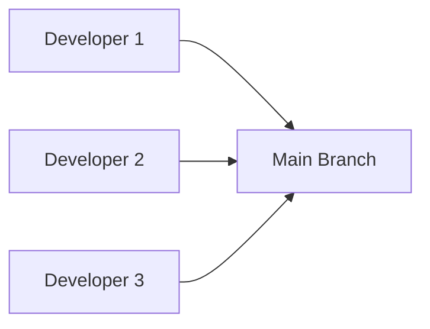
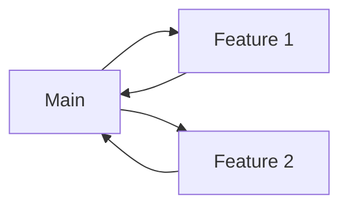
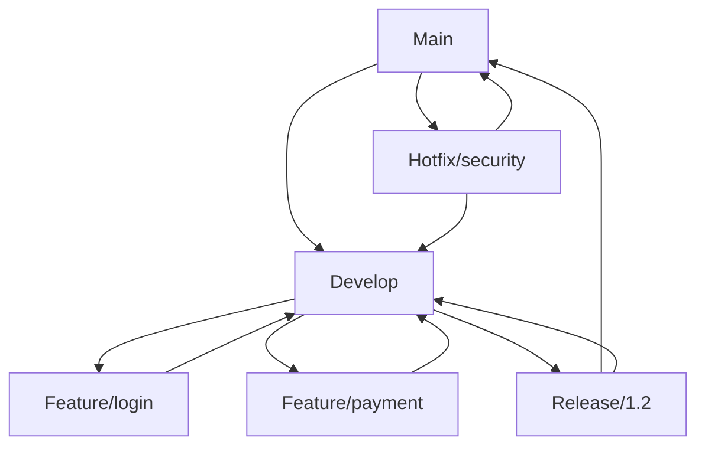
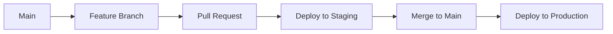
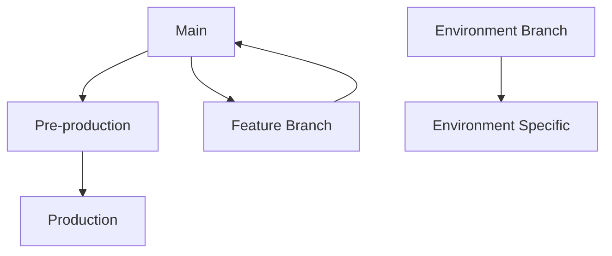
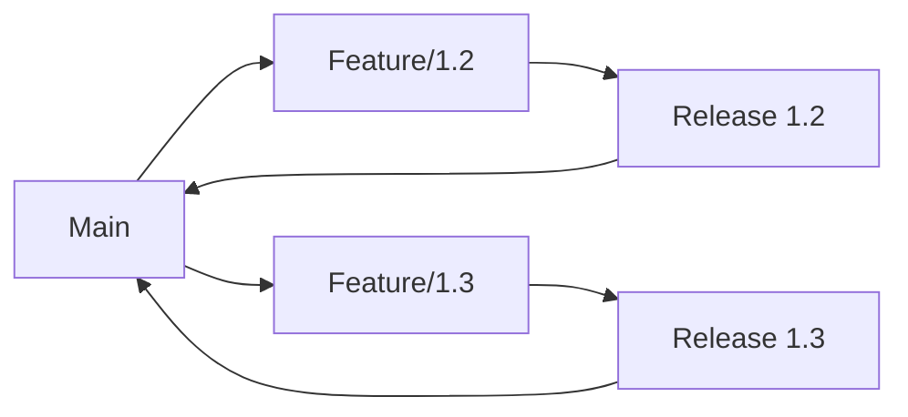

# Confronto tra Workflow Git

## Introduzione

Esistono diversi workflow Git, ognuno adatto a contesti e team diversi. Questa guida presenta un confronto dettagliato per aiutarti a scegliere quello più appropriato per il tuo progetto.

## Panoramica dei Workflow Principali

### 1. Centralized Workflow
**Adatto per**: Team piccoli, migrazione da SVN

### 2. Feature Branch Workflow  
**Adatto per**: Team medi, sviluppo collaborativo

### 3. Git Flow
**Adatto per**: Progetti con release pianificate

### 4. GitHub Flow
**Adatto per**: Deployment continuo, team agili

### 5. GitLab Flow
**Adatto per**: Ambienti multipli, CI/CD avanzato

### 6. OneFlow
**Adatto per**: Semplificazione di Git Flow

## Confronto Dettagliato

### Centralized Workflow



**Caratteristiche:**
- Un singolo branch principale (main/master)
- Tutti committano direttamente su main
- Simile a SVN ma con Git

**Vantaggi:**
- ✅ Semplicità estrema
- ✅ Facile da capire per principianti
- ✅ Nessuna complessità di branching
- ✅ Setup immediato

**Svantaggi:**
- ❌ Nessun isolamento delle funzionalità
- ❌ Conflitti frequenti
- ❌ Difficile tracciare feature
- ❌ No review process
- ❌ Rollback complessi

**Esempio di utilizzo:**
```bash
# Developer workflow
git clone https://github.com/team/project.git
cd project

# Lavora direttamente su main
git pull origin main
# ... modifiche ...
git add .
git commit -m "Add new feature"
git push origin main
```

**Quando usarlo:**
- Team di 2-3 sviluppatori
- Progetti interni semplici
- Prototipazione rapida
- Migrazione da sistemi centralizzati

---

### Feature Branch Workflow



**Caratteristiche:**
- Branch dedicato per ogni feature
- Merge su main tramite Pull Request
- Review obbligatorio del codice

**Vantaggi:**
- ✅ Isolamento delle funzionalità
- ✅ Code review process
- ✅ Storia pulita
- ✅ Facilità di rollback
- ✅ Collaborazione migliorata

**Svantaggi:**
- ❌ Complessità media
- ❌ Possibili conflitti lunghi
- ❌ Setup branch necessario

**Esempio di utilizzo:**
```bash
# Crea feature branch
git checkout -b feature/user-authentication
# ... sviluppo ...
git push origin feature/user-authentication

# Crea Pull Request via interfaccia web
# Dopo review e merge
git checkout main
git pull origin main
git branch -d feature/user-authentication
```

**Quando usarlo:**
- Team di 3-10 sviluppatori
- Progetti con review obbligatorio
- Sviluppo collaborativo strutturato
- Necessità di tracciabilità

---

### Git Flow



**Caratteristiche:**
- Branch principali: main e develop
- Branch di supporto: feature, release, hotfix
- Workflow strutturato e prevedibile

**Vantaggi:**
- ✅ Gestione release strutturata
- ✅ Hotfix rapide
- ✅ Separazione sviluppo/produzione
- ✅ Parallelizzazione del lavoro
- ✅ Stabilità produzione

**Svantaggi:**
- ❌ Complessità elevata
- ❌ Overhead per progetti semplici
- ❌ Curva di apprendimento ripida
- ❌ Branch long-lived

**Esempio di utilizzo:**
```bash
# Inizializza Git Flow
git flow init

# Feature development
git flow feature start user-profile
# ... sviluppo ...
git flow feature finish user-profile

# Release preparation
git flow release start 1.2.0
# ... bug fixes, documentazione ...
git flow release finish 1.2.0

# Emergency hotfix
git flow hotfix start security-patch
# ... fix critica ...
git flow hotfix finish security-patch
```

**Quando usarlo:**
- Team grandi (10+ sviluppatori)
- Release pianificate
- Prodotti enterprise
- Necessità di stabilità

---

### GitHub Flow



**Caratteristiche:**
- Un solo branch principale (main)
- Feature branch per ogni modifica
- Deploy continuo
- Semplicità estrema

**Vantaggi:**
- ✅ Semplicità
- ✅ Deploy rapidi
- ✅ Feedback veloce
- ✅ Adatto a CI/CD
- ✅ Flessibilità massima

**Svantaggi:**
- ❌ Richiede deployment automatico
- ❌ Test robusti necessari
- ❌ Gestione release complessa
- ❌ No staging di funzionalità

**Esempio di utilizzo:**
```bash
# Crea branch per qualsiasi modifica
git checkout -b fix/broken-login
# ... fix ...
git push origin fix/broken-login

# Pull Request + review
# Automatic deploy to staging
# Se tutto OK, merge to main
# Automatic deploy to production
```

**Quando usarlo:**
- Startup e team agili
- Web applications
- Deploy automatizzato
- Feedback rapido necessario

---

### GitLab Flow



**Caratteristiche:**
- Combina GitHub Flow con environment branch
- Branch per ambienti (staging, production)
- Upstream first approach

**Vantaggi:**
- ✅ Controllo ambienti
- ✅ Deploy graduali
- ✅ Tracciabilità completa
- ✅ Flessibilità deployment
- ✅ Issue tracking integrato

**Svantaggi:**
- ❌ Complessità media-alta
- ❌ Richiede GitLab CI/CD
- ❌ Configurazione iniziale complessa

**Esempio di utilizzo:**
```bash
# Sviluppo normale
git checkout -b feature/new-dashboard
# ... sviluppo ...
git push origin feature/new-dashboard
# Merge to main via MR

# Deploy a staging
git checkout staging
git merge main
git push origin staging

# Deploy a production (dopo validazione)
git checkout production  
git merge staging
git push origin production
```

**Quando usarlo:**
- Ambienti multipli
- Deploy controllati
- Team che usa GitLab
- Requisiti compliance

---

### OneFlow



**Caratteristiche:**
- Semplificazione di Git Flow
- Branch per feature e release
- Main sempre deployabile

**Vantaggi:**
- ✅ Più semplice di Git Flow
- ✅ Main sempre stabile
- ✅ Release planning chiaro
- ✅ Hotfix gestibili

**Svantaggi:**
- ❌ Meno diffuso
- ❌ Documentazione limitata
- ❌ Tool support ridotto

**Quando usarlo:**
- Alternative a Git Flow
- Team che trova Git Flow troppo complesso
- Progetti con release multiple

## Matrice di Decisione

| Criterio | Centralized | Feature Branch | Git Flow | GitHub Flow | GitLab Flow | OneFlow |
|----------|-------------|----------------|----------|-------------|-------------|---------|
| **Team Size** | 1-3 | 3-10 | 10+ | 2-15 | 5+ | 5-15 |
| **Complessità Setup** | 🟢 Bassa | 🟡 Media | 🔴 Alta | 🟢 Bassa | 🟡 Media | 🟡 Media |
| **Deploy Frequency** | 🔴 Raro | 🟡 Settimanale | 🟡 Mensile | 🟢 Giornaliero | 🟡 Controllato | 🟡 Pianificato |
| **Stabilità Richiesta** | 🟡 Media | 🟢 Alta | 🟢 Massima | 🟡 Media | 🟢 Alta | 🟢 Alta |
| **CI/CD Integration** | 🔴 Limitata | 🟡 Buona | 🟡 Complessa | 🟢 Eccellente | 🟢 Nativa | 🟡 Buona |
| **Learning Curve** | 🟢 Facile | 🟡 Media | 🔴 Difficile | 🟢 Facile | 🟡 Media | 🟡 Media |

## Scenari di Utilizzo Dettagliati

### Startup Tech (5 sviluppatori)
```yaml
Scenario: Webapp SaaS in crescita rapida
Raccomandazione: GitHub Flow
Motivo:
  - Deploy multiple volte al giorno
  - Feedback rapido da utenti
  - Team piccolo e agile
  - Infrastruttura cloud nativa
```

### Azienda Enterprise (50+ sviluppatori)
```yaml
Scenario: Software enterprise con release trimestrali
Raccomandazione: Git Flow + GitLab Flow
Motivo:
  - Release pianificate
  - Ambienti multipli (dev/test/staging/prod)
  - Compliance e audit necessari
  - Team distribuiti geograficamente
```

### Open Source Project
```yaml
Scenario: Progetto open source con contributori globali
Raccomandazione: Feature Branch Workflow
Motivo:
  - Contributori esterni numerosi
  - Review obbligatorio
  - Maintainer con controllo qualità
  - Release quando pronto
```

### Agenzia Web (10 sviluppatori)
```yaml
Scenario: Progetti multipli per clienti diversi
Raccomandazione: GitHub Flow per progetti semplici, Git Flow per complessi
Motivo:
  - Progetti eterogenei
  - Timeline clienti diverse
  - Deploy frequency varia per progetto
  - Team condiviso tra progetti
```

## Migration Strategies

### Da Centralized a Feature Branch

```bash
# 1. Educare il team sul branching
git checkout -b feature/first-feature

# 2. Implementare PR template
# .github/pull_request_template.md
echo "## Descrizione
- [ ] Feature completata
- [ ] Test aggiunti
- [ ] Documentazione aggiornata" > .github/pull_request_template.md

# 3. Proteggere main branch
# Via GitHub settings: Require PR reviews
```

### Da Feature Branch a Git Flow

```bash
# 1. Installa git-flow
brew install git-flow  # macOS
# o
apt-get install git-flow  # Ubuntu

# 2. Inizializza git-flow su repository esistente
git flow init -d  # usa defaults

# 3. Migra feature esistenti
git checkout feature/existing-feature
git flow feature track existing-feature

# 4. Crea develop da main
git checkout -b develop main
git push origin develop
```

### Da Git Flow a GitHub Flow

```bash
# 1. Merge tutte le feature in develop
git checkout develop
git flow feature finish feature-name

# 2. Release finale da develop
git flow release start final-release
git flow release finish final-release

# 3. Elimina develop e workflow git-flow
git branch -D develop
git push origin --delete develop

# 4. Adotta GitHub Flow
echo "Ora usa solo main + feature branches"
```

## Automazione e Tooling

### Git Hooks per Enforcement

```bash
#!/bin/bash
# .git/hooks/pre-commit
# Verifica naming convention dei branch

branch=$(git rev-parse --abbrev-ref HEAD)

# Feature Branch Workflow enforcement
if [[ "$branch" =~ ^(feature|bugfix|hotfix)/.+ ]]; then
    echo "✅ Branch naming OK: $branch"
    exit 0
else
    echo "❌ Branch deve seguire pattern: feature/name, bugfix/name, hotfix/name"
    echo "Corrente: $branch"
    exit 1
fi
```

### Automated Branch Policies

```yaml
# .github/workflows/branch-protection.yml
name: Enforce Workflow Rules

on:
  pull_request:
    branches: [main, develop]

jobs:
  validate-branch:
    runs-on: ubuntu-latest
    steps:
      - uses: actions/checkout@v2
      
      - name: Validate branch name
        run: |
          if [[ "${{ github.head_ref }}" =~ ^(feature|bugfix|hotfix)/.+ ]]; then
            echo "✅ Branch name valid"
          else
            echo "❌ Invalid branch name: ${{ github.head_ref }}"
            exit 1
          fi
          
      - name: Check commit message convention
        run: |
          # Verifica conventional commits
          git log --pretty=format:"%s" -1 | grep -E "^(feat|fix|docs|style|refactor|test|chore)(\(.+\))?: .+"
```

## Metriche e KPI per Workflow

### Dashboard Metriche

```python
# workflow_metrics.py
import git
from datetime import datetime, timedelta
import json

def analyze_workflow_efficiency():
    """Analizza l'efficienza del workflow Git."""
    
    repo = git.Repo('.')
    
    # Metriche branch
    branches = list(repo.heads)
    active_branches = [b for b in branches if b.commit.committed_date > 
                      (datetime.now() - timedelta(days=30)).timestamp()]
    
    # Metriche merge
    merges = [c for c in repo.iter_commits() if len(c.parents) > 1]
    recent_merges = [m for m in merges if m.committed_date > 
                    (datetime.now() - timedelta(days=30)).timestamp()]
    
    # Tempo di vita branch
    branch_lifetimes = []
    for branch in branches:
        if 'feature/' in branch.name:
            # Calcola dalla creazione al merge
            first_commit = list(repo.iter_commits(branch))[-1]
            last_commit = branch.commit
            lifetime = (last_commit.committed_date - first_commit.committed_date) / 86400
            branch_lifetimes.append(lifetime)
    
    metrics = {
        'total_branches': len(branches),
        'active_branches': len(active_branches),
        'recent_merges': len(recent_merges),
        'avg_branch_lifetime': sum(branch_lifetimes) / len(branch_lifetimes) if branch_lifetimes else 0,
        'workflow_health': 'good' if len(active_branches) < 10 and 
                          (sum(branch_lifetimes) / len(branch_lifetimes) if branch_lifetimes else 0) < 7 else 'needs_attention'
    }
    
    return metrics

def generate_workflow_report():
    """Genera report settimanale del workflow."""
    
    metrics = analyze_workflow_efficiency()
    
    report = f"""
# Workflow Health Report

## Metriche Chiave
- **Branch totali**: {metrics['total_branches']}
- **Branch attivi**: {metrics['active_branches']}
- **Merge recenti**: {metrics['recent_merges']}
- **Vita media branch**: {metrics['avg_branch_lifetime']:.1f} giorni
- **Stato workflow**: {metrics['workflow_health']}

## Raccomandazioni
"""
    
    if metrics['avg_branch_lifetime'] > 7:
        report += "- ⚠️ Branch troppo longevi - considera merge più frequenti\n"
    
    if metrics['active_branches'] > 15:
        report += "- ⚠️ Troppi branch attivi - considera pulizia\n"
    
    return report
```

## Conclusioni e Raccomandazioni

### Quick Decision Tree

```
Hai mai usato Git?
├─ No → Centralized Workflow
└─ Sì
   ├─ Team < 5 persone?
   │  ├─ Deploy continuo? → GitHub Flow
   │  └─ Release pianificate? → Feature Branch Workflow
   └─ Team > 5 persone?
      ├─ Ambienti multipli? → GitLab Flow
      ├─ Release complesse? → Git Flow
      └─ Semplicità importante? → OneFlow
```

### Best Practices Universali

1. **Inizia semplice** - Puoi sempre evolvere
2. **Adatta al team** - Non forzare workflow complessi
3. **Automatizza tutto** - Riduci friction manuale
4. **Misura e ottimizza** - Usa metriche per migliorare
5. **Documenta decisioni** - Spiega il "perché" del workflow scelto

### Evolution Path

```
Centralized → Feature Branch → Git Flow/GitHub Flow → Custom Hybrid
```

Ogni passaggio dovrebbe essere motivato da necessità concrete del team e del progetto, non da mode tecnologiche.
