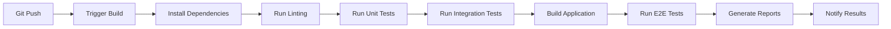

# CI/CD Automation e DevOps

## 📖 Introduzione

La Continuous Integration e Continuous Deployment (CI/CD) rappresentano pratiche essenziali per lo sviluppo software moderno. In questo progetto finale, implementerai pipeline automatizzate che garantiscono qualità, affidabilità e deployment rapido.

## 🎯 Obiettivi di Apprendimento

- ✅ Comprendere i principi di CI/CD nel contesto Git/GitHub
- ✅ Implementare pipeline di testing automatizzato
- ✅ Configurare deployment automation con GitHub Actions
- ✅ Gestire environments e release management
- ✅ Monitorare qualità del codice e performance

## 📋 Concetti Fondamentali

### Continuous Integration (CI)

**Definizione**: Pratica di integrare frequentemente le modifiche del codice in un repository condiviso, con validazione automatica.

#### Principi Chiave
```yaml
CI Principles:
  - Commit Frequenti: Almeno una volta al giorno
  - Build Automatizzati: Ogni commit trigger un build
  - Test Automatici: Suite completa di test eseguita
  - Feedback Rapido: Risultati disponibili in minuti
  - Fix Immediati: Problemi risolti prioritariamente
```

#### Pipeline CI Tipica


### Continuous Deployment (CD)

**Definizione**: Estensione di CI che automatizza il deployment delle modifiche validate in production.

#### Strategie di Deployment
```yaml
Deployment Strategies:
  Blue-Green:
    - Two identical environments
    - Switch traffic instantly
    - Zero downtime deployment
    
  Rolling:
    - Gradual instance replacement
    - Progressive traffic migration
    - Reduced risk deployment
    
  Canary:
    - Small percentage rollout
    - Monitor metrics closely
    - Full rollout if successful
```

## 🚀 GitHub Actions per CI/CD

### Workflow Base per Testing

```yaml
# .github/workflows/ci.yml
name: Continuous Integration

on:
  push:
    branches: [ main, develop ]
  pull_request:
    branches: [ main ]

jobs:
  test:
    runs-on: ubuntu-latest
    
    strategy:
      matrix:
        node-version: [16, 18, 20]
    
    steps:
    - name: Checkout code
      uses: actions/checkout@v4
      
    - name: Setup Node.js ${{ matrix.node-version }}
      uses: actions/setup-node@v4
      with:
        node-version: ${{ matrix.node-version }}
        cache: 'npm'
    
    - name: Install dependencies
      run: npm ci
      
    - name: Run linting
      run: npm run lint
      
    - name: Run unit tests
      run: npm run test:unit
      
    - name: Run integration tests
      run: npm run test:integration
      
    - name: Generate coverage report
      run: npm run coverage
      
    - name: Upload coverage to Codecov
      uses: codecov/codecov-action@v3
      with:
        file: ./coverage/lcov.info
        fail_ci_if_error: true
```

### Quality Gates Implementation

```yaml
# .github/workflows/quality-gates.yml
name: Quality Gates

on:
  pull_request:
    branches: [ main ]

jobs:
  quality-check:
    runs-on: ubuntu-latest
    
    steps:
    - uses: actions/checkout@v4
      with:
        fetch-depth: 0  # Full history for better analysis
    
    - name: Setup Node.js
      uses: actions/setup-node@v4
      with:
        node-version: '18'
        cache: 'npm'
    
    - name: Install dependencies
      run: npm ci
    
    # Code Quality Analysis
    - name: Run ESLint with annotations
      run: |
        npm run lint -- --format=@microsoft/eslint-formatter-sarif \
                         --output-file=eslint-results.sarif
      continue-on-error: true
    
    - name: Upload ESLint results
      uses: github/codeql-action/upload-sarif@v2
      with:
        sarif_file: eslint-results.sarif
        wait-for-processing: true
    
    # Security Audit
    - name: Run npm audit
      run: npm audit --audit-level=high
    
    # Test Coverage Requirements
    - name: Check test coverage
      run: |
        npm run coverage
        npx nyc check-coverage --lines 90 --functions 90 --branches 85
    
    # Performance Budget Check
    - name: Build and check bundle size
      run: |
        npm run build:prod
        npx bundlesize
    
    # Accessibility Testing
    - name: Run accessibility tests
      run: npm run test:a11y
    
    # Visual Regression Testing
    - name: Visual regression tests
      run: npm run test:visual
      if: github.event_name == 'pull_request'
```

### Advanced Deployment Pipeline

```yaml
# .github/workflows/deploy.yml
name: Deployment Pipeline

on:
  push:
    branches: [ main ]
  release:
    types: [ published ]

env:
  NODE_VERSION: '18'

jobs:
  deploy-staging:
    if: github.ref == 'refs/heads/main'
    runs-on: ubuntu-latest
    environment: staging
    
    steps:
    - uses: actions/checkout@v4
    
    - name: Setup Node.js
      uses: actions/setup-node@v4
      with:
        node-version: ${{ env.NODE_VERSION }}
        cache: 'npm'
    
    - name: Install and build
      run: |
        npm ci
        npm run build:staging
      env:
        REACT_APP_API_URL: ${{ secrets.STAGING_API_URL }}
        REACT_APP_ENV: staging
    
    - name: Deploy to staging
      uses: peaceiris/actions-gh-pages@v3
      with:
        github_token: ${{ secrets.GITHUB_TOKEN }}
        publish_dir: ./dist
        destination_dir: staging
        cname: staging-taskmanager.example.com
    
    - name: Run smoke tests
      run: |
        sleep 30  # Wait for deployment
        npm run test:smoke -- --baseUrl=https://staging-taskmanager.example.com
    
    - name: Notify team
      uses: 8398a7/action-slack@v3
      with:
        status: ${{ job.status }}
        text: 'Staging deployment completed'
      env:
        SLACK_WEBHOOK_URL: ${{ secrets.SLACK_WEBHOOK }}

  deploy-production:
    if: github.event_name == 'release'
    runs-on: ubuntu-latest
    environment: production
    needs: [deploy-staging]
    
    steps:
    - uses: actions/checkout@v4
    
    - name: Setup Node.js
      uses: actions/setup-node@v4
      with:
        node-version: ${{ env.NODE_VERSION }}
        cache: 'npm'
    
    - name: Install and build
      run: |
        npm ci
        npm run build:production
      env:
        REACT_APP_API_URL: ${{ secrets.PRODUCTION_API_URL }}
        REACT_APP_ENV: production
    
    - name: Deploy to production
      uses: peaceiris/actions-gh-pages@v3
      with:
        github_token: ${{ secrets.GITHUB_TOKEN }}
        publish_dir: ./dist
        cname: taskmanager.example.com
    
    - name: Health check
      run: |
        sleep 60  # Wait for deployment
        curl -f https://taskmanager.example.com/health || exit 1
    
    - name: Update deployment status
      uses: actions/github-script@v7
      with:
        script: |
          github.rest.repos.createDeploymentStatus({
            owner: context.repo.owner,
            repo: context.repo.repo,
            deployment_id: context.payload.deployment.id,
            state: 'success',
            environment_url: 'https://taskmanager.example.com'
          });
```

## 📊 Monitoring e Observability

### Performance Monitoring

```yaml
# .github/workflows/performance.yml
name: Performance Monitoring

on:
  push:
    branches: [ main ]
  schedule:
    - cron: '0 */6 * * *'  # Every 6 hours

jobs:
  lighthouse-audit:
    runs-on: ubuntu-latest
    
    steps:
    - uses: actions/checkout@v4
    
    - name: Setup Node.js
      uses: actions/setup-node@v4
      with:
        node-version: '18'
    
    - name: Install dependencies
      run: npm ci
    
    - name: Build application
      run: npm run build:prod
    
    - name: Serve application
      run: |
        npx serve -s dist -l 3000 &
        sleep 10
    
    - name: Run Lighthouse audit
      uses: treosh/lighthouse-ci-action@v10
      with:
        configPath: './lighthouserc.json'
        uploadArtifacts: true
        temporaryPublicStorage: true
    
    - name: Check performance budget
      run: |
        # Fail if performance score < 90
        if [ $(cat ./lhci_reports/manifest.json | jq '.[] | .summary.performance' | head -1) -lt 0.9 ]; then
          echo "Performance budget exceeded!"
          exit 1
        fi
```

### Error Tracking Integration

```javascript
// js/monitoring.js
class ErrorMonitoring {
    constructor(config) {
        this.config = config;
        this.setupGlobalErrorHandlers();
        this.setupPerformanceObserver();
    }
    
    setupGlobalErrorHandlers() {
        // JavaScript errors
        window.addEventListener('error', (event) => {
            this.reportError({
                type: 'javascript',
                message: event.message,
                filename: event.filename,
                lineno: event.lineno,
                colno: event.colno,
                stack: event.error?.stack,
                timestamp: new Date().toISOString(),
                userAgent: navigator.userAgent,
                url: window.location.href
            });
        });
        
        // Promise rejections
        window.addEventListener('unhandledrejection', (event) => {
            this.reportError({
                type: 'promise',
                message: event.reason?.message || event.reason,
                stack: event.reason?.stack,
                timestamp: new Date().toISOString(),
                url: window.location.href
            });
        });
    }
    
    setupPerformanceObserver() {
        // Web Vitals monitoring
        if ('PerformanceObserver' in window) {
            // Largest Contentful Paint
            new PerformanceObserver((list) => {
                for (const entry of list.getEntries()) {
                    this.reportMetric({
                        name: 'LCP',
                        value: entry.startTime,
                        rating: entry.startTime > 2500 ? 'poor' : entry.startTime > 1200 ? 'needs-improvement' : 'good'
                    });
                }
            }).observe({ entryTypes: ['largest-contentful-paint'] });
            
            // First Input Delay
            new PerformanceObserver((list) => {
                for (const entry of list.getEntries()) {
                    this.reportMetric({
                        name: 'FID',
                        value: entry.processingStart - entry.startTime,
                        rating: entry.processingStart - entry.startTime > 300 ? 'poor' : 
                               entry.processingStart - entry.startTime > 100 ? 'needs-improvement' : 'good'
                    });
                }
            }).observe({ entryTypes: ['first-input'] });
        }
    }
    
    reportError(errorData) {
        // In a real application, send to error tracking service
        console.error('Error reported:', errorData);
        
        // Example integration with GitHub Issues
        if (this.config.createIssues && errorData.type === 'javascript') {
            this.createGitHubIssue(errorData);
        }
    }
    
    reportMetric(metricData) {
        console.log('Performance metric:', metricData);
        
        // Store metrics for trending analysis
        this.storeMetric(metricData);
    }
    
    async createGitHubIssue(errorData) {
        const issueBody = `
## Error Report

**Message**: ${errorData.message}
**File**: ${errorData.filename}:${errorData.lineno}:${errorData.colno}
**URL**: ${errorData.url}
**User Agent**: ${errorData.userAgent}
**Timestamp**: ${errorData.timestamp}

### Stack Trace
\`\`\`
${errorData.stack}
\`\`\`

### Environment
- Branch: ${process.env.GITHUB_REF}
- Commit: ${process.env.GITHUB_SHA}
- Deployment: ${process.env.DEPLOYMENT_ENV}

This issue was automatically created by error monitoring.
        `;
        
        // Would integrate with GitHub API to create issue
        console.log('Would create GitHub issue:', issueBody);
    }
}

// Initialize monitoring
const monitoring = new ErrorMonitoring({
    createIssues: true,
    environment: process.env.NODE_ENV || 'development'
});
```

## 🔧 Configuration Management

### Environment-Specific Configurations

```javascript
// config/environments.js
const environments = {
    development: {
        api: {
            baseUrl: 'http://localhost:3001/api',
            timeout: 5000
        },
        features: {
            debugMode: true,
            analyticsEnabled: false,
            errorReporting: false
        },
        storage: {
            type: 'localStorage',
            prefix: 'taskmanager_dev_'
        }
    },
    
    staging: {
        api: {
            baseUrl: 'https://api-staging.taskmanager.com/api',
            timeout: 10000
        },
        features: {
            debugMode: false,
            analyticsEnabled: true,
            errorReporting: true
        },
        storage: {
            type: 'localStorage',
            prefix: 'taskmanager_staging_'
        }
    },
    
    production: {
        api: {
            baseUrl: 'https://api.taskmanager.com/api',
            timeout: 15000
        },
        features: {
            debugMode: false,
            analyticsEnabled: true,
            errorReporting: true
        },
        storage: {
            type: 'localStorage',
            prefix: 'taskmanager_'
        }
    }
};

// Get current environment configuration
function getConfig() {
    const env = process.env.NODE_ENV || 'development';
    return {
        ...environments[env],
        environment: env,
        version: process.env.APP_VERSION || '1.0.0',
        buildDate: process.env.BUILD_DATE || new Date().toISOString()
    };
}

export default getConfig();
```

### Feature Flags Implementation

```javascript
// js/featureFlags.js
class FeatureFlags {
    constructor() {
        this.flags = {
            // UI Features
            darkModeToggle: { enabled: true, rollout: 100 },
            advancedFiltering: { enabled: true, rollout: 50 },
            taskTemplates: { enabled: false, rollout: 0 },
            
            // Performance Features
            lazyLoading: { enabled: true, rollout: 100 },
            virtualScrolling: { enabled: false, rollout: 25 },
            
            // Beta Features
            aiSuggestions: { enabled: false, rollout: 5 },
            voiceInput: { enabled: false, rollout: 0 }
        };
        
        this.userId = this.getUserId();
        this.loadRemoteFlags();
    }
    
    isEnabled(flagName) {
        const flag = this.flags[flagName];
        if (!flag || !flag.enabled) return false;
        
        // Consistent rollout based on user ID
        const hash = this.hashUserId(this.userId + flagName);
        return (hash % 100) < flag.rollout;
    }
    
    getUserId() {
        let userId = localStorage.getItem('user_id');
        if (!userId) {
            userId = 'user_' + Math.random().toString(36).substr(2, 9);
            localStorage.setItem('user_id', userId);
        }
        return userId;
    }
    
    hashUserId(str) {
        let hash = 0;
        for (let i = 0; i < str.length; i++) {
            const char = str.charCodeAt(i);
            hash = ((hash << 5) - hash) + char;
            hash = hash & hash; // Convert to 32-bit integer
        }
        return Math.abs(hash);
    }
    
    async loadRemoteFlags() {
        try {
            // In real application, fetch from feature flag service
            const response = await fetch('/api/feature-flags');
            if (response.ok) {
                const remoteFlags = await response.json();
                this.flags = { ...this.flags, ...remoteFlags };
            }
        } catch (error) {
            console.warn('Failed to load remote feature flags:', error);
        }
    }
    
    // Analytics integration
    track(flagName, enabled) {
        // Report feature flag usage
        console.log(`Feature flag ${flagName}: ${enabled ? 'enabled' : 'disabled'}`);
    }
}

const featureFlags = new FeatureFlags();
export default featureFlags;
```

## 📈 Deployment Strategies Avanzate

### Blue-Green Deployment

```yaml
# .github/workflows/blue-green-deploy.yml
name: Blue-Green Deployment

on:
  workflow_dispatch:
    inputs:
      environment:
        description: 'Target environment'
        required: true
        default: 'production'
        type: choice
        options:
        - staging
        - production

jobs:
  deploy:
    runs-on: ubuntu-latest
    environment: ${{ github.event.inputs.environment }}
    
    steps:
    - uses: actions/checkout@v4
    
    - name: Determine deployment slots
      id: slots
      run: |
        # Determine which slot is currently active
        CURRENT=$(curl -s https://api.taskmanager.com/deployment/current-slot)
        if [ "$CURRENT" = "blue" ]; then
          echo "active=blue" >> $GITHUB_OUTPUT
          echo "inactive=green" >> $GITHUB_OUTPUT
        else
          echo "active=green" >> $GITHUB_OUTPUT
          echo "inactive=blue" >> $GITHUB_OUTPUT
        fi
    
    - name: Deploy to inactive slot
      run: |
        echo "Deploying to ${{ steps.slots.outputs.inactive }} slot"
        # Deploy application to inactive slot
        ./scripts/deploy.sh ${{ steps.slots.outputs.inactive }}
    
    - name: Run health checks
      run: |
        # Verify deployment health
        ./scripts/health-check.sh ${{ steps.slots.outputs.inactive }}
    
    - name: Switch traffic
      if: success()
      run: |
        echo "Switching traffic to ${{ steps.slots.outputs.inactive }}"
        ./scripts/switch-traffic.sh ${{ steps.slots.outputs.inactive }}
    
    - name: Verify switch
      run: |
        sleep 30
        ./scripts/verify-deployment.sh
    
    - name: Rollback on failure
      if: failure()
      run: |
        echo "Rolling back to ${{ steps.slots.outputs.active }}"
        ./scripts/switch-traffic.sh ${{ steps.slots.outputs.active }}
```

## 🎯 Best Practices per CI/CD

### 1. Pipeline Design Principles

```yaml
Best Practices:
  Speed:
    - Parallel job execution
    - Efficient caching strategies
    - Incremental builds where possible
    
  Reliability:
    - Idempotent operations
    - Retry mechanisms for flaky tests
    - Clear failure reporting
    
  Security:
    - Secret management
    - Least privilege access
    - Audit logging
    
  Maintainability:
    - Modular workflow design
    - Reusable actions
    - Clear documentation
```

### 2. Testing Strategy

```mermaid
pyramid
    title Testing Pyramid
    "E2E Tests" : 10
    "Integration Tests" : 30
    "Unit Tests" : 60
```

### 3. Deployment Checklist

```markdown
Pre-Deployment:
- [ ] All tests passing
- [ ] Code review completed
- [ ] Security scan passed
- [ ] Performance budget met
- [ ] Documentation updated

During Deployment:
- [ ] Health checks passing
- [ ] Monitoring active
- [ ] Rollback plan ready
- [ ] Team notified

Post-Deployment:
- [ ] Smoke tests executed
- [ ] Metrics baseline established
- [ ] User feedback monitored
- [ ] Performance verified
```

## 📚 Strumenti e Integrazioni

### GitHub Actions Marketplace

```yaml
Recommended Actions:
  Testing:
    - actions/setup-node@v4
    - codecov/codecov-action@v3
    - cypress-io/github-action@v6
    
  Security:
    - github/codeql-action@v2
    - securecodewarrior/github-action-add-sarif@v1
    
  Deployment:
    - peaceiris/actions-gh-pages@v3
    - azure/webapps-deploy@v2
    - aws-actions/configure-aws-credentials@v4
    
  Notifications:
    - 8398a7/action-slack@v3
    - peter-evans/repository-dispatch@v2
```

### Monitoring Tools Integration

```javascript
// Integration examples
const integrations = {
    sentry: {
        dsn: process.env.SENTRY_DSN,
        environment: process.env.NODE_ENV,
        beforeSend(event) {
            // Filter sensitive data
            return event;
        }
    },
    
    googleAnalytics: {
        trackingId: process.env.GA_TRACKING_ID,
        anonymizeIp: true
    },
    
    hotjar: {
        siteId: process.env.HOTJAR_SITE_ID,
        version: 6
    }
};
```

L'implementazione di CI/CD automation nel progetto finale dimostra la padronanza di pratiche DevOps moderne e prepara per ambienti di sviluppo professionali dove questi processi sono essenziali per la delivery rapida e affidabile del software.
