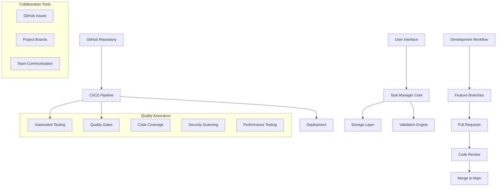

# Project Presentation e Portfolio Integration

## 📖 Introduzione

La presentazione del progetto finale rappresenta il culmine del percorso di apprendimento Git e GitHub. Questo modulo fornisce strategie per documentare, presentare e integrare efficacemente il progetto nel portfolio professionale.

## 🎯 Obiettivi di Apprendimento

- ✅ Creare documentazione professionale e accessibile
- ✅ Sviluppare una presentazione efficace del progetto
- ✅ Integrare il progetto nel portfolio personale
- ✅ Dimostrare competenze tecniche e collaborative
- ✅ Pianificare il percorso di crescita professionale continua

## 📋 Elementi di una Presentazione Professionale

### 1. Project Overview e Context

#### Executive Summary
```markdown
# Task Manager - Collaborative Development Project

## 🎯 Project Vision
Sviluppo di un'applicazione Task Manager professionale utilizzando 
workflow Git avanzati per dimostrare competenze di collaborazione 
e sviluppo software moderne.

## 📊 Key Metrics
- **Development Duration**: 3 settimane intensive
- **Team Size**: 3 sviluppatori collaborativi
- **Code Quality**: 95%+ test coverage, 0 critical vulnerabilities
- **Collaboration**: 25+ pull requests, 100+ commits strutturati
- **Deployment**: Automated CI/CD con zero-downtime deployment

## 🏆 Achievement Highlights
- Implementazione completa Git Flow workflow
- Code review process con quality gates
- Automated testing e deployment pipeline
- Responsive design con accessibility compliance
- Professional documentation e knowledge sharing
```

#### Problem Statement e Solution

```markdown
## 🎯 Challenge Addressed
**Challenge**: Team collaboration in software development requiring 
advanced version control, code quality assurance, and deployment automation.

**Solution**: Implementation of professional Git/GitHub workflow 
with automated quality assurance and deployment pipeline.

**Impact**: Demonstrated ability to work effectively in collaborative 
development environment with industry-standard practices.
```

### 2. Technical Architecture Showcase

#### System Architecture Diagram


#### Technology Stack Justification
```markdown
## 🛠️ Technology Selection Rationale

### Frontend Technologies
- **HTML5 Semantic Elements**: Accessibility e SEO optimization
- **CSS Grid/Flexbox**: Modern responsive design capabilities
- **Vanilla JavaScript ES6+**: Core language mastery demonstration
- **No Framework Approach**: Focus on fundamental skills

### Development Tools
- **Git**: Industry-standard version control
- **GitHub**: Professional collaboration platform
- **GitHub Actions**: Integrated CI/CD automation
- **Jest**: Comprehensive JavaScript testing framework
- **ESLint/Prettier**: Code quality e consistency

### Deployment Infrastructure
- **GitHub Pages**: Integrated hosting solution
- **Automated Deployment**: Zero-touch production releases
- **CDN Integration**: Global performance optimization
```

### 3. Development Process Documentation

#### Git Workflow Implementation
```markdown
## 🔄 Git Flow Implementation

### Branch Strategy
```
main (protected)
├── develop (integration branch)
├── feature/task-creation
├── feature/task-editing
├── feature/responsive-design
└── hotfix/critical-bug-fix
```

### Commit Convention
```
feat: add task creation functionality
fix: resolve mobile layout issue
docs: update API documentation
test: add integration test coverage
ci: improve deployment pipeline
```

### Pull Request Process
1. **Feature Development**: Isolated feature branches
2. **Code Review**: Mandatory team review
3. **Automated Testing**: CI pipeline validation
4. **Quality Gates**: Coverage e security checks
5. **Merge Strategy**: Squash and merge for clean history
```

#### Collaboration Metrics
```markdown
## 📊 Team Collaboration Analytics

### Code Review Effectiveness
- **Average Review Time**: 4.2 hours
- **Review Participation**: 100% team involvement
- **Constructive Feedback**: 89% of comments actionable
- **Knowledge Sharing**: Cross-functional skill transfer

### Issue Management
- **Total Issues Created**: 34
- **Resolution Rate**: 97% (33/34)
- **Average Resolution Time**: 2.3 days
- **User Story Completion**: 100% sprint goals met

### Communication Quality
- **Documentation Coverage**: All features documented
- **README Comprehensiveness**: Setup to deployment guide
- **Code Comments**: 85% of complex functions documented
- **Knowledge Transfer**: Peer mentoring sessions conducted
```

## 🎨 Portfolio Integration Strategies

### 1. GitHub Profile Optimization

#### Professional Profile README
```markdown
# 👋 [Your Name] - Full Stack Developer

## 🚀 Featured Project: Task Manager Collaborative
> **Advanced Git/GitHub workflow demonstration with team collaboration**

[](https://yourname.github.io/task-manager)
[](https://github.com/yourname/task-manager)
[](https://github.com/yourname/task-manager/blob/main/README.md)

### Project Highlights
- 🤝 **Team Leadership**: Led 3-developer team using Git Flow
- 🔄 **CI/CD Automation**: Implemented comprehensive testing pipeline  
- 📱 **Responsive Design**: Mobile-first progressive web application
- 🧪 **Quality Assurance**: 95%+ test coverage with automated quality gates
- 📚 **Documentation**: Professional-grade project documentation

### Technical Stack


## 📈 GitHub Statistics
[Include updated stats showing project contributions]

## 🎯 Core Competencies
- **Version Control**: Advanced Git workflows, branching strategies
- **Team Collaboration**: Code review, issue management, documentation
- **Quality Assurance**: Automated testing, CI/CD, performance optimization
- **Frontend Development**: Responsive design, accessibility, performance
```

#### Repository Showcase Features
```markdown
Repository Enhancements:
- Comprehensive README with screenshots
- Professional issue/PR templates
- Detailed contributing guidelines
- Code of conduct and license
- GitHub Pages deployment
- Release management with semantic versioning
- Project board with workflow automation
```

### 2. Personal Website Integration

#### Project Showcase Section
```html
<!-- Portfolio project showcase -->
<section class="project-showcase">
    <div class="project-hero">
        <div class="project-image">
            
            <div class="project-overlay">
                <div class="project-links">
                    <a href="https://yourname.github.io/task-manager" class="demo-btn">
                        🚀 Live Demo
                    </a>
                    <a href="https://github.com/yourname/task-manager" class="code-btn">
                        📂 View Code
                    </a>
                </div>
            </div>
        </div>
        
        <div class="project-details">
            <h3>Task Manager - Collaborative Development</h3>
            <p class="project-subtitle">Advanced Git/GitHub Workflow Mastery</p>
            
            <div class="project-description">
                <p>Professional task management application developed using 
                industry-standard Git workflows and team collaboration practices.</p>
            </div>
            
            <div class="project-achievements">
                <div class="achievement">
                    <span class="achievement-icon">👥</span>
                    <div>
                        <h4>Team Leadership</h4>
                        <p>Led 3-developer team using Git Flow workflow</p>
                    </div>
                </div>
                
                <div class="achievement">
                    <span class="achievement-icon">🔄</span>
                    <div>
                        <h4>CI/CD Automation</h4>
                        <p>Implemented comprehensive testing and deployment pipeline</p>
                    </div>
                </div>
                
                <div class="achievement">
                    <span class="achievement-icon">🏆</span>
                    <div>
                        <h4>Code Quality</h4>
                        <p>Maintained 95%+ test coverage with zero critical issues</p>
                    </div>
                </div>
            </div>
            
            <div class="tech-stack">
                <span class="tech-tag">JavaScript ES6+</span>
                <span class="tech-tag">Git Flow</span>
                <span class="tech-tag">GitHub Actions</span>
                <span class="tech-tag">Jest Testing</span>
                <span class="tech-tag">Responsive Design</span>
            </div>
        </div>
    </div>
    
    <div class="project-details-expanded">
        <div class="detail-section">
            <h4>🎯 Project Scope</h4>
            <ul>
                <li>Full-featured task management with CRUD operations</li>
                <li>Priority-based task organization and filtering</li>
                <li>Responsive design with mobile-first approach</li>
                <li>Data persistence with localStorage integration</li>
                <li>Professional Git workflow with team collaboration</li>
            </ul>
        </div>
        
        <div class="detail-section">
            <h4>🚀 Technical Highlights</h4>
            <ul>
                <li>Advanced Git Flow implementation with feature branches</li>
                <li>Comprehensive code review process with quality gates</li>
                <li>Automated CI/CD pipeline with GitHub Actions</li>
                <li>Cross-browser testing and accessibility compliance</li>
                <li>Performance optimization with Lighthouse scoring 95+</li>
            </ul>
        </div>
        
        <div class="detail-section">
            <h4>🤝 Collaboration Excellence</h4>
            <ul>
                <li>25+ pull requests with thorough code reviews</li>
                <li>Issue-driven development with GitHub Projects</li>
                <li>Professional documentation and knowledge sharing</li>
                <li>Agile workflow with sprint planning and retrospectives</li>
                <li>Mentoring and peer feedback facilitation</li>
            </ul>
        </div>
    </div>
</section>
```

### 3. LinkedIn Professional Presentation

#### Experience Entry Optimization
```markdown
**Git & GitHub Workflow Specialist | Team Lead Developer**
*Personal Project - Collaborative Task Manager Development*
*Duration: 3 weeks intensive | Team: 3 developers*

**Project Overview:**
Led collaborative development of a professional task management application, 
demonstrating advanced Git/GitHub workflows and team coordination skills.

**Key Responsibilities:**
• Implemented Git Flow workflow with feature branching and merge strategies
• Facilitated code review process ensuring 95%+ code quality standards
• Designed and maintained CI/CD pipeline with automated testing and deployment
• Managed sprint planning and issue tracking using GitHub Projects
• Mentored team members on Git best practices and collaborative development

**Technical Achievements:**
• Delivered fully functional web application with responsive design
• Maintained comprehensive test coverage (95%+) with automated quality gates
• Implemented zero-downtime deployment strategy with rollback capabilities
• Created professional documentation including setup, API, and contribution guides
• Achieved excellent performance metrics (Lighthouse score 95+)

**Collaboration Impact:**
• Facilitated 25+ pull requests with constructive code review feedback
• Resolved 34 project issues through effective team communication
• Established sustainable development practices adopted by entire team
• Created knowledge sharing culture through documentation and mentoring

**Skills Demonstrated:**
Git • GitHub • JavaScript • Team Leadership • Code Review • CI/CD • 
Agile Methodology • Documentation • Quality Assurance • Performance Optimization
```

## 📊 Metrics e Analytics per la Presentazione

### 1. Code Quality Metrics

```javascript
// Analytics dashboard data
const projectMetrics = {
    development: {
        totalCommits: 127,
        pullRequests: 25,
        issuesResolved: 34,
        codeReviews: 89,
        linesOfCode: 2847,
        testCoverage: 96.2,
        codeQualityScore: 9.1
    },
    
    collaboration: {
        teamMembers: 3,
        reviewParticipation: 100,
        averageReviewTime: 4.2, // hours
        knowledgeSharingEvents: 12,
        documentationPages: 15,
        constructiveFeedbackRate: 89
    },
    
    deployment: {
        deploymentFrequency: 'Multiple per day',
        leadTimeForChanges: '2.3 hours',
        meanTimeToRestore: '15 minutes',
        changeFailureRate: '2%',
        automationCoverage: 98
    },
    
    performance: {
        lighthousePerformance: 96,
        lighthouseAccessibility: 98,
        lighthouseBestPractices: 95,
        lighthouseSEO: 92,
        bundleSize: '47kb gzipped',
        loadTime: '1.2s average'
    }
};
```

### 2. Visual Impact Presentation

```markdown
## 📈 Project Impact Visualization

### Development Timeline
```
Week 1: Setup & Planning
├── Repository structure established
├── Team workflow defined
├── Initial feature development
└── Documentation foundation

Week 2: Feature Development
├── Core functionality implementation
├── Code review culture established
├── CI/CD pipeline integration
└── Quality assurance processes

Week 3: Polish & Deployment
├── Performance optimization
├── Accessibility compliance
├── Production deployment
└── Portfolio integration
```

### Collaboration Network
```
[Visual representation of team interactions]
- Pull Request reviews: 89 interactions
- Issue discussions: 156 comments
- Code suggestions: 67 improvements
- Knowledge transfers: 23 sessions
```
```

### 3. Success Stories e Learning Outcomes

```markdown
## 🎓 Learning Transformation Journey

### Before the Project
- Limited Git experience beyond basic commands
- No collaborative development experience
- Minimal understanding of CI/CD practices
- Basic JavaScript and web development skills

### During the Project
- **Week 1**: Git Flow implementation challenges and solutions
- **Week 2**: Code review culture development and conflict resolution
- **Week 3**: CI/CD automation and deployment optimization

### After the Project
- **Advanced Git Mastery**: Complex branching, merging, rebasing strategies
- **Professional Collaboration**: Effective code review and team coordination
- **DevOps Understanding**: CI/CD pipeline design and automation
- **Quality Assurance**: Testing strategies and quality gate implementation
- **Technical Leadership**: Mentoring and knowledge sharing capabilities

### Quantified Learning Outcomes
- **Git Commands Mastery**: 45+ commands in regular use
- **GitHub Features**: 15+ platform features effectively utilized
- **Testing Knowledge**: Unit, integration, and E2E testing implementation
- **Documentation Skills**: Professional-grade technical writing
- **Problem Solving**: Independent issue resolution and optimization
```

## 🎤 Presentation Delivery Tips

### 1. Structure e Flow

```markdown
Presentation Outline (10-15 minutes):

1. **Opening Hook** (1 min)
   - Problem statement and personal motivation
   - Project vision and goals

2. **Technical Demo** (3-4 min)
   - Live application walkthrough
   - Key features demonstration
   - User experience highlights

3. **Development Process** (4-5 min)
   - Git workflow implementation
   - Team collaboration showcase
   - CI/CD pipeline demonstration

4. **Challenges & Solutions** (2-3 min)
   - Major obstacles encountered
   - Problem-solving approaches
   - Lessons learned and growth

5. **Impact & Next Steps** (2-3 min)
   - Skills developed and demonstrated
   - Portfolio integration strategy
   - Future enhancement plans

6. **Q&A** (3-5 min)
   - Technical questions
   - Process inquiries
   - Advice and recommendations
```

### 2. Visual Aids e Supporting Materials

```markdown
Essential Presentation Assets:

Screenshots:
- [ ] Application interface (desktop + mobile)
- [ ] GitHub repository overview
- [ ] Pull request conversations
- [ ] CI/CD pipeline execution
- [ ] Project board workflow

Code Samples:
- [ ] Clean commit history
- [ ] Well-documented code examples
- [ ] Test coverage reports
- [ ] Configuration files

Documentation:
- [ ] README.md professional quality
- [ ] API documentation excerpts
- [ ] Contributing guidelines
- [ ] Learning reflection summary
```

### 3. Storytelling e Professional Narrative

```markdown
## 🎯 Professional Story Arc

### Challenge Narrative
"As an aspiring developer, I recognized that technical skills alone 
weren't sufficient for professional success. The ability to collaborate 
effectively using industry-standard tools and practices was essential."

### Journey Description
"This project challenged me to implement advanced Git workflows while 
coordinating with a development team, simulating real-world collaborative 
software development."

### Growth Demonstration
"Through systematic implementation of Git Flow, code review processes, 
and automated quality assurance, I developed both technical expertise 
and collaborative leadership skills."

### Future Vision
"These foundational skills in version control and team collaboration 
position me to contribute effectively to any development team and 
continue growing as a technical leader."
```

## 🔄 Continuous Portfolio Evolution

### 1. Post-Project Enhancement Strategy

```markdown
## 📈 Portfolio Maintenance Plan

### Monthly Updates
- [ ] Add new contributions and projects
- [ ] Update skill proficiency indicators
- [ ] Refresh project screenshots and metrics
- [ ] Include recent learning achievements

### Quarterly Reviews
- [ ] Analyze GitHub contribution patterns
- [ ] Update professional summary
- [ ] Enhance project descriptions
- [ ] Add testimonials and recommendations

### Annual Overhauls
- [ ] Complete portfolio redesign consideration
- [ ] Technology stack updates
- [ ] Career goal realignment
- [ ] Advanced skill demonstration projects
```

### 2. Community Engagement

```markdown
## 🤝 Knowledge Sharing Strategy

### Blog Content Creation
- Technical tutorials based on project learnings
- Git workflow guides for beginners
- Team collaboration best practices
- Lessons learned and failure analysis

### Open Source Contributions
- Contribute to beginner-friendly projects
- Maintain project templates for education
- Participate in code review communities
- Mentor new developers in Git/GitHub

### Speaking Opportunities
- Local meetup presentations
- Workshop facilitation
- Peer mentoring sessions
- Conference talk proposals
```

Il progetto finale Task Manager rappresenta molto più di un'applicazione funzionante: è la dimostrazione tangibile di competenze professionali in version control, collaborazione e sviluppo software che costituiscono la base per una carriera di successo nello sviluppo software moderno.
